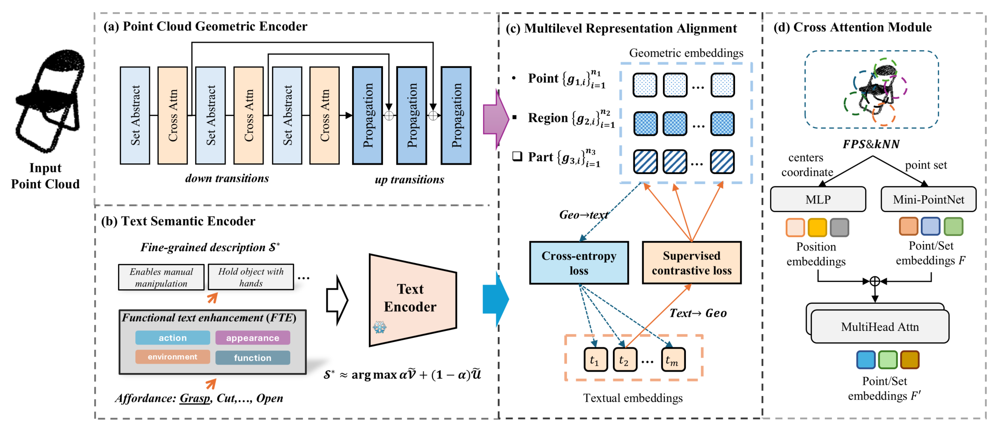
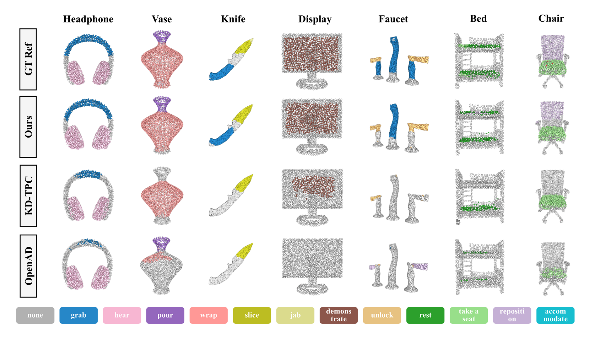
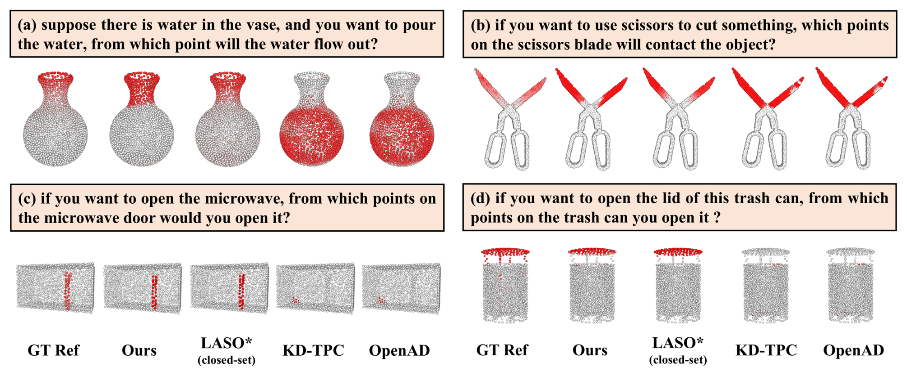
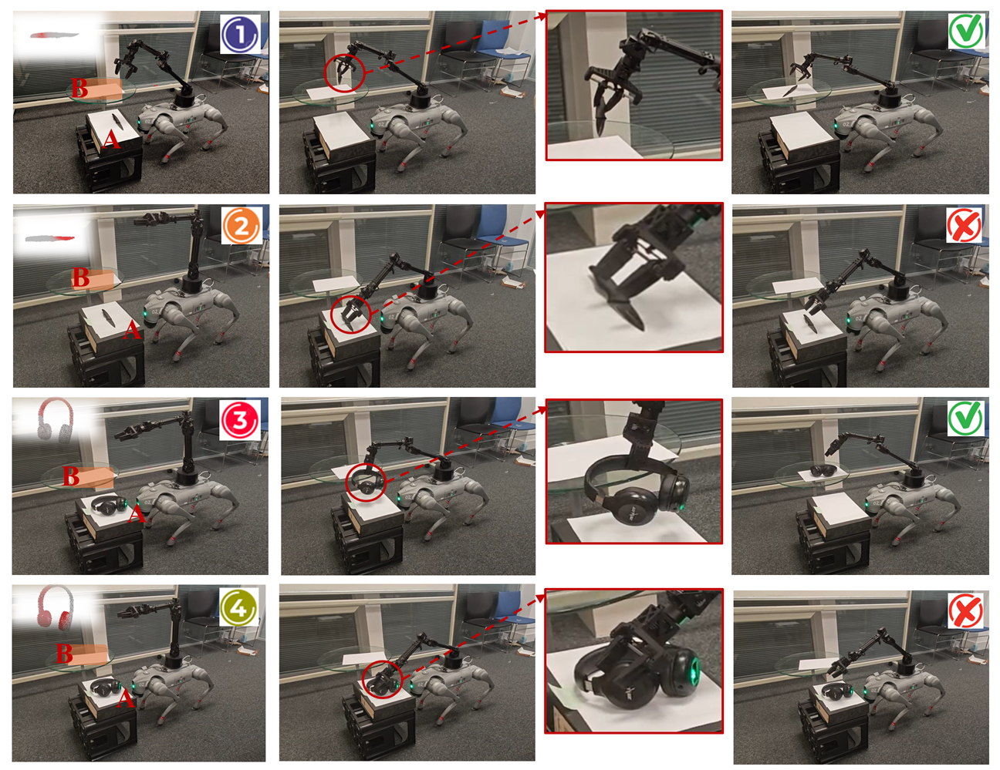
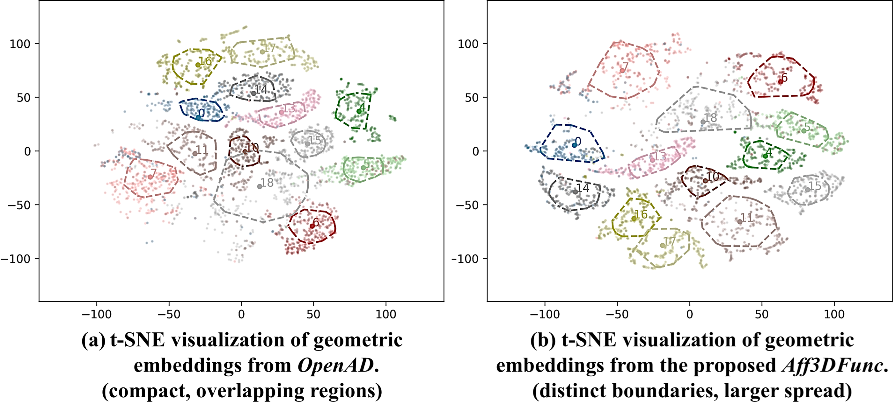
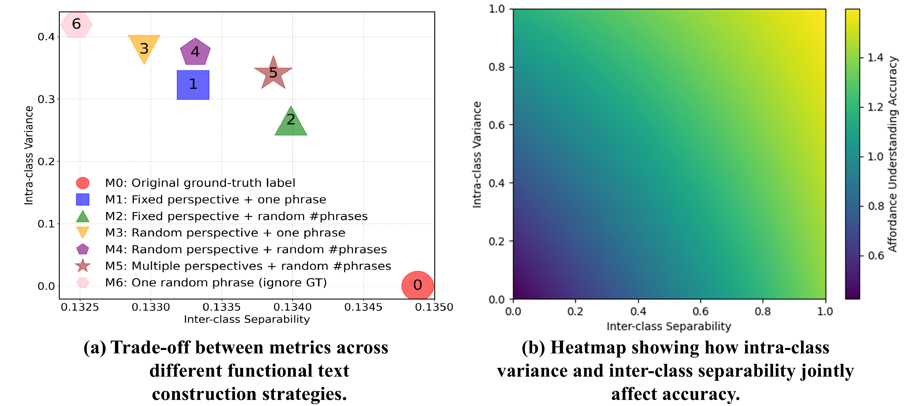

# Aff3DFunc：功能文本增强与多层表征对齐的开放词汇 3D 可供性理解

## 核心信息

- 标题: Open-Vocabulary 3D Affordance Understanding via Functional Text Enhancement and Multilevel Representation Alignment
- 标题翻译: 基于功能文本增强与多层表征对齐的开放词汇 3D 可供性理解
- 作者: Lin Wu、Wei Wei、Peizhuo Yu、Jianglin Lan
- 机构: 格拉斯哥大学 詹姆斯·瓦特工程学院（James Watt School of Engineering, University of Glasgow）
- 发表时间: 2025 年 10 月（MM '25，2025 年 10 月 27-31 日，爱尔兰都柏林）
- 发表渠道: ACM Multimedia 2025（第 33 届 ACM 国际多媒体会议）
- DOI: 10.1145/3746027.3755239
- arXiv: 无（本地文件为 ACM 正式出版版，非预印本）
- 论文链接: https://doi.org/10.1145/3746027.3755239
- 代码 / 项目: https://github.com/wulin97/Aff3DFunc
- 数据 / 资源: 3D AffordanceNet（22,949 个实例 / 23 类物体 / 18 类可供性）
- 论文类型: AI 方法（框架 + 训练目标 + 消融 + 实机验证）

## 原文摘要翻译

理解 3D 可供性对于智能体有效与现实世界环境交互至关重要，涵盖操作与导航等任务。现有方法通常通过基于标签的语言描述来支持开放词汇查询，但在泛化能力与表征判别力方面往往表现有限。然而，可供性理解需要从碎片化的语言表达中构建一个连贯的语义景观——它既要保留类内多样性，又要最小化类间重叠。为应对这些挑战，我们提出 Aff3DFunc，一个旨在增强可供性与 3D 几何之间对齐的框架。它首先引入一个以信息瓶颈（IB）原理为基础的功能文本增强模块，通过同时最大化相关性与多样性来系统性地丰富可供性语义。随后采用双编码器架构，分别从点云与文本中提取嵌入。为弥合模态鸿沟，我们进一步提出一种多层表征对齐策略，结合监督对比学习，以从局部到整体的方式强化语义与几何的对应关系。大量实验表明，我们的方法显著提升了对可供性复杂性的理解。所学到的表征对多样化的文本查询具有高度适应性，在零样本设定下尤为突出。此外，真实机器人验证证实，我们的方法改进了可供性理解，使更细粒度的操作任务成为可能。

## 创新点

- **功能文本增强：把信息瓶颈原理落成可操作的采样准则。** 论文不去直接优化难以计算的互信息，而是用类内方差与类间可分性两个可测代理量，从动作、功能、外观、环境四个视角构造概念池并按打分采样拼接。这为什么重要：它把开放词汇可供性定位的改进重心从「换几何骨干」挪到「重写文本语义空间」，是一条与换编码器正交的改进轴，同时给文本构造提供了一条可解释的取舍曲线。
- **多层表征对齐：让弱监督的中间层也能参与对齐。** 论文在 2048、512、128 三个点集层级上同时施加加权交叉熵与监督对比损失，中间层的「主导可供性」由点级标注在多次采样的点集上聚合得到。这为什么重要：它使区域级与点级嵌入共享同一条文本锚点，把「局部—整体」的多尺度几何都拉进同一语义空间，而且不需要额外的人工层级标注。
- **跨注意力几何精炼：把局部点集与全局上下文关联。** 论文用最远点采样加近邻分组切出点集，用多层感知机学习位置嵌入、用微型网络学集合嵌入，再送入注意力编码块。这为什么重要：消融显示它只带来约 1.6 毫秒的额外延迟，却贡献了最大的单项精度提升，属于低成本高回报的模块。
- **把「定位错误」写成安全后果的验证体系。** 论文除两条零样本评测线外，还加上冻结编码器的线性探针实验与四足机器人实机抓取试验，并明确对比对照方法误指向刀刃与耳罩触发急停的行为。这为什么重要：它把可供性理解从「指标高低」转译成「会不会出事」，是比单列一项分割指标更有说服力的证据形式，值得在后续工作中复用。

> [!warning] 命名不一致需留意
> 论文正文与摘要统一使用 Aff3DFunc，但结论段落改称 3DAffFunc。二者指同一方法，检索与引用时应以标题和 DOI 为准，避免被当成两篇工作。

## 一句话总结

> [!summary] 一句话总结
> 该工作把开放词汇 3D 可供性定位的瓶颈定位到**文本语义空间的构造方式**上：先用信息瓶颈原则在四个语义视角上采样拼接功能文本，再把三层几何嵌入与同一条文本锚点对齐，从而在 3D AffordanceNet 的两条零样本评测线上超过 OpenAD 与 KD-TPC，并在实机抓取中避开刀刃这类危险区域。

## 研究问题

### 可供性的「多对多」结构为什么难

论文把核心困难总结为可供性与物体之间的多对多关系：一个物体可以承载多种可供性，同一可供性又可以泛化到多个物体，如同副词之于动词。这带来三个连锁后果。

- **标签式描述的粒度不足以承载功能语义。** 同一句 grasp 无法区分「抓刀柄」与「抓刀刃」这类功能差异，而这恰恰是下游操作安全所依赖的区分。
- **标注数据的稀缺使直接学习语义空间不可行。** 可供性在几何上往往不可直接观测，仅靠少量标注难以对齐语义与几何。
- **更深层的是评价口径问题。** 论文认为要稳健对齐，第一步应当先系统刻画可供性的语义空间，而不只是把原始标签当作文本输入。

### 现有方法的短板

- **只对齐标签语义的路线**（如 OpenAD 以文本编码器配 PointNet++）虽然支持新标签，但文本侧信息量太小，表征判别力弱。
- **依赖图像或问句的路线各有代价**：图像线索受限于视觉可供性提示的泛化性，问句形式则抬高了任务复杂度且不够直接。
- **用大语言模型生成短语的路线**（如 3D-AffordanceLLM）效率受限，且短语选择缺乏可解释的准则。论文正是针对「短语该怎么选」这一空白提出可打分的构造流程。

## 数据与任务定义

### 任务形式化

给定包含 $n$ 个无序点的点云 $P=\{p_1,\dots,p_n\}$，其中每个点由三维欧氏坐标定义，再给定自然语言查询 $T=\{t_1,\dots,t_m\}$，目标是发现逐点的可供性区域。与固定标签方法不同，这里的查询长度 $m$ 理论上不受限制，查询形式可以是标签、问句或更长的功能描述，模型需要把一个功能文本与物体点云对齐。

### 数据集与评测协议

- 数据集为 3D AffordanceNet，规模 22,949 个实例，覆盖 23 个物体类别与 18 个可供性标签，是该领域规模最大的点云可供性数据集。
- 评测分两条零样本线。第一条是标签查询（Label-as-Query），用多标签查询考察对未见标签的检测，指标为 mIoU、Acc 与 mAcc。
- 第二条是问句查询（Question-as-Query），用情境问句考察定位，指标为 mIoU、AUC、SIM 与 MAE。
- 两条线的测试集分别来自 OpenAD 与 LASO，因此跨线比较必须固定协议。
- 为适配问句查询，论文把逐点判断为「更接近问句」还是「更接近背景」来生成掩码。因此问句线的指标口径取决于这套逐点判定方式，只有采用相同协议时数值才可直接比较。

### 基线设置

- 3DGenZ 与 ZSLPC 是三维零样本学习的强基线；OpenAD 与 KD-TPC 是开放词汇可供性检测的代表方法；LASO 是面向复杂情境查询的语言引导可供性分割方法。
- 论文明确说明，3DGenZ 与 ZSLPC 的结果取自 KD-TPC 的复现，其余基线在相同设置下重跑。这一点在跨表比较时很关键。
- 额外设置两个参考档：闭集全监督的 LASO 作为上界，以及冻结点云编码器后接线性分类头的 Ours，用于单独衡量表征质量。

## 方法主线

### 机制流程

*图 2：Aff3DFunc 框架总览，四个子模块分别为点云几何编码器、文本语义编码器与功能文本增强、多层表征对齐、跨注意力模块。*

1. **输入点云与可供性标签，送入文本侧构造流程。** 以标签为索引查询离线构建的概念池，按四个语义视角采样短语并拼接成一条功能描述，再送入冻结的文本编码器提取文本嵌入，得到对齐用的文本锚点。
2. **同一点云送入几何分支并行编码。** 编码层用最远点采样与近邻分组切出点集，分别经多层感知机得到位置嵌入、经微型网络得到集合嵌入，两者相加后进入注意力编码块，提取精炼后的集合嵌入。
3. **三层几何嵌入与同一条文本嵌入做跨模态对齐。** 在最深层的逐点嵌入与两个较浅的集合嵌入上分别计算加权交叉熵与监督对比损失，把同类拉近、异类推远，得到统一的语义与几何对应关系。
4. **输出逐点可供性响应并生成掩码。** 推理时只跑点云分支，用点嵌入与查询文本嵌入的余弦相似度得到逐点分数，阈值化后输出可供性掩码，供机器人操作使用。

### 功能文本增强：从信息瓶颈到两把标尺

论文用信息瓶颈形式化描述选择问题，目标是选出一个描述子集，使其与可供性之间的互信息最大、与完整概念集之间的冗余最小：

$$
S^{*} = \arg\max_{S'\subseteq S}\ I(A, S') - \beta\, I(S'; S)
$$

由于语言空间中的互信息不可直接计算，论文引入中间变量——一组由提示生成的可供性描述，并假设描述数量趋于无穷时它与可供性等价，从而把目标改写成可用描述集合表达的版本。更关键的是工程化这一步：论文用**类内方差**近似「提升与可供性的互信息」，用**类间可分性**近似「压低与原始概念集的冗余」，并把二者归一化后线性组合成单个效用分：

$$
\mathrm{Score}(S) = \alpha\,\tilde{V}(S) + (1-\alpha)\,\tilde{U}(S)
$$

这里的核心工程含义是：原本不可算的互信息被换成两个可在线测量、可画成散点图的量，使得「概念池该多大、短语该怎么拼」从直觉判断变成可调参的取舍问题。

### 四视角概念池与采样拼接

- 为抑制语言模型幻觉并控制不确定性，论文把描述限制在四个视角。
- **动作**：能对物体做什么，与该可供性相关的操作。
- **功能**：物体相对该可供性发挥的作用。
- **外观**：与动作或功能相关的视觉特征。
- **环境**：交互可能发生的场景条件。

四个视角各自采样短语后**拼接成整句**再交给文本编码器。论文明确比较了两种编码方式：先拼接再编码优于逐条编码再池化，因为后者会把归一化方差从 0.58 压到 0.29、类间可分性从 0.34 压到 0.13，等于同时损掉多样性与区分度。

### 几何分支与跨注意力

几何侧沿用 PointNet++ 的分层结构，采用三层编码与解码，配合下采样与上采样过渡和桥接连接。在此之上，论文借用了点云注意力的做法引入跨注意力：位置嵌入来自采样坐标，集合嵌入来自微型网络，二者逐元素相加后进入多头注意力与多层感知机组成的编码块，并以残差方式与原始集合嵌入融合，得到精炼后的几何表征。

### 训练目标与关键实现细节

训练在三个层级上同时施加两种损失，总目标是把两个损失按系数加权后跨层求和：

$$
\mathcal{L} = \sum_{l}\ \big(\mathcal{L}^{l}_{ce} + \lambda\,\mathcal{L}^{l}_{sc}\big)
$$

- **加权交叉熵**负责把几何嵌入拉向对应的功能文本嵌入，其中权重系数用于缓解可供性类别不平衡，温度参数可学习以控制确定性与探索的平衡。
- **监督对比损失**负责在批内区分正负样本，对每个出现的可供性最小化正样本到参考文本的距离并推远负样本。
- **层级标签的构造**是这套设计能跑通的前提：最深层的逐点参考标签显而易见，而中间层与浅层需要记录多次采样得到的点集，再依据点级标注统计出每个点集的主要可供性。
- **超参数**：三个层级分别使用 2048、512、128 个点集；文本与几何嵌入统一投影到 512 维共享空间；损失权重系数取 0.25；温度参数初始化为 $\ln(1/0.07)$。
- **优化设置**：文本编码器全程冻结，只优化点云分支；使用 Adam，学习率 0.001，批大小 16；全部实验在单张 20GB 显存的 RTX A4500 上完成。

## 关键结果

### 主结果：全视与部分视的标签查询

| 任务 | 方法 | mIoU | Acc | mAcc | 参数量 (M) |
| --- | --- | --- | --- | --- | --- |
| 全视 | 3DGenZ | 0.0646 | 0.4547 | 0.1833 | 1.79 |
| 全视 | ZSLPC | 0.0997 | 0.4013 | 0.1870 | 1.96 |
| 全视 | OpenAD | 0.1437 | 0.4631 | 0.1951 | 1.80 |
| 全视 | KD-TPC | 0.2233 | 0.4972 | 0.3429 | 0.78 |
| 全视 | Ours（去掉 CA） | 0.2653 | 0.5941 | 0.4501 | 0.92 |
| 全视 | Ours | **0.2942** | **0.6078** | **0.4829** | 3.20 |
| 部分视 | OpenAD | 0.1250 | 0.4525 | 0.1737 | 1.80 |
| 部分视 | KD-TPC | 0.2048 | 0.4872 | 0.3286 | 0.78 |
| 部分视 | Ours | **0.2615** | **0.6020** | **0.4105** | 3.20 |

*表 1：标签查询线的零样本检测结果，覆盖全视与部分视两种观测条件，数值取自论文表 1。*

> [!figure] 标签查询主结果表的原始表格图像
> 建议位置：关键结果
> 放置原因：这张表直接承载主结果，本应是最优先插入的表格图像。
> 当前状态：候选裁切与其声明的图号身份不符，判定为图号不匹配并伴随裁切越界，未通过视觉质量门，因此改用上方的 Markdown 表格重建全部数值。

读法上有四点需要注意。

- 论文正文写的「检测精度提升 14%、mIoU 提升 7%」实际是**以 KD-TPC 为参照的绝对百分点差**。
- 具体换算为：mAcc 从 0.3429 升到 0.4829，涨 14.00 个点；mIoU 从 0.2233 升到 0.2942，涨 7.09 个点。引用时不要照抄成相对提升。
- 部分视场景下的 mIoU 增益降到 5.67 个点，说明观测不完整会压缩方法优势。
- 去掉跨注意力的轻量版本参数量只有 0.92 M，mIoU 却已达 0.2653，提示主要增益来自文本侧与多层对齐，而非更重的几何模块。

### 主结果：问句查询与闭集上界的差距

| 方法 | mIoU | AUC | SIM | MAE | 参数量 (M) |
| --- | --- | --- | --- | --- | --- |
| LASO（闭集全监督） | 0.1995 | 0.8527 | 0.6080 | 0.1023 | 9.10 |
| OpenAD | 0.1026 | 0.5968 | 0.2251 | 0.1827 | 1.80 |
| KD-TPC | 0.1083 | 0.6066 | 0.3372 | 0.2563 | 0.78 |
| Ours（去掉 CA） | 0.1218 | 0.6153 | 0.3467 | 0.2760 | 0.92 |
| Ours | **0.1315** | **0.6216** | **0.3558** | 0.2716 | 3.20 |
| Ours（线性探针） | 0.1756 | 0.8438 | 0.6129 | 0.1078 | 3.20 |

*表 2：问句查询线的零样本检测结果，含闭集上界与线性探针参考档，数值取自论文表 2。*

> [!figure] 问句查询主结果表的原始表格图像
> 建议位置：关键结果
> 放置原因：该表是问句查询线的主结果表，适合与上方表格互为校核。
> 当前状态：候选裁切与其声明的图号身份不符，实际取到的是另一张表格的表体，属于身份不匹配且表体被裁切，未通过视觉质量门，已用上方 Markdown 表格重建。

这里最值得注意的是两点张力。

- 零样本设定下本方法的 mIoU 领先 OpenAD 2.89 个点，领先 KD-TPC 2.32 个点。
- 但绝对水平只有 0.1315，与闭集上界 0.1995 之间仍有明显差距。
- 反过来，冻结编码器后接线性探针的参考档在 AUC 与 SIM 上已逼近闭集全监督的 LASO（0.8438 对 0.8527、0.6129 对 0.6080），而参数量只有约三分之一。
- 这说明学到的几何表征质量确实变好了，但零样本下的区域定位仍受文本侧与对齐方式的限制。

### 定性结果：标签查询与问句查询

*图 3：标签查询下不同方法的可供性检测定性对比，行依次为真值、本方法、KD-TPC 与 OpenAD。*

*图 4：问句查询下的定性对比，四组案例分别为花瓶出水口、剪刀剪切接触点、微波炉开门位置与垃圾桶盖开启位置。*

图 3 显示本方法在花瓶瓶身、显示器屏幕这类局部区域给出了更干净的预测与更清晰的边界，但论文也承认在极小区域上仍会出错，例如刀尖。图 4 则说明问句这类功能性描述对零样本推理是有效的：模型能把「水会从哪一点流出」定位到瓶口而非瓶身，这正是功能文本相比标签的价值所在。

### 真实机器人验证

*图 7：四足移动平台配 6 自由度机械臂的真实抓取验证，试验 1 与 3 为本方法成功，试验 2 与 4 为对照方法指向非功能区域触发急停。*

机器人实验平台为 Unitree GO2 移动底盘加 6 自由度 D1 机械臂与平行夹爪，聚焦安全攸关的抓取任务，典型场景是区分刀柄可抓与刀刃危险。结果呈现明显的定性分野。

- 本方法定位到手柄与耳机头梁，可完成可靠的取放操作。
- 对照方法频繁指向刀刃与耳机耳罩，触发急停。
- 论文自陈这部分证据是定性的，没有给出成功率统计，因此只能作为趋势性证据。

### 消融到底说明了什么

*表 3：各组件逐步加入后的指标变化，左侧为标签查询、右侧为问句查询，数值取自论文表 3。*

把消融读成一条责任链会更清楚：

- **监督对比损失主要买「判别力」**：标签查询 mIoU 从 0.1531 升到 0.1963。
- **功能文本增强主要买「泛化」**：在监督对比的基础上再加功能文本，mIoU 进一步从 0.1963 升到 0.2504。
- **多层对齐补「多尺度局部性」**：叠加后到 0.2653；**跨注意力补「局部与全局的关联」**，最终到 0.2942。
- 累计组合比任何单项都高，但论文只给了单调叠加序列，没有做正交组合对照，因此无法判断后两者是否真的相互依赖。

### 功能文本增强的机制拆解

*表 4：功能文本构造策略的系统对比，覆盖语言模型选择、提示策略、采样与组合、短语融合四组设计选择。*

- **语言模型选择**：GPT 3.5、GPT 4o 与 DeepSeek R1 的差异很小（标签查询 mIoU 分别为 0.2942、0.2895、0.2795），说明收益来自构造流程而非某个特定模型。
- **提示策略**：只用标签为 0.1741、简单提示为 0.2145，而完整流程为 0.2942。这是全文最关键的一组对照。
- **采样与组合**：六个采样变体从 0.1812 递增到 0.2942，最优配置在类内方差与类间可分性之间取得平衡。
- **短语融合**：拼接优于逐条编码后池化（0.2942 对 0.2747），与理论预期一致。

### 效率与池大小

| 配置 | 浮点运算量 (G) | 参数量 (M) | 延迟 (ms) |
| --- | --- | --- | --- |
| Ours | 5.37 | 3.20 | 104.4 |
| Ours（去掉 CA） | 4.83 | 0.92 | 102.8 |
| Ours（去掉 ML） | 5.33 | 3.07 | 104.1 |

*表 6：推理效率对比，全部在单张 20GB 显存的 RTX A4500 上测得，数值取自论文表 6。*

> [!figure] 池大小与推理效率两张原始表格
> 建议位置：关键结果
> 放置原因：这两张表体积很小，适合直接插入以保留原始排版。
> 当前状态：池大小的候选裁切与表 4 的裁切字节完全相同，属于图号身份不匹配；效率表的候选裁切混入了小节标题与正文首行，正文污染无法分离。两者均未通过视觉质量门，数值已在正文以 Markdown 表格重建。

延迟数据揭示一个反直觉的结构：加入跨注意力的代价只有 1.6 毫秒（102.8 到 104.4 毫秒），却换来 2.89 个点的 mIoU，属于典型的低成本高回报模块；而去掉多层对齐反而几乎没有时延差（104.1 对 104.4 毫秒），说明这个模块的计算开销远比参数量差异看起来要小。

池大小方面，取值 4 时方差为 0.2889、可分性为 0.1339；取值 64 时变为 0.3463 与 0.1331；取值 100 时仅微调到 0.3537 与 0.1329。也就是说扩大概念池主要抬升类内方差，对可分性几乎无益甚至轻微有害，超过阈值后边际收益迅速衰减。

## 深度分析

### 为什么有效：改进点其实在文本侧

把全文的证据串起来，可以得到一个与论文标题一致但更锋利的判断：本文的主要增益来自**语义侧的构造方式**，几何侧基本沿用 PointNet++ 加注意力精炼的既有配方。

- 最直接的证据是提示策略对照：从标签到完整流程的 mIoU 提升（0.1741 到 0.2942）远大于任何几何模块带来的提升。
- 旁证来自语言模型的鲁棒性：换用不同的语言模型几乎不改变结果，说明不是模型能力在起作用，而是「从多视角采样再拼接」这一流程在起作用。
- 再一个旁证是轻量版本的表现：去掉跨注意力后参数量降到 0.92 M，mIoU 仍有 0.2653，说明表征可分性主要不是靠更大的几何网络换来的。

### 为什么有效：表征几何的可分性

*图 5：几何嵌入的 t-SNE 可视化，左侧子图为对照方法，右侧为本方法，可见类别边界更清晰且类内铺展更大。*

*图 6：功能文本策略的进一步分析，左侧为六种构造策略在方差与可分性上的权衡，右侧为两项指标对精度的联合影响热力图。*

图 5 给出了机制层面的解释：功能文本使类别边界更清晰，同时保留更大的类内铺展，也就是「同类更紧凑但不塌缩、异类更分开」。图 6 则揭示了这套设计的内部张力：把两个指标做最小二乘拟合后，交互项为负，意味着方差与可分性同时升高时会压低精度的增长率。这解释了一个看起来矛盾的现象——为什么最优采样配置不是把方差推到最大，而是取一个平衡点。

### 归因缺口与脆弱之处

- **缺少正交消融。** 论文只给出累计叠加的单调序列，没有单独测多层对齐与跨注意力的正交组合，因此「二者互补」这一说法目前只是事后解释，无法排除其中一项已经吸收了另一项的收益。
- **问句线的指标不单调。** 均方误差在消融中并不随组件增加而下降：基线为 0.1802，仅加监督对比后反而升到 0.3374，加到多层对齐后又降到 0.2760。这说明该指标对训练配置高度敏感，只挑好看的指标宣布改进是不成立的。
- **百分数表述与比较对象不统一。** 正文的 14% 与 7% 分别对应不同的基线指标，且都是绝对百分点差。跨论文引用时若不做换算，很容易把 7.09 个点误读成相对提升。
- **机器人证据是定性的。** 四组试验没有重复次数、没有成功率、没有跨物体曲线，因此「更安全」这一结论目前只能作为趋势性证据。

### 复现与部署注意点

- 概念池是离线构造的，训练时只做查询与拼接，因此复现成本主要集中在提示工程与池构建，而不在训练循环里。
- 文本编码器全程冻结，训练信号只回传到点云分支。这一点让线性探针实验成为可能，也意味着换更强的文本编码器不会自动带来增益，需要重新调对齐权重。
- 层级标签聚合是实现细节中最容易踩坑的一步：需要在多次采样过程中记录点集划分，再依据点级标注统计主导可供性，否则中间层的监督信号无法构造。
- 单卡 20GB 显存即可完成训练，但语言模型调用被放在离线阶段，实际部署时的成本结构需要把这一部分单列评估。

## 局限

- **绝对精度仍然很低。** 全视 mIoU 为 0.2942、部分视 0.2615、问句线仅 0.1315，论文自己也承认当前最好水平仍低于 0.3，因此「提升 7 个点」必须与 0.29 这个基数一起读。
- **细粒度区域是明确的失败面。** 论文直接点名刀尖这类极小功能区域，主区域准、极小区域不准，而这类区域恰恰是安全操作最敏感的地方，这与实机试验里对刀刃的依赖形成内在张力。
- **文本编码器的上下文长度构成天花板。** 论文把这一点列为主要局限，说明「加长功能描述」这条路线在当前编码器下走不通，方法的上限被文本侧长度限制锁住。
- **真实世界证据不完整。** 机器人实验只有四组定性试验，缺少重复次数、失败率与跨物体泛化曲线，论文自陈这部分是定性的，无法支撑成功率层面的结论。
- **数据与任务覆盖单一。** 全部实验只在 3D AffordanceNet 上完成，23 类物体与 18 类可供性都是室内小物体，不能直接外推到场景级或室外环境。
- **缺少不确定性度量。** 论文并未披露跨随机种子的方差，也没有给出逐类别的误差分布，这使得「哪一类可供性最脆弱」无法从公开数据回答。
- **概念池构造成本未计入效率结论。** 效率表只覆盖推理时延与参数量，语言模型调用与池构建的开销没有纳入，而这部分成本在标注稀缺的新场景中可能不可忽略。

## 我的笔记

### 可直接复用的三点

- **语义侧是与换骨干正交的改进轴。** 本文最值钱的操作是把「文本描述怎么造」变成一个可打分的优化问题：离线生成概念池，再用类内方差与类间可分性做筛选与采样。这条路不依赖新的几何网络，也不依赖新数据集，尤其适合标注稀缺的开放词汇设定。
- **多层对齐加冻结编码器的配方很便宜。** 在骨干的三个层级上共享同一条文本锚点，配合「冻结编码器 + 线性探针」来单独衡量表征质量，是一套低成本的验证组合：既能拿到多尺度监督，又能在不微调文本侧的前提下判断编码器是否真的变好。
- **把定位错误写成安全后果。** 用「误指向刀刃会不会触发急停」来组织实机实验，比只报一项分割指标更能说明可供性理解的价值。这个证据形式可以直接迁移到其它需要区分功能区域与危险区域的任务上。

### 需要在后续工作中验证的疑点

- 多层对齐与跨注意力缺少正交消融，如果要在自己的工作里引用「二者互补」这一说法，最好先把正交实验补上。
- 问句线的指标不稳定提示这套训练目标可能存在置信度标定偏差，若要做不确定性相关工作，需要先看清误差分布而不仅看单一均值。
- 论文百分之七的 mIoU 提升对应的是绝对值而非相对值，在和自己工作比较时必须统一口径。
- 命名在正文与结论之间不一致，做文献计量或去重时需要按 DOI 合并。

### 与自身选题的关系

本工作属于「语义侧改造」而非「几何侧改造」，因此与以换编码器或换骨干为主张的路线不构成正面撞车；但它已经占据了「功能文本增强」这一位置。如果后续想在同一方向继续推进，可辩护的差异点应当落在**文本构造与不确定性的耦合**上，例如让概念池的采样权重随几何侧观测质量变化，而不是再提出一种新的采样启发式。

## 引用

- 原文：Lin Wu, Wei Wei, Peizhuo Yu, Jianglin Lan. 2025. Open-Vocabulary 3D Affordance Understanding via Functional Text Enhancement and Multilevel Representation Alignment. In Proceedings of the 33rd ACM International Conference on Multimedia (MM '25), October 27–31, 2025, Dublin, Ireland. DOI: 10.1145/3746027.3755239
- 数据集来源：3D AffordanceNet，本文全部实验的数据基础，22,949 个实例、23 类物体与 18 类可供性。
- 主要对照 1：OpenAD，开放词汇可供性检测，提供标签查询线的测试集与部分基线结果，见论文参考文献 [34]。
- 主要对照 2：KD-TPC，通过几何知识蒸馏与文本点相关性增强对齐，本文最强基线，见论文参考文献 [40]。
- 主要对照 3：LASO，语言引导的可供性分割，提供问句查询线的测试集并在闭集设定下充当上界，见论文参考文献 [23]。
- 对照 4：3D-AffordanceLLM，用大语言模型嵌入可供性标签，本文批评其效率与短语选择准则，见论文参考文献 [7] 与 [8]。
- 方法依据：信息瓶颈原理与监督对比学习，分别见论文参考文献 [9]、[25] 与 [20]。
