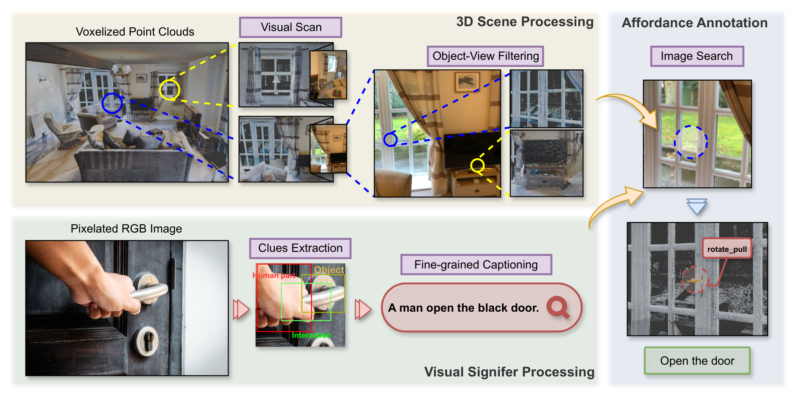
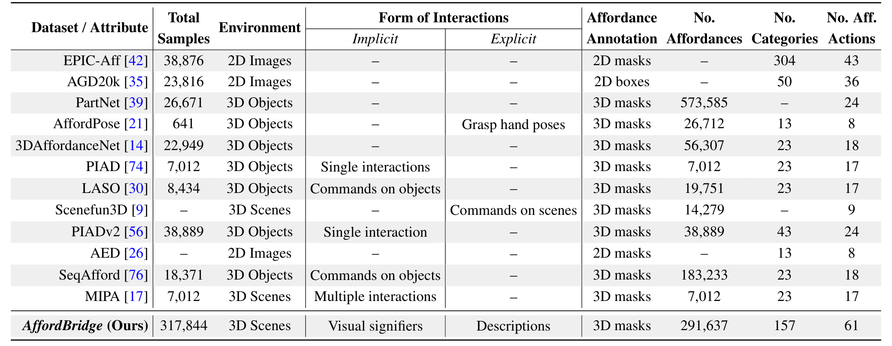
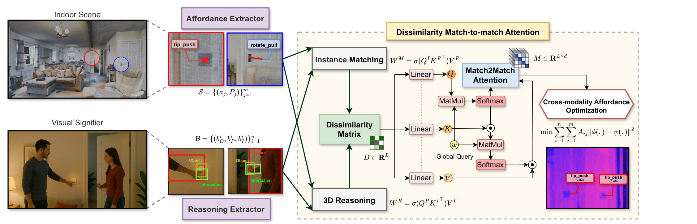
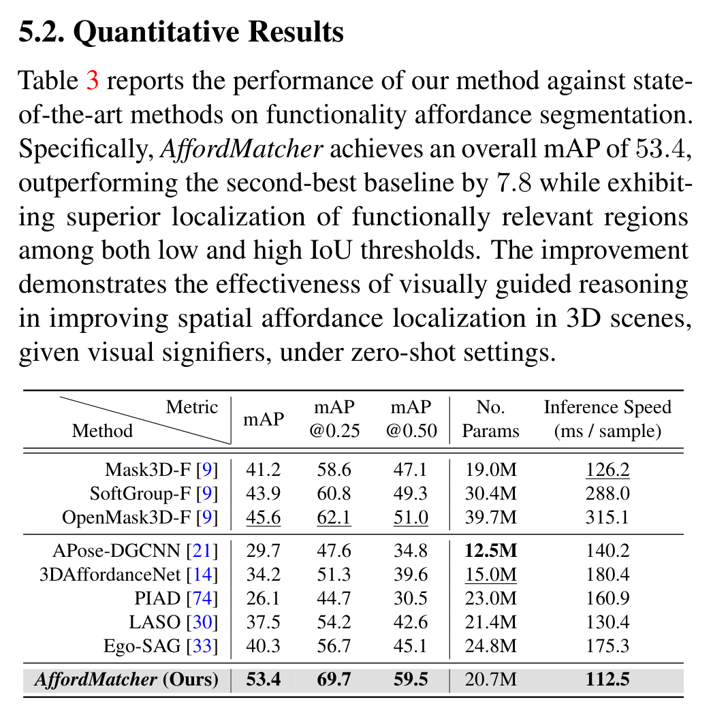
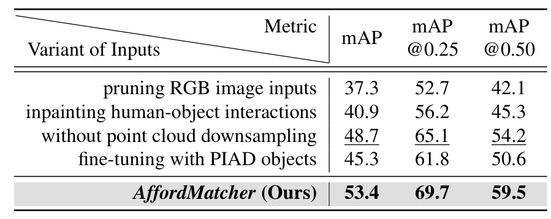
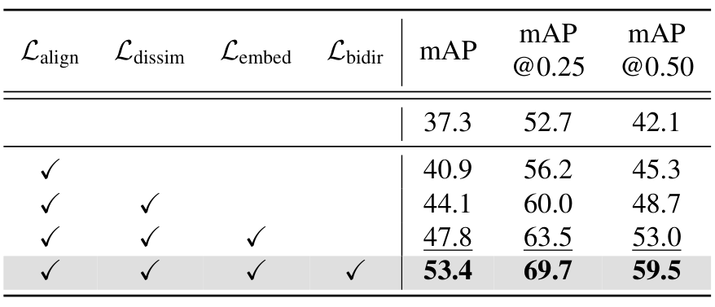
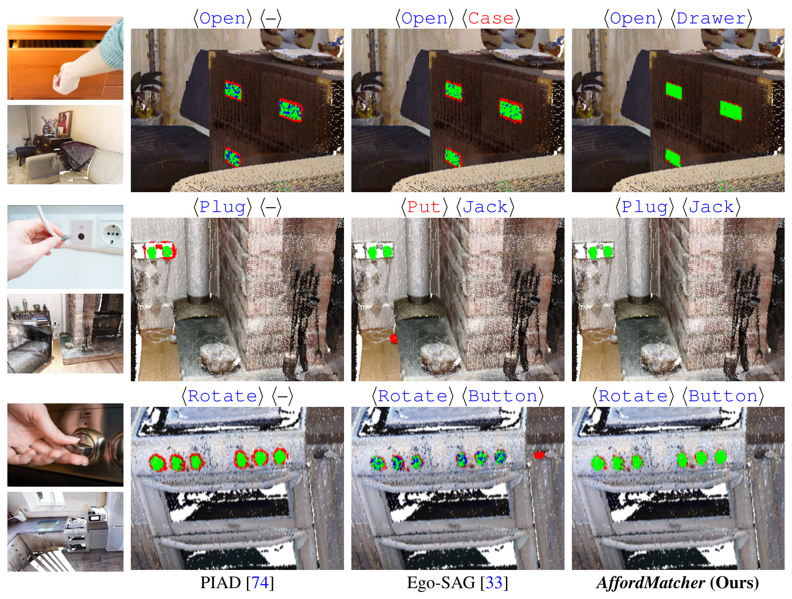

# AffordMatcher：从视觉指示符学习 3D 场景可供性

## 核心信息

- 标题: AffordMatcher: Affordance Learning in 3D Scenes from Visual Signifiers
- 标题翻译: AffordMatcher：从视觉指示符学习 3D 场景可供性
- 作者: Nghia Vu*, Tuong Do*, Khang Nguyen, Baoru Huang, Nhat Le, Binh Xuan Nguyen, Erman Tjiputra, Quang D. Tran, Ravi Prakash, Te-Chuan Chiu, Anh Nguyen（* 共同一作）
- 机构: 利物浦大学；AIOZ（新加坡）；台湾清华大学（中国台湾）；MBZUAI；西澳大学；印度科学理工学院；NVIDIA
- 发表时间: 2026-03-30（arXiv v1）
- 发表渠道: arXiv 预印本（arXiv:2603.27970，cs.CV）
- DOI: 10.48550/arxiv.2603.27970
- arXiv: 2603.27970
- 论文链接: https://arxiv.org/abs/2603.27970
- 代码 / 项目: https://aioz-ai.github.io/AffordMatcher/
- 数据 / 资源: 自建 AffordBridge 数据集（317,844 对 2D-3D 配对样本）；底层扫描来自 SceneFun3D，交互图取自 PIAD
- 论文类型: AI 方法论文（数据集 + 场景级可供性定位方法）

## 原文摘要翻译

可供性学习在许多应用中是一个复杂挑战，现有方法主要依赖物体的几何结构、视觉知识与可供性标签来确定可交互区域。然而，把这一学习能力扩展到场景层面要困难得多，因为融入物体级与场景级语义并非易事。本文提出 AffordBridge——一个大规模数据集，在 685 个高分辨率室内场景（点云形式）上提供 291,637 条功能性交互标注；这些可供性标注还配有与场景中同一实例关联的 RGB 图像。在该数据集之上，我们提出可供性学习方法 AffordMatcher，它在基于图像的实例与基于点云的实例之间建立连贯的语义对应以进行关键点匹配，从而基于所谓"视觉指示符"（visual signifier）的线索更精确地识别可供性区域。在数据集上的实验结果表明，与其他方法相比，本文方法的有效性得到了验证。

## 创新点

- **任务重定义：从文本指令转向视觉指示符**：输入不是"按这里""转动旋钮"这类几何上含糊的语言指令，而是带有人-物交互的 RGB 图（人、物、交互三个框 + 手部接触关键点 + 细粒度描述），从可观察的交互线索出发做场景级定位，直击"可供性须可物理验证"的动机。
- **AffordBridge 数据集**：317,844 个 2D-3D 配对样本、685 个场景、291,637 个体素级可供性掩码、157 类物体、61 种动作，规模比此前场景级数据集（Scenefun3D、MIPA）高一个数量级，且首次同时配齐显式/隐式交互描述、RGB 图与场景点云掩码。
- **不相似度匹配对间注意力**：先做双向跨模态注意力得到两个方向的匹配特征，再逐对算余弦不相似度，把整个不相似度矩阵展平后用加性自注意力在"匹配对"之间推理——把语义对应文献（TransforMatcher）的思路迁移到可供性跨模态对应。
- **一对多软阈值机制**：对不相似度小于 0.2 的高相似对允许在匹配矩阵中多次传播，配合标注时保留前三个候选实例，处理"一个视觉线索对应多个 3D 实例"的场景级特有歧义。
- **四项损失的跨模态优化目标**：单位超球嵌入约束、基于 S-CLIP 伪目标的对齐损失、双向投影一致性、注意力不相似惩罚，累计带来 +16.1 mAP。

## 一句话总结

AffordMatcher 用"交互图 → 双向跨模态注意力 → 不相似度矩阵 → 匹配对间自注意力"的链路，把 RGB 里的人-物交互线索显式匹配到体素化场景的可交互区域，在自建大规模场景级数据集 AffordBridge 上以 mAP 53.4（次优 +7.8）、20.7M 参数、112.5 ms/样本取得精度与效率双优；但评测仅限自建基准，架构增益与损失增益未解耦，推理仍需在线跑 2D 分支。

## 研究问题

把可供性学习从单物体推广到完整场景面临四重困难（引言自陈）：

1. **跨模态分布差异**：图像与点云特征空间差异显著，直接融合不易。
2. **匹配设计难度**：跨场景、多动作下同时做"3D 域定位 + 图像域检测"需要精细的模型设计。
3. **语言指令的几何歧义**：像"press here""rotate knob"这样的指令缺乏显式几何语境（作者以此对比 PIAD/LASO 的文本驱动路线）。
4. **数据缺口**：现有数据集几乎都缺少"带交互线索的 RGB 图 + 已标注 3D 可供性区域"的配对标注，无法端到端训练与评测。

作者把核心问题凝练为：如何从视觉指示符学习能在不同场景间匹配多样空间可供性的表示。与本工作区的关联：它是**场景级（G3 相邻槽位）+ 2D-3D 配对**的代表作，且把输入模态从文本换成了交互图像。

## 数据与任务定义

*AffordBridge 三阶段半监督构建流程：3D 场景处理、视觉指示符处理、可供性标注。*

### 任务定义

场景点云 $P=\{(p_i,f_i)\}$，逐点特征 $f_i$ 为六维 RGB 颜色与法向。

每个视觉指示符是一张交互图，标注人、物、交互三个框 $b=(b_H,b_O,b_I)$（沿用 MUREN 记法），并叠加 OpenPose 手部关键点。

目标：给定指示符，在体素化场景中分割出对应的可交互区域（体素掩码），零样本协议——测试的场景与实例未参与训练。

### 构建流程（三阶段半监督）

1. **3D 场景处理**：取 SceneFun3D 原始扫描，体素化降采样到 10 万点（体素边长 0.05 m）；SLAM 轨迹估计把 RGB 视频帧按深度对齐投影到 3D 分割段，多视角检查剔除遮挡与错位；用 MobileNet 检测候选物体并按空间位置、尺度、上下文相关性排序，约 15% 不一致匹配人工剔除，三人交叉标注要求 Kappa 系数大于 0.75。
2. **视觉指示符处理**：交互图沿用 PIAD，仅保留直接人-物接触的样本；三框标注加 OpenPose 关键点增强接触区域；用 Object Relation Transformer 生成模板化细粒度描述，全部人工核验语义与空间正确性。

> A man opens the black door.

3. **可供性标注**：CLIP 图文嵌入经对比学习微调后，按余弦相似度检索关键视角；标注员在网页界面把 2D 视角映射到 3D 实例掩码（映射式见下）；为避免一对多歧义保留前三个候选再人工定夺，约 5% 样本重标注。

$$M_i=\arg\max_{M_j\in P}\ \phi_{sim}(I_i,M_j)$$

其中 $\phi_{sim}$ 度量关键视角与 3D 实例之间的视觉-几何相似度。

### 统计与划分

*表 1：与 12 个可供性数据集的对比（已逐格读图核验）。*

| 数据集 | 总样本 | 环境 | 交互形式 | 掩码 | 动作数 | 类别数 | 可供性动作数 |
| --- | --- | --- | --- | --- | --- | --- | --- |
| EPIC-Aff | 38,876 | 2D 图像 | — | 2D 掩码 | — | 304 | 43 |
| AGD20k | 23,816 | 2D 图像 | — | 2D 框 | — | 50 | 36 |
| PartNet | 26,671 | 3D 物体 | — | 3D 掩码 | 573,585 | — | 24 |
| AffordPose | 641 | 3D 物体 | 抓握手姿 | 3D 掩码 | 26,712 | 13 | 8 |
| 3DAffordanceNet | 22,949 | 3D 物体 | — | 3D 掩码 | 56,307 | 23 | 18 |
| PIAD | 7,012 | 3D 物体 | 单交互 | 3D 掩码 | 7,012 | 23 | 17 |
| LASO | 8,434 | 3D 物体 | 物体指令 | 3D 掩码 | 19,751 | 23 | 17 |
| Scenefun3D | — | 3D 场景 | 场景指令 | 3D 掩码 | 14,279 | — | 9 |
| PIADv2 | 38,889 | 3D 物体 | 单交互 | 3D 掩码 | 38,889 | 43 | 24 |
| AED | — | 2D 图像 | — | 2D 掩码 | — | 13 | 8 |
| SeqAfford | 18,371 | 3D 物体 | 物体指令 | 3D 掩码 | 183,233 | 23 | 18 |
| MIPA | 7,012 | 3D 场景 | 多交互 | 3D 掩码 | 7,012 | 23 | 17 |
| AffordBridge（本文） | 317,844 | 3D 场景 | 视觉指示符 + 描述 | 3D 掩码 | 291,637 | 157 | 61 |

（Scenefun3D 与 AED 在原表中总样本列为空，PartNet、AffordPose 个别列的归属以原表图为准。）

划分：训练 206.6K / 验证 63.6K / 测试 47.7K；视觉指示符 9,870 条，3D 场景 689 个（正文另处写 685，前后不一致，待核对）。物体分布：椅子 28.2%、杯子 18.9%、桌子 8.1%、书 7.8%、灯 7.5%、按钮 8.7%、箱子 6.1%、其他 14.7%——长尾并不极端，但"椅子 + 杯子"近半，类别均衡性主张要打折。

## 方法主线

*AffordMatcher 架构总图：从实例匹配、不相似度矩阵到匹配对间注意力与跨模态优化。*

### 机制流程

1. **双分支特征提取**：输入为视觉指示符图像与体素化场景点云。推理提取器（ViT-B/16 加两层投影头）编码人、物、交互三框特征；可供性提取器（PointNet++ 加两层投影头）把候选三维区域（动作描述符加局部点云）编码到同一空间。
2. **实例匹配（双向跨模态注意力）**：两组特征分别线性投影出查询、键、值三组向量，做双向注意力，得到两个方向的匹配特征（式见下）：$W^{(M)}$ 定位被指示符引导的空间关键点特征，$W^{(R)}$ 捕捉从三维上下文回传的推理反馈。

$$W^{(M)}=\mathrm{softmax}\bigl(Q^{(I)}K^{(P)\top}\bigr)V^{(P)},\qquad W^{(R)}=\mathrm{softmax}\bigl(Q^{(P)}K^{(I)\top}\bigr)V^{(I)}$$

3. **不相似度量化与匹配对间注意力**：逐对计算余弦不相似度得到矩阵 $D$（截断形式待核对）；把 $D$ 展平成序列投影后做 FastFormer 式加性自注意力，多头投影出匹配矩阵，交给框与掩码预测头（式见下）。对 $D_{ij}<0.2$ 的高相似对允许多次传播以处理一对多。

$$D_{ij}=\max\Bigl\{0,\;1-\frac{W^{(M)}_i\cdot W^{(R)}_j}{\|W^{(M)}_i\|_2\,\|W^{(R)}_j\|_2}\Bigr\}$$

$$Z=K\odot\sigma(Qw_q)^{\top}Q,\qquad M=V\odot\sigma(Zw_k)^{\top}Z$$

其中 $\sigma$ 为逐元素 sigmoid 函数，$\odot$ 为哈达玛积；多头投影后得到最终匹配矩阵（式见下）。

$$\mathcal{M}=\mathrm{MultiHead}(M)\,W_h+b_h$$

4. **跨模态可供性优化与输出**：四项损失联合训练（见下），推理时对场景点云输出零样本可供性分割掩码。

### 训练目标

匹配问题的形式化目标（式 1）：

$$\min_{\phi,\psi}\sum_{i=1}^{n}\sum_{j=1}^{m}A_{ij}\,\bigl|\phi(b_i)-\psi(a_j,P_j)\bigr|^{2},\qquad \text{s.t.}\ \sum_{j=1}^{m}A_{ij}=1$$

其中 $A_{ij}$ 是指示符 $b_i$ 与可供性实例 $(a_j,P_j)$ 的对齐置信度。总损失（式 11）：

$$\mathcal{L}_{\text{total}}=\mathcal{L}_{\text{embed}}+\lambda\,\mathcal{L}_{\text{align}}+\gamma\,\mathcal{L}_{\text{bidir}}+\eta\,\mathcal{L}_{\text{dissim}}$$

- 嵌入正则：把两组投影嵌入约束在单位超球上（范数恒为 1）并加权重正则。
- 对齐损失：以 S-CLIP 伪目标（CLIP 文本嵌入的凸组合）监督匹配矩阵，让匹配结果逼近文本语义结构（式见下）。

$$\mathcal{L}_{\text{align}}=\sum_{i=1}^{n}\sum_{j=1}^{m}A_{ij}\,\|M_{ij}-T_{ij}\|_2^2$$

- 双向损失：两个线性投影头做双向映射一致性约束（式见下）。

$$\mathcal{L}_{\text{bidir}}=\sum_{i,j}A_{ij}\Bigl(\|g_{\text{ins}}(\phi_i)-\psi_j\|_2^2+\|g_{\text{r}}(\psi_j)-\phi_i\|_2^2\Bigr)$$

- 不相似损失：惩罚两个方向匹配特征的余弦分歧，直接压低跨模态注意力不一致（式见下）。

$$\mathcal{L}_{\text{dissim}}=\sum_{i,j}A_{ij}\left[1-\frac{W^{(M)}_i\cdot W^{(R)}_j}{\|W^{(M)}_i\|_2\|W^{(R)}_j\|_2}\right]$$

### 关键实现细节

单卡 RTX 3090 训练 100 轮，批大小 16，初始学习率 $10^{-4}$ 每 30 轮减半；图像缩放到 224×224 并做视觉与姿态增广；场景体素化到 64³ 网格，用预训练 3D 分割模型切出二值掩码候选作为可供性候选。这意味着**候选质量上限由实例分割决定**，方法本身不负责发现实例。

## 关键结果

*表 3：主对比结果（AffordBridge 测试集，零样本）。*

| 方法 | mAP | mAP@0.25 | mAP@0.50 | 参数量 | 速度（ms/样本） |
| --- | --- | --- | --- | --- | --- |
| Mask3D-F | 41.2 | 58.6 | 47.1 | 19.0M | 126.2 |
| SoftGroup-F | 43.9 | 60.8 | 49.3 | 30.4M | 288.0 |
| OpenMask3D-F | 45.6 | 62.1 | 51.0 | 39.7M | 315.1 |
| AffordPose-DGCNN | 29.7 | 47.6 | 34.8 | 12.5M | 140.2 |
| 3DAffordanceNet | 34.2 | 51.3 | 39.6 | 15.0M | 180.4 |
| PIAD | 26.1 | 44.7 | 30.5 | 23.0M | 160.9 |
| LASO | 37.5 | 54.2 | 42.6 | 21.4M | 130.4 |
| Ego-SAG | 40.3 | 56.7 | 45.1 | 24.8M | 175.3 |
| AffordMatcher（本文） | 53.4 | 69.7 | 59.5 | 20.7M | 112.5 |

同表内看：领先次优方法 +7.8，且在高 IoU 阈值下优势更大（@0.50 +8.5），说明定位更"准"而不只是更"宽"；同时参数更少、速度最快。

另一个观察：三维实例分割功能化系（Mask3D、SoftGroup、OpenMask3D 的改造版）整体强于物体级可供性方法的移植（PIAD 仅 26.1）——**直接把物体级方法搬到场景级会崩**。

*表 4：输入模态消融。*

| 输入变体 | mAP | mAP@0.25 | mAP@0.50 |
| --- | --- | --- | --- |
| 去掉 RGB 图输入 | 37.3 | 52.7 | 42.1 |
| 把人-物交互 inpaint 掉 | 40.9 | 56.2 | 45.3 |
| 不做点云降采样（>50 万点） | 48.7 | 65.1 | 54.2 |
| 用 PIAD 物体微调 | 45.3 | 61.8 | 50.6 |
| 完整版（本文） | 53.4 | 69.7 | 59.5 |

*表 5：损失组件逐项累加消融（首行为语义可供性基线）。*

| 配置 | mAP | mAP@0.25 | mAP@0.50 |
| --- | --- | --- | --- |
| 基线 | 37.3 | 52.7 | 42.1 |
| +对齐损失 | 40.9 | 56.2 | 45.3 |
| +不相似损失 | 44.1 | 60.0 | 48.7 |
| +嵌入正则 | 47.8 | 63.5 | 53.0 |
| +双向损失（完整） | 53.4 | 69.7 | 59.5 |

每加一项损失都有单调增益，累计 +16.1——但注意这是"逐项累加"而非"逐项去除"，单项边际贡献的解读要谨慎（累加顺序也会影响最后几项的归因）。

*图 8：与 PIAD、Ego-SAG 的定性对比——PIAD 欠分割、Ego-SAG 过分割，本文掩码更紧凑。*

补充材料还有：20 名三维视觉专家的用户研究（40 场景、5 级量表），本文均分 4.2，68% 场景被评为最佳（配对 t 检验显著）。

对手均分：Mask3D-F 3.1、Ego-SAG 3.3、PIAD 3.4。

可视化方面：t-SNE 显示加视觉推理后可供性类型簇更紧更分离；同一把椅子上"坐"与"拉"激活不同区域（座垫前部与背部扶手）。

## 深度分析

### 为什么有效：2D 交互语义主导收益

三条证据链指向同一结论：去 RGB 分支 -16.1；把人手修补掉 -3.6；注意力可视化显示模型跟着"指示符"走。

> Rest on Pillow: the 2D attention concentrates on the pillow region, and the 3D attention highlights the corresponding seating surface voxels.

这与本工作区已确认的"语义 > 几何"互证：HAMMER 去文本语义监督 -4.93、O³Afford 去 DINOv2 -19.60，本文去 2D 分支 -16.1。**场景级可供性的瓶颈在跨模态语义对应，不在几何编码器**——换更强的 3D 骨干在这篇论文里连被消融的资格都没有。

### 架构增益与损失增益未解耦

匹配对间注意力是全文最大的架构卖点，但表 5 只消融损失项，没有"匹配对间注意力 vs 普通逐点交叉注意力"的对照；一对多软阈值同样只有定性支撑（补充材料里同一个"打开"线索定位到窗闩、把手、门钮多个实例）。因此"架构带来了多少收益"在论文内不可回答——这是复现者最该补的实验。

### 结论边界与协议陷阱

- 主结果只在自建 AffordBridge 测试集上报告，无任何外部基准；"零样本"指未见场景/实例，但训练测试同源同标注协议，不是分布外泛化。
- 评测指标是按 IoU 阈值取平均的 mAP 系列，与 PIAD 系的 aIoU/MAE/AUC 不兼容，跨论文数字不可直接比较（本工作区红线：优先比同表内相对提升）。
- 可供性候选由预训练 3D 分割模型给出，方法的上限受实例分割召回约束，论文未报告候选召回率。
- "用 PIAD 物体微调掉 8.1"被用来论证场景级优于物体级，但该行同时改变了训练数据构成，不是严格单变量对照。
- 表 1 数字与正文统计存在小口径漂移（685 vs 689 个场景；摘要 291,637 掩码 vs 表 1 汇总 317,844 样本），引用时需注明出处位置。

### 与本工作区既有工作的定位对照

- 对比 GEAL/HAMMER（物体级、单物体点云 + MLLM 意图）：本文不需要 MLLM，用"交互图 + 显式匹配"把意图信号变成可监督的对应问题；推理无重模型，与"训练时教师 + 推理轻量化"的叙事不冲突，反而佐证。
- 对比 Scenefun3D：后者只支持文本检索可供性，本文用交互图替代文本——"视觉指示符驱动的场景级可供性"这个槽位已被占掉，空白地图里应记入。
- 它的 2D-3D 配对数据管线（SLAM 对齐 + CLIP 检索关键视角 + top-3 投影 + 人工核验）是低成本构造配对标注的可复用模板，对我们若做蒸馏类方法是现成数据源。

## 局限

作者自陈与补充材料实证：

1. **内存与可扩展性**：高精细场景下计算成本显著上升；消融显示不降采样的原始点云（>50 万点）反而掉 4.7，显存是硬约束。
2. **语义歧义**：重叠可供性与动作不清时出错——打台球时"推"从哪一侧推无法判断；"转动"与"推"混淆（补充材料图 12 两个失败案例）。
3. **稀疏点云**：补充材料点名稀疏点云场景表现受限。
4. **时间与交互**：结论里把时序与机器人在线交互列为未来工作，当前是静态单帧指示符。
5. 结合上文：架构贡献未做隔离消融；评测仅自建基准；候选掩码上限依赖实例分割。

## 我的笔记

- **可被 UZ3DVG 式质疑的点**：本文推理在线跑双分支（ViT-B/16 + PointNet++）加实例分割候选，112.5 ms 的速度叙事依赖自建统计；如果按"训练时重、推理时蒸馏轻量化"的范式去打它，2D 分支正是可蒸馏对象——但它没做蒸馏，这是它与我们关注路线的接口，也是它的弱点。
- **AffordBridge 的真实价值可能大于方法价值**：61 动作 × 157 类别 × 2D-3D 配对掩码，是做 2D→3D 可供性蒸馏、置信度校准（G5）与开放词汇覆盖度评测的现成基准；需确认项目页是否真放出了下载（论文未给许可条款，待核对）。
- **指标体系提醒**：按 IoU 阈值平均的 mAP 与 aIoU 不可横比；引用本文数字时一律标"AffordBridge 测试集 × 表 3"。
- **一对多软阈值（不相似度小于 0.2 时多次传播）是个便宜的工程技巧**，在同类多实例消歧场景（G3' 关心的槽位）值得记住；ScanRefer/MiKASA 的消歧协议经验与此同向。
- 未解之问：匹配对间注意力的独立增益？候选实例召回上限？项目页代码与数据是否可复现？

## 引用

- Delitzas et al. SceneFun3D: Fine-grained functionality and affordance understanding in 3D scenes. CVPR 2024.（本文扫描数据来源与 3D 分割基线来源）
- Yang et al. Grounding 3D object affordance from 2D interactions in images (PIAD). ICCV 2023.
- Li et al. LASO: Language-guided affordance segmentation on 3D object. CVPR 2024.
- Kim & Cho. TransforMatcher: Match-to-match attention for semantic correspondence. CVPR 2022.（匹配对间注意力来源）
- Li et al. 2D3D-MATR: 2D-3D matching transformer for detection-free registration. ICCV 2023.
- Wu et al. FastFormer: Additive attention can be all you need. arXiv 2021.
- Mo et al. S-CLIP: Semi-supervised vision-language learning using few specialist captions. NeurIPS 2023.
- Takmaz et al. OpenMask3D: Open-vocabulary 3D instance segmentation. NeurIPS 2023.
- Liu et al. Grounding 3D scene affordance from egocentric interactions (Ego-SAG). arXiv 2024.
- Yao et al. HAMMER: Intention-driven 3D affordance grounding. arXiv 2603.02329.（本工作区基线，对照物体级路线）
- Kim et al. MiKASA: Multi-key-anchor and scene-aware transformer for 3D visual grounding. CVPR 2024.（同类多实例消歧协议，工作区交叉参考）
