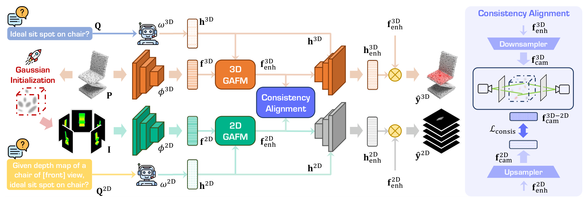
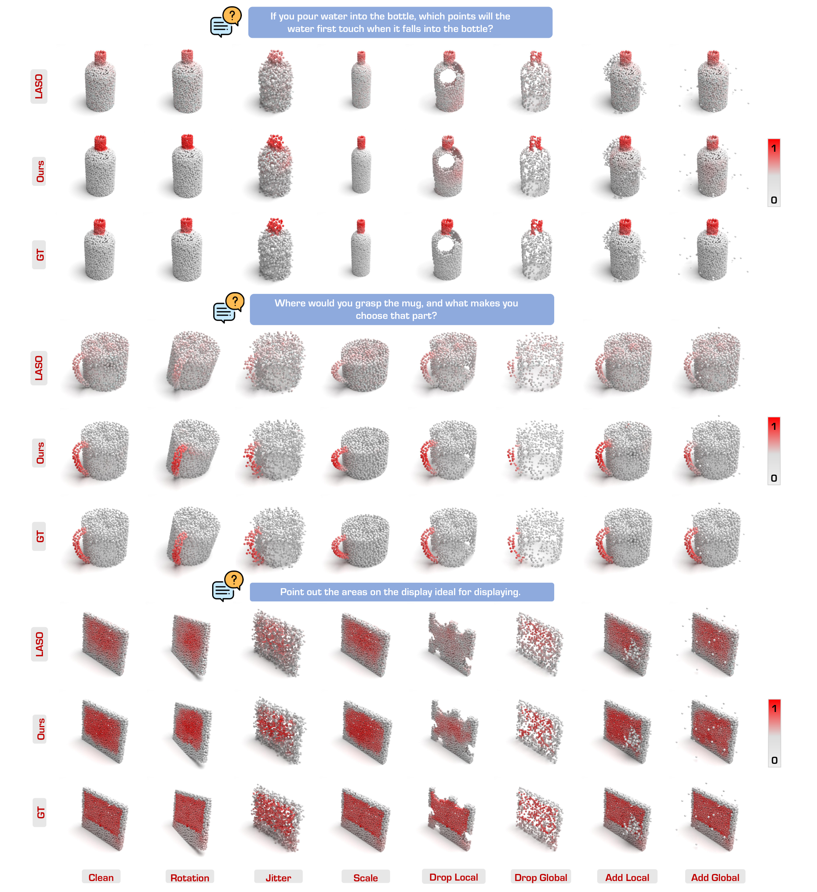

---
tags:
  - papers/3d-affordance
  - papers/cross-modal-learning
  - papers/robustness
aliases:
  - GEAL
  - Generalizable 3D Affordance Learning
date: 2024-12-12
doi: 10.1109/CVPR52734.2025.00164
arxiv_id: 2412.09511
---

# GEAL：基于跨模态一致性的可泛化三维可供性学习

## 核心信息

- 标题: GEAL: Generalizable 3D Affordance Learning with Cross-Modal Consistency
- 标题翻译: GEAL：基于跨模态一致性的可泛化三维可供性学习
- 作者: Dongyue Lu, Lingdong Kong, Tianxin Huang, Gim Hee Lee
- 机构: National University of Singapore
- 发表时间: 2024-12-12（arXiv）；2025（CVPR）
- 发表渠道: 2025 IEEE/CVF Conference on Computer Vision and Pattern Recognition（CVPR 2025）
- DOI: 10.1109/CVPR52734.2025.00164
- arXiv: 2412.09511
- 论文链接: https://arxiv.org/abs/2412.09511
- 代码 / 项目: https://dylanorange.github.io/projects/geal ｜ https://github.com/DylanOrange/geal
- 数据 / 资源: https://huggingface.co/datasets/dylanorange/geal
- 论文类型: 三维视觉方法论文；同时贡献点云腐化评测基准

## 原文摘要翻译

从语义提示中识别三维物体上的可供区域，对机器人和人机交互至关重要。然而，现有三维可供性学习方法受限于标注数据不足，并依赖侧重几何编码的三维骨干网络，因此在泛化能力与稳健性方面表现不佳，对真实世界噪声和数据腐化也往往缺少抵抗力。本文提出 GEAL，一种利用大规模预训练二维模型提升三维可供性学习泛化性与稳健性的新框架。该方法采用双分支架构，并通过高斯泼溅在三维点云与二维表示之间建立一致映射，从稀疏点云生成逼真的二维渲染。粒度自适应融合模块和二维—三维一致性对齐模块进一步加强跨模态对齐与知识迁移，使三维分支能够利用二维模型丰富的语义和泛化能力。为全面评估稳健性，作者还提出两个基于腐化的基准 PIAD-C 和 LASO-C。公开数据集及新基准上的大量实验表明，GEAL 在已见物体类别、新物体类别和受腐化数据上均持续优于现有方法，能够在多种条件下实现稳健且适应性较强的可供性预测。代码与腐化数据集已公开。

## 创新点

1. **把三维高斯泼溅用作二维基础模型与稀疏点云之间的接口。** GEAL 不把点云直接投影成稀疏像素，而是把点坐标初始化为高斯中心，从多视角渲染带深度结构的二维图像，使冻结的 DINOv2 能真正参与三维可供性学习。
2. **设计粒度自适应视觉—文本融合。** GAFM 同时处理“按钮、把手”等细粒度区域和“座面、支撑面”等大范围区域，用带噪门控学习不同层级特征的权重，再用文本条件交叉注意力注入任务语义。
3. **利用同一组高斯基元建立二维—三维特征对应。** CAM 把每个三维点特征附着到对应高斯上并渲染到二维，与二维分支特征做均方误差约束；它不是只融合最终预测，而是在共享嵌入空间中迁移二维语义。
4. **提出专用于三维可供性学习的腐化基准。** PIAD-C 和 LASO-C 覆盖七种点云腐化及五档强度，把过去主要关注干净数据泛化的评测扩展到系统化稳健性分析。

## 一句话总结

GEAL 的核心不是“同时跑二维和三维网络”，而是用高斯泼溅建立可追踪的空间对应，再通过多粒度文本融合和特征一致性约束，把预训练二维模型的语义与稳健性迁移进最终独立推理的三维分支。

## 研究问题

### 现有路线的三个缺口

三维可供性预测要根据语义指令，在物体点云中找出可交互区域。例如给定“在哪里拿起袋子”，模型需要为每个点输出“支持 lift 功能”的概率。论文认为现有方法存在三层瓶颈：

1. **三维标注规模小。** 二维模型可以从大规模视觉数据预训练中学习对象、部件和场景语义，而三维可供性标注昂贵且稀缺。
2. **三维骨干偏重局部几何。** PointNet++ 一类网络擅长位置和形状编码，但对全局语义的建模能力通常弱于二维基础模型。
3. **真实点云天然会退化。** 传感器误差、遮挡、后处理和环境复杂度会造成抖动、旋转、缺点、多点等问题；精确定位交互部位时，这些扰动尤其危险。

直接把点云投影到图像平面并不能解决问题，因为结果仍是稀疏点，缺少连续表面、遮挡和深度线索，预训练二维骨干难以提取有效语义。GEAL 因而选择高斯泼溅作为中间表示。

## 数据与任务定义

### 输入与输出

给定文本指令 $Q$ 和包含 $N$ 个点的物体点云 $P$，其中 $P$ 的形状为 $N\times 3$，模型预测逐点可供性分数：

$$
y\in[0,1]^N,
$$

其中 $y_n$ 表示第 $n$ 个点支持指令所描述功能的可能性。这是语言条件的三维逐点定位任务，不是对象分类，也不直接预测抓取姿态或机器人动作轨迹。

### 数据集与泛化划分

| 数据集 | 规模 | 语义条件 | Seen / Unseen 含义 |
|---|---:|---|---|
| LASO | 19,751 个点云—问题对；8,434 个物体；23 类物体；17 类功能 | 专家编写并由 GPT-4 扩充的问题 | 未见划分排除部分物体—功能组合，如训练见过“抓袋子”、测试出现“抓杯子” |
| PIAD | 7,012 个点云；5,162 张交互图像；23 类物体；17 类 affordance | 原数据无语言标注；作者从 LASO 的同一物体—affordance 配对中随机复用问题 | Unseen 会把某些物体类别完整排除在训练集之外，难度高于仅组合未见 |

因此，两套数据的“Unseen”并不完全等价。PIAD 更接近新物体类别迁移，LASO 更接近新物体—功能组合迁移。比较数字时不能忽略这个协议差异。

### 腐化基准

PIAD-C 和 LASO-C 分别由 PIAD、LASO 的已见测试集构建。两者合计 4,890 个物体—功能配对，覆盖 23 个物体类别、17 种功能和 2,047 个不同的干净物体形状。

| 腐化 | 机制 | 五档强度 |
|---|---|---|
| Jitter | 各坐标加入独立高斯噪声 | $\sigma=0.01,0.02,0.03,0.04,0.05$ |
| Scale | 三轴独立随机缩放，再归一化到单位球 | $S=1.6,1.7,1.8,1.9,2.0$ |
| 旋转 | 三个欧拉角独立随机采样 | 最大角度依次为 $\pi/30$、$\pi/15$、$\pi/10$、$\pi/7.5$、$\pi/6$ |
| Drop Global | 全局随机删除点 | 比例 $0.25,0.375,0.5,0.675,0.75$ |
| Drop Local | 从若干局部中心删除近邻簇 | 共删 $100,200,300,400,500$ 点 |
| Add Global | 在单位球内均匀加入噪声点 | 加入 $10,20,30,40,50$ 点 |
| Add Local | 在随机中心附近加入高斯点簇 | 共加 $100,200,300,400,500$ 点 |

该评测协议是“在干净数据上训练、在腐化数据上测试”，因而测量的是分布外退化，而不是经过腐化增强训练后的恢复能力。

### 评测指标

- **AUC：** 衡量点级 affordance 排序和区分能力，越高越好。
- **aIoU：** 对阈值化预测区域与真实区域的交并比求平均，越高越好。
- **SIM：** 对归一化预测图与真实图逐点取最小值再求和，越高越好。
- **MAE：** 逐点绝对误差的平均值，越低越好。

## 方法主线

### 机制流程

1. **输入：文本指令与稀疏点云。** 操作：以点坐标初始化三维高斯，固定几何相关参数，从多个相机视角渲染深度着色图。输出去向：二维图像进入 DINOv2 分支，原点云进入 PointNet++ 分支。
2. **输入：多层二维/三维视觉特征与文本特征。** 操作：GAFM 学习不同粒度层级的软权重，并用文本条件交叉注意力把“要找什么功能”写入视觉特征。输出去向：得到两条分支各自的增强视觉表征。
3. **输入：增强后的二维和三维特征。** 操作：CAM 把三维点特征作为高斯属性渲染到二维，在共享特征空间中与二维特征做一致性约束。输出去向：二维基础模型的语义被迁移到三维分支。
4. **输入：对齐后的视觉特征与文本查询。** 操作：三层 Transformer 解码器生成动态核并输出逐点或逐像素概率；先训练二维分支，再冻结其大部分参数训练三维分支。输出去向：训练时优化双分支，推理时仅保留三维分支。

*图 2：左侧为 GEAL 的二维—三维双分支流程，右侧为把三维特征渲染到二维共享空间的一致性对齐模块。*

### 高斯泼溅构建三维—二维映射

每个高斯基元包含位置 $\mu$、协方差 $\Sigma$、颜色参数 $c$ 和不透明度 $o$。对一个像素 $v$，沿深度顺序进行 alpha 混合：

$$
C(v)=\sum_{i\in\mathcal{N}} c_i\alpha_i\prod_{j=1}^{i-1}(1-\alpha_j),
\qquad \alpha_i=o_iG_i^{2D}(v).
$$

深度图使用同样的透射权重，只把颜色 $c_i$ 换成深度 $d_i$。作者将高斯中心直接设为输入点坐标，即 $\mu=P$；协方差与不透明度经人工设定后在训练中固定，以保持原始几何。点级真实 affordance 分数也可作为灰度属性渲染，从而产生二维监督掩码。

这一设计的工程意义是：二维分支看到的不是稀疏散点，而是保留遮挡、深度和连续性的多视角图像；同时每个二维像素仍可追溯到生成它的三维高斯。

### 双分支编码与视角条件文本

三维分支使用 PointNet++，二维分支使用冻结的 DINOv2。两者都提取多层特征。文本编码器使用相同架构的 RoBERTa，但二维分支会给原问题添加视角前缀，例如“给定某物体前视角的深度图”，形成 $Q^{2D}$。因此二维文本特征不仅描述 affordance，还携带当前渲染视角。

### GAFM：粒度自适应融合

二维分支先拼接最后 $m$ 个层级的视觉特征，再通过带学习噪声的门控函数计算层级权重：

$$
W=\operatorname{Softmax}\left(f_{con}^{2D}W_g+\sigma\epsilon\right),
\qquad \epsilon\sim\mathcal{N}(0,1),
$$

$$
f^{2D}=\sum_{i=1}^{m}w_i\odot f_i^{2D}.
$$

噪声门控使模型不必固定依赖某一层，而能根据问题选择局部细节或全局上下文。随后，文本先以视觉特征为条件进行交叉注意力更新，再由视觉位置反向查询更新后的文本特征，从而得到保留空间结构且带有问题语义的 $f_{enh}^{2D}$。

三维 PointNet++ 各层的点数和通道数不同，无法直接拼接。因此三维分支先在每一尺度独立做文本条件视觉对齐，再上采样到统一空间分辨率，最后执行粒度加权聚合。

### CAM：二维—三维一致性对齐

CAM 先用两个一维卷积把三维增强特征降维为逐点特征 $f_{cam}^{3D}$，再把该向量作为高斯的固有属性渲染。像素 $v$ 的特征为：

$$
F(v)=\sum_{i\in\mathcal{N}} f_i\alpha_i\prod_{j=1}^{i-1}(1-\alpha_j).
$$

二维特征经过三个二维卷积上采样并降维为 $f_{cam}^{2D}$。对所有视角的对应像素，使用均方误差约束：

$$
\mathcal{L}_{consis}=\operatorname{MSE}\left(f_{cam}^{3D\rightarrow2D},f_{cam}^{2D}\right).
$$

这里最关键的不是“两个特征做 MSE”，而是同一组高斯基元提供了空间对应关系。没有这个绑定，二维像素特征和三维点特征的距离并不具备明确语义。

### 解码、训练与推理

二维和三维分支共享三层 Transformer 解码器结构。文本特征作为查询，增强视觉特征作为键和值；更新后的文本特征充当动态核，与视觉特征做内积后经 sigmoid 得到 affordance score。

每条分支都使用二元交叉熵与 Dice 损失。训练分两阶段：

1. 先训练二维分支，使其适应深度着色渲染与 affordance 解码。
2. 第二阶段冻结二维分支中除 CAM 外的层，优化三维分支：

$$
\mathcal{L}_{3D}=\mathcal{L}_{BCE}^{3D}+\mathcal{L}_{Dice}^{3D}+\mathcal{L}_{consis}.
$$

推理时只运行三维分支。这意味着二维分支更像训练期教师与对齐参照，而不是部署时必须提供的输入模态。

### 关键实现细节

- 框架：PyTorch；优化器：Adam。
- 初始学习率：$1\times10^{-4}$；训练 50 个 epoch；使用阶梯学习率调度。
- 批量大小：12；硬件：单张 NVIDIA A5000 24GB。
- DINOv2 在训练中保持冻结；RoBERTa 会微调。
- 作者最终选择渲染分辨率 $r=112$、视角数 $V=12$，并启用视角条件提示。

## 关键结果

### 干净数据上的主结果

下表统一按平均交并比、曲线下面积、相似度和平均绝对误差的顺序书写。LASO 原论文的未见划分未公开，因此作者额外给出了按论文描述复现的 LASO*；分析 GEAL 的公平收益时应优先比较 LASO*。

| 数据集与划分 | 强基线 | GEAL | 主要差值 |
|---|---|---|---|
| PIAD Seen | IAGNet：20.5 / 84.9 / 0.545 / 0.098 | **22.5 / 85.0 / 0.600 / 0.092** | aIoU +2.0，SIM +0.055，MAE -0.006 |
| PIAD Unseen | IAGNet：8.0 / 71.8 / 0.352 / 0.127 | **8.7 / 72.5 / 0.390 / 0.102** | AUC +0.7，MAE -0.025 |
| LASO Seen | LASO*：19.7 / 85.2 / 0.600 / 0.097 | **22.0 / 86.7 / 0.634 / 0.092** | aIoU +2.3，AUC +1.5 |
| LASO Unseen | LASO*：15.6 / 79.9 / 0.549 / 0.108 | **16.7 / 80.9 / 0.567 / 0.106** | aIoU +1.1，AUC +1.0 |

GEAL 在四个聚合设置中都取得最佳整体结果，但提升幅度并非所有指标都很大。特别是 PIAD Unseen 的 aIoU 仍只有 8.7，说明“超过基线”与“新类别定位已经可靠”是两回事。

### 腐化稳健性

下表列出 clean-trained 模型在七种腐化上的 aIoU，括号中是 GEAL 相对 LASO 的绝对提升。

| 腐化 | PIAD-C：LASO → GEAL | LASO-C：LASO → GEAL |
|---|---:|---:|
| Scale | 17.6 → **19.7**（+2.1） | 18.7 → **21.0**（+2.3） |
| Jitter | 14.7 → **17.0**（+2.3） | 15.4 → **17.8**（+2.4） |
| Rotate | 16.7 → **19.0**（+2.3） | 17.8 → **19.8**（+2.0） |
| Drop Local | 10.6 → **12.4**（+1.8） | 12.6 → **13.3**（+0.7） |
| Drop Global | 18.7 → **21.1**（+2.4） | 18.4 → **20.9**（+2.5） |
| Add Local | 15.7 → **18.5**（+2.8） | 17.6 → **20.2**（+2.6） |
| Add Global | 13.4 → **16.1**（+2.7） | 16.7 → **19.0**（+2.3） |

所有腐化类型上，GEAL 的 AUC、SIM 与 MAE 也整体优于 LASO。局部删点仍是两套基准中最难的一类，提示关键交互区域一旦被结构化移除，仅靠语义先验无法恢复不存在的几何证据。

*图 7：三组样例分别比较真实标注、GEAL 与 LASO；列方向覆盖干净输入以及旋转、抖动、缩放、局部/全局删点和局部/全局加点。*

### 模块消融到底说明了什么

| 配置 | PIAD 已见：四项指标 | PIAD 未见：四项指标 |
|---|---|---|
| 仅二维分支 | 19.2 / 80.5 / 0.567 / 0.101 | 8.5 / 70.8 / 0.357 / 0.112 |
| 仅三维分支 | 19.5 / 83.5 / 0.585 / 0.097 | 8.0 / 69.2 / 0.386 / 0.118 |
| 二维 + 三维 + CAM | 22.0 / 84.4 / 0.592 / 0.094 | 8.6 / 71.2 / 0.371 / 0.105 |
| 完整模型，再加 GAFM | **22.5 / 85.0 / 0.600 / 0.092** | **8.7 / 72.5 / 0.390 / 0.102** |

一致性对齐模块带来主要跃升：相对仅三维分支，已见平均交并比提高 2.5，未见曲线下面积提高 2.0。粒度自适应融合在此基础上继续提高所有聚合指标，尤其未见曲线下面积增加 1.3。不过，这个实验没有“仅加粒度自适应融合、不加一致性对齐”的组合，因此只能证明完整递进方案有效，不能完全分离两个模块是否存在互补或依赖关系。

### 高斯泼溅配置

| 分辨率 $r$ | 视角数 $V$ | 视角提示 | 已见：平均交并比 / 曲线下面积 | 未见：平均交并比 / 曲线下面积 |
|---:|---:|---|---|---|
| 112 | 6 | 否 | 20.2 / 83.5 | 7.0 / 70.7 |
| 112 | 12 | 否 | 21.4 / 83.8 | 7.5 / 71.9 |
| 112 | 12 | 是 | **22.5 / 85.0** | **8.7 / 72.5** |
| 112 | 14 | 是 | 22.5 / 85.2 | 8.9 / 72.8 |
| 224 | 14 | 是 | 22.9 / 86.1 | 9.2 / 73.0 |

增加视角从 6 到 12 有稳定收益；加入视角条件提示的收益更明显；继续增加视角或把分辨率翻倍只带来边际提升。因此作者选择 $112\times112$、12 视角和视角提示作为效果与效率的折中，而不是表中最高精度的配置。

### 类别级结果暴露的非全胜现象

附录表格显示，GEAL 的优势不是每个类别、每个指标都成立。例如：

- PIAD 已见划分的显示器类，GEAL 的平均交并比上升，但曲线下面积从 91.5 降至 91.3，平均绝对误差从 0.083 变为 0.104。
- PIAD 未见划分的花瓶类，平均交并比与相似度改善，但曲线下面积从 58.1 降至 54.9。
- LASO 已见划分的洗碗机类，GEAL 的平均交并比与曲线下面积低于 LASO；键盘、微波炉等也有个别指标退化。
- LASO 未见划分的笔记本电脑类提升极大，而剪刀类的绝对结果仍很低，说明总体均值可能被少数获益显著的类别拉动。

这些结果更支持“整体更稳健”，而不是“对所有语义和形状都稳定改进”。

## 深度分析

### 为什么这一方案可能有效

**第一，映射方式保留了空间对应。** 若只把二维预测反投影到三维，知识迁移主要发生在最终热图层；GEAL 让三维特征本身作为高斯属性被渲染，因此能在表征层约束相同空间位置。这比无配准的特征蒸馏更有物理含义。

**第二，二维与三维信息具有互补性。** DINOv2 提供大规模预训练获得的对象和部件语义，PointNet++ 保留几何与被二维自遮挡区域的信息。CAM 的价值不只是让两者相似，而是在保持三维分支可部署性的同时，把二维表征作为训练期正则化。

**第三，粒度选择受文本条件影响。** “按按钮”依赖细粒度局部特征，“坐在椅子上”依赖较大结构区域。固定使用最后一层无法保证同时适配两者；GAFM 的层级门控提供了任务相关的尺度选择。

### 与相邻路线的定位

- **相对 LASO：** LASO 直接对齐语言与三维特征；GEAL 增加一个由点云自身渲染出的二维教师分支，并在空间对应的特征层做迁移。
- **相对 IAGNet：** IAGNet 从外部示范图像向点云迁移 affordance；GEAL 不要求推理时提供示范图像，而是从目标点云生成多视角表示。
- **相对一般图像—点云融合：** 常见方法依赖真实相机图像、内参和跨传感器配准。GEAL 的两种模态来自同一物体和同一组高斯，空间绑定更直接，但二维外观也更“合成”。

### 论文证据能支持到哪里

主结果和消融支持：在 PIAD、LASO 的当前划分及作者的训练预算内，双分支对齐方案比选定基线更有效；合成腐化实验也支持其对七类原子扰动更稳健。

论文尚不能证明：

1. 高斯泼溅优于所有其他点云渲染或三维重建接口，因为没有替代映射对照。
2. 性能提升完全来自预训练二维语义，因为系统同时改变了特征尺度、文本融合和损失。
3. 合成 corruption 的排名可直接外推到真实深度相机、移动机器人场景或场景级点云。
4. 更好的逐点热图会自动带来更高的抓取、开门或倾倒任务成功率；论文未进行闭环机器人验证。

### 复杂度与复现代价

推理只使用三维分支是重要优点，但训练并不轻量：需要多视角渲染、冻结 DINOv2、微调 RoBERTa、维护二维与三维两条解码路径，并进行两阶段训练。作者仅报告在单张 A5000 上训练 50 个 epoch，没有给出训练时长、参数量、吞吐、显存峰值和推理延迟。因此“高效”主要由推理模态数量推断，尚缺系统测量。

### 复现注意点

1. 先复现作者的折中配置 $r=112,V=12$ 和视角提示，不要直接追求 $224,V=14$ 的最高表格数字。
2. 明确高斯协方差、不透明度和相机位姿的初始化；正文只说人工调整并固定，这些值可能显著影响可见性与平滑程度。
3. PIAD 的语言问题来自 LASO 随机复用，需要固定随机种子并保存映射，否则语言条件并不完全可复现。
4. LASO Unseen 划分由作者根据论文描述复现，应同时报告原始 LASO 与 LASO*，避免混用不可比协议。
5. 除平均指标外，应检查 contain、display、scissors 等类别，防止总体提升掩盖内部结构或小区域失败。

## 局限

### 作者明确指出的局限

- **内部功能泛化不足。** 点云主要描述外表面，难以表达瓶子内部的容纳功能；内部结构相关的高质量训练数据也不足。
- **伦理风险。** 用于监控或自主决策时可能带来隐私、责任归属和误用问题。
- **资源成本。** 训练和部署复杂模型需要较高算力，限制资源不足组织的采用。

### 基于证据的进一步判断

- corruption 都是独立的合成原子扰动，缺少组合腐化、扫描条纹、动态遮挡、材质反射和设备域偏移。
- PIAD-C 与 LASO-C 都来自 Seen 测试集，因此没有同时测量“新类别 + 腐化”的双重分布外情形。
- GAFM 与 CAM 的消融不是完整因子设计，难以估计独立主效应和交互效应。
- 统计稳定性仍需额外验证：现有表格只给出单次聚合结果，缺少多随机种子方差或置信区间，因此小幅指标差异不宜被过度解释。
- 推理虽只保留三维分支，但训练成本、参数量、延迟和能耗没有量化。

## 我的笔记

### 对 affordance grounding 研究最值得复用的思想

1. **把跨模态对齐建立在可追踪的几何对应上。** 对 affordance 这种位置敏感任务，仅靠全局语义相似度容易丢失“功能发生在哪里”。高斯基元提供了从点到像素的软对应，可作为其他三维—二维蒸馏任务的通用接口。
2. **区分语义泛化与几何可见性。** 预训练二维语义可以帮助识别“杯把用于抓握”，但无法凭空恢复被 Drop Local 删除的杯把或未观测的瓶子内部。未来方法需要把不确定性、补全或多视角主动感知纳入系统。
3. **评测要把 clean generalization 与 corruption robustness 分开。** 新类别、噪声、传感器域和闭环执行是不同能力，单个平均数不能替代分解评测。

### 可直接延伸的研究问题

- 用真实 RGB-D 相机采集的跨设备噪声替代合成腐化后，二维教师是否仍然稳健？
- 比较 DINOv2、CLIP、SAM 特征，判断收益来自预训练规模、语言对齐还是局部结构。
- 用可见性掩码和内部几何补全改进 contain、pour 等内部或空腔相关 affordance。
- 把热图解码扩展到接触点、抓取姿态、力方向和碰撞约束，并以机器人任务成功率验证。
- 设计完整的 $2\times2$ 因子消融，独立测试 CAM 与 GAFM，并加入替代渲染方法作为对照。

### Active Recall

1. 为什么直接把稀疏点云投影到二维平面不足以利用预训练二维骨干？
2. GEAL 中高斯基元同时承担了哪两种映射功能？
3. GAFM 为什么在二维分支先聚合尺度，而三维分支要先逐尺度做文本对齐？
4. CAM 的 MSE 约束为什么具有空间语义，而不是任意两个特征张量之间的距离？
5. PIAD 与 LASO 的 Unseen 协议有何区别？
6. Table 5 能证明 GAFM 和 CAM 的独立贡献吗？为什么？
7. 为什么作者选择 $r=112,V=12$，而不是表中精度最高的 $r=224,V=14$？
8. PIAD-C/LASO-C 不能代表哪些真实世界鲁棒性问题？

## 引用

- Lu, Dongyue; Kong, Lingdong; Huang, Tianxin; Lee, Gim Hee. “GEAL: Generalizable 3D Affordance Learning with Cross-Modal Consistency.” CVPR 2025. DOI: 10.1109/CVPR52734.2025.00164.
- arXiv: 2412.09511。
