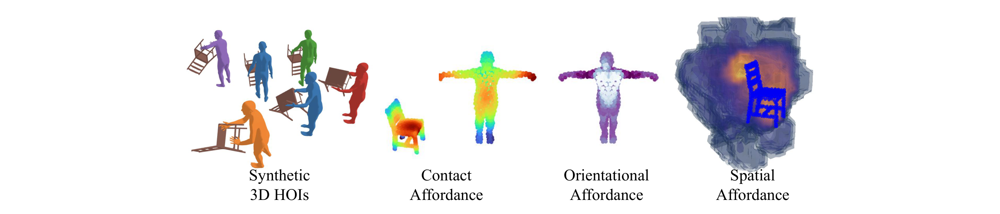
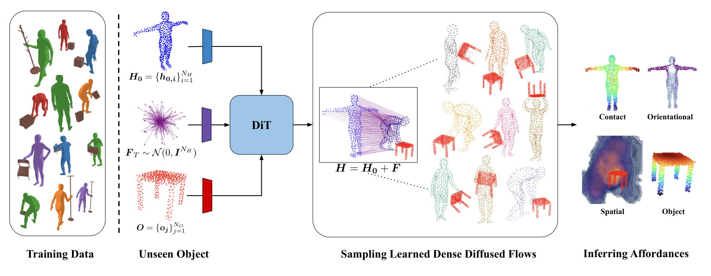
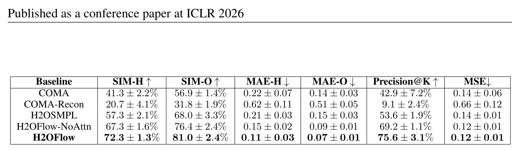
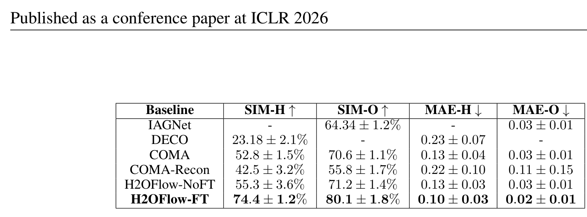
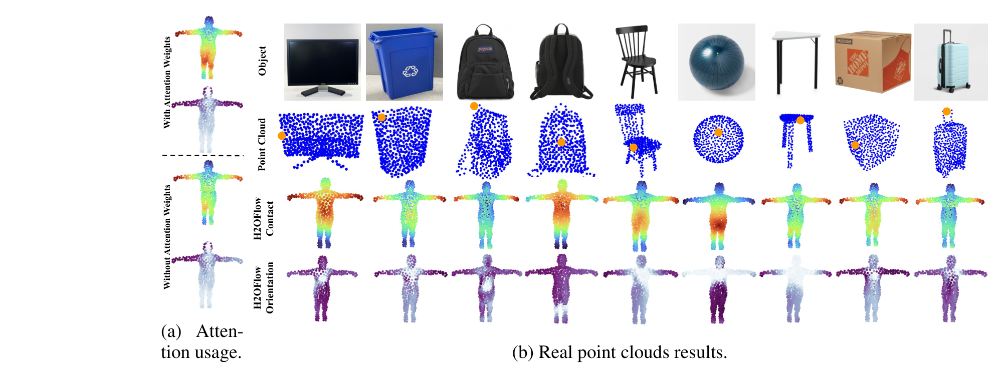
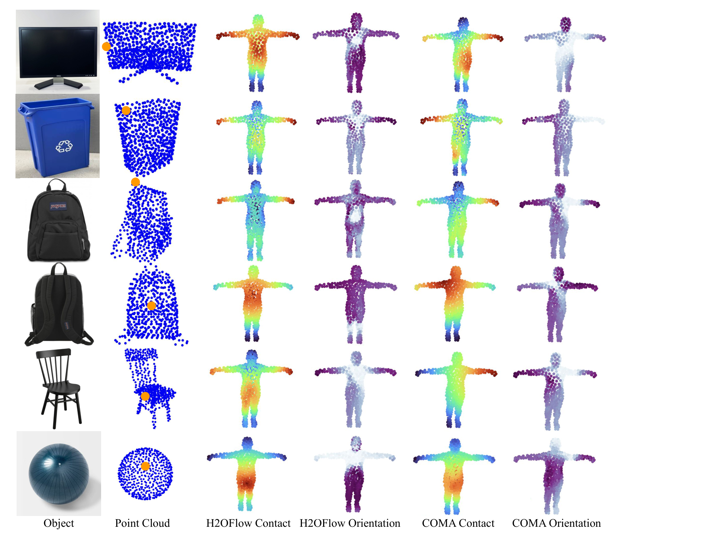
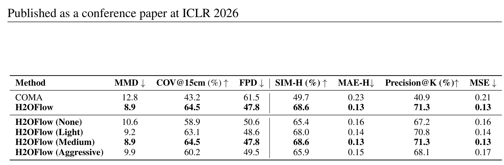
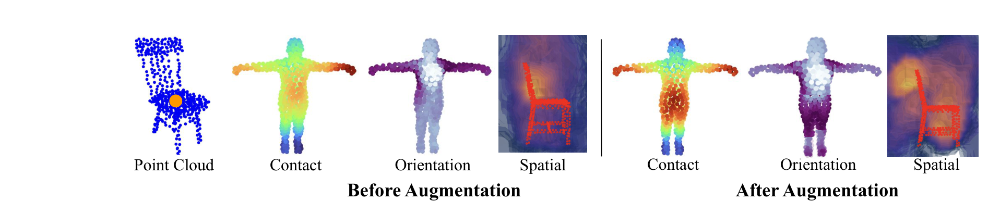

# H2OFlow

> [!abstract] 摘要
> 理解人类如何与周围环境交互——尤其是对物体交互与可供性的推理——是计算机视觉、机器人与智能体的关键挑战。
> 现有方法通常依赖耗费人力的手工标注数据集来捕捉真实或仿真的人-物交互任务，成本高、耗时长。
> 此外，多数三维可供性理解方法局限于接触分析，忽略了交互的其他关键方面，例如朝向（人对电视有偏好的朝向）与空间占用（人更倾向占据微波炉前方而非背部的区域）。
> 为解决这些局限，作者提出 H2OFlow：一个仅用三维生成模型产生的合成数据，就全面学习三维人-物交互可供性——覆盖接触、朝向与空间占用——的框架。
> 该方法采用稠密三维流表征，通过作用在点云上的稠密扩散过程来学习；学到的流使得无需任何人工标注即可发现丰富的三维 affordance。
> 大量定量与定性评测表明，它能有效泛化到真实世界物体，并超过依赖人工标注或网格表征的先前方法。

---

## 核心信息

- 标题：H2OFlow: Grounding Human-Object Affordances with 3D Generative Models and Dense Diffused Flows
- 标题翻译：H2OFlow：用 3D 生成模型与稠密扩散流定位人-物 affordance
- 作者：Harry Zhang; Luca Carlone
- 机构：MIT（麻省理工学院，SPARK Lab / LIDS）
- 发表时间：2025-10-17（arXiv v1）；v2 为 2026-02-10
- 发表渠道：ICLR 2026（conference paper）
- arXiv：2510.21769
- 论文链接：https://arxiv.org/abs/2510.21769
- 代码 / 项目：正文与附录都没有公开仓库链接；Figure 3 附有结果视频页
- 数据 / 资源：OMOMO、BEHAVE 数据集；CHOIS 预训练 3D HOI 生成模型；InteractAnything、HOI-PAGE、PICO（扩展实验数据源）
- 论文类型：AI_method

## 原文摘要翻译

理解人类如何与周围环境交互——尤其是对物体交互与可供性的推理——是计算机视觉、机器人与智能体的关键挑战。现有方法通常依赖耗费人力的手工标注数据集来捕捉真实或仿真的人-物交互任务，成本高、耗时长。

此外，多数三维可供性理解方法局限于接触分析，忽略了交互的其他关键方面，例如朝向（人对电视有偏好的朝向）与空间占用（人更倾向占据微波炉前方而非背部的区域）。

为解决这些局限，作者提出 H2OFlow：一个仅用三维生成模型产生的合成数据，就全面学习三维人-物交互可供性——覆盖接触、朝向与空间占用——的框架。该方法采用稠密三维流表征，通过作用在点云上的稠密扩散过程来学习；学到的流使得无需任何人工标注即可发现丰富的三维 affordance。大量定量与定性评测表明，它能有效泛化到真实世界物体，并超过依赖人工标注或网格表征的先前方法。

---

## 创新点

1. **点云上的完备可供性表征**：把 affordance 从"接触热图"扩展为三类逐点对分数——接触 $c_{ij}$、朝向 $R_{ij}$、空间占用 $S_{ij}$——且直接定义在（部分可观测的）点云对上，绕开了 COMA 对封闭网格与逐顶点法线的依赖。这是从"标注的接触"走向"概率化交互几何"的关键一步。
2. **合成数据驱动的稠密扩散流管线**：用预训练 CHOIS 生成三维人-物交互网格序列，经最远点采样得到成对点云，再训练 DiT 扩散模型学习"零姿态人体到交互构型"的逐点位移分布。这一学习式中间表征替代了 COMA 的无学习重建流水线，天然适配带噪的传感器点云。
3. **推理期三类可供性的免标注推断**：从采样出的多模态流分布出发，用距离核导出接触分数、用叉积方向直方图加负熵导出朝向分数、用体素占用期望导出空间分数，并用交叉注意力权重做聚合修正，全程无需任何人工可供性标签。
4. **系统性的真实世界证据链**：深度相机扫描、遮挡分级、去噪强度分级、人体姿态分布距离等一整套评测协议，把"合成到真实"的主张拆成了可检验的多条证据。

---

## 一句话总结

**用三维生成模型无限造交互数据，把"人如何与物体交互"学成一个点云上的稠密扩散流分布，再从流分布中免费导出接触、朝向、空间三类可供性**——训练零人工标注，推理只看物体点云，单物体约 6.7 秒出全套结果。

---

## 研究问题

### 人-物交互可供性的"不完整"现状

此前的 HOI 可供性学习几乎都聚焦接触这一子集：从彩色图、点云或人体模型估计接触分数（Bahl、Chu、Yang、Hassan 等），依赖密集的人工接触标注。这带来两个后果：标注昂贵，且对新物体、新交互类别泛化差。

### 接触之外还缺什么

作者的核心观察是：交互中的人体面部、躯干、手臂相对物体维持着特征化的距离与朝向——握锤时手腕有固定倾角、握笔时手指靠近笔尖。Kim 等人（2024）的 COMA 首次提出概率化的完备可供性：对每对物体与人体表面点建模三维空间与朝向关系的分布。但它的技术路线依赖合成彩色图加二维到三维的提升（需精细掩码、失败模式多）、封闭网格与法线计算，且对真实物体泛化差。

### 本文要回答的问题

能否只从合成数据学到一个表示，使其在真实、带噪、部分可观测的物体点云上，直接推断出包含接触、朝向、空间占用三方面的可供性？作者的答案是稠密扩散流——一个既保留多模态性、又对几何噪声鲁棒的中间表征。

---

## 数据与任务定义

### 任务形式化

给定物体点云与标准零姿态（T 型姿态）人体点云，模型需预测交互构型并输出三类逐点对可供性。记物体点为 $o_j$、人体点为 $h_i$，三类分数的取值域如下：

$$
c_{ij}\in\mathbb{R},\qquad R_{ij}\in\mathbb{R},\qquad S_{ij}\in\mathbb{R}^{H\times W\times L}
$$

- **接触可供性** $c_{ij}$：人体点与物体点发生接触的可能性；
- **朝向可供性** $R_{ij}$：人体部位相对物体朝向模式的一致性（前臂相对桌面比脚更统一则分数高）；
- **空间可供性** $S_{ij}$：物体周围体素格中被人体占据的概率分布。

*Figure 1 —— 合成三维交互数据与三类可供性的输出形态*

### 训练数据：合成流水线

- 用预训练的交互生成模型（CHOIS，以语言与路标点为条件）生成物体与人体同步运动的网格序列；
- 数据规模：训练 12 类物体、测试 5 类；每个训练物体生成 100 条交互序列、每条 200 帧；
- 零姿态人体网格与交互目标网格用同一组索引做最远点采样（各 512 点），保证逐点一一对应，从而可计算稠密流真值；
- 零姿态人体与物体按物体质心中心化到同一规范坐标系；训练时对物体施加随机旋转与随机遮挡增广，使模型对物体位姿与残缺扫描保持鲁棒。

### 评测数据与指标

| 数据集    | 用途                       | 说明                                              |
| ------ | ------------------------ | ----------------------------------------------- |
| OMOMO  | 主实验（原表 1）                | COMA 需二维渲染输入，故为每个物体渲染 50 个视角；所有方法每物体生成 50 个交互样本 |
| BEHAVE | 跨数据集泛化（原表 4/5）           | 分零样本直测与微调两档                                     |
| 真实扫描   | 真实世界证据（原表 7、Figure 5b/7） | 深度相机扫描加最远点采样降采样，6 个与仿真同类的物体，点云配准到规范帧            |

指标：接触用直方图交集（SIM）与平均绝对误差；朝向用前 K 精度（预测分数排名与真值方向熵排名的前 K 重叠）；空间用体素占据的均方误差。真实世界另用 MMD、15 厘米覆盖率与 FPD（重构姿态集合与合成参考集合的分布距离）。

---

## 方法主线

### 机制流程

1. **输入：物体点云 $O$ 与标准零姿态人体点云 $H_0$；操作：由预训练生成模型产出大量合成交互网格序列，经最远点采样与质心中心化，得到成对点云与稠密流真值（训练期）**——输出：带配对关系的训练集 $(H,O,F^{GT})$。
2. **输入：加噪的稠密流、人体点云、物体点云与时间步；操作：共享权重多层感知机提取逐点特征，拼接后送入 DiT（自注意力加对物体特征的交叉注意力，零初始化自适应层归一化调制）**——输出：预测噪声与插值向量。
3. **输入：未见物体点云与零姿态人体；操作：从高斯噪声出发迭代去噪 100 步，采样多条稠密流并重构多模态目标人体**——输出：交互构型的分布与每条样本的交叉注意力权重。
4. **输入：采样出的流分布与点云对；操作：按原文式（4）至（9）聚合出接触、朝向、空间三类分数，并用注意力权重修正**——输出：逐点对可供性场与物体周围的体素占用图。

*论文原图编号：Figure 2 —— 合成数据训练 DiT、采样稠密扩散流、推断三类可供性的总览*

### 逐步输入输出对照表

把机制流程拆成训练期与推理期各四步，标注每步的输入、具体操作与输出形状（人体与物体点云均下采样到 512 点）。

**训练期**

| 步骤 | 输入 | 具体操作 | 输出 |
|------|------|----------|------|
| ① 构造流真值 | 交互网格序列、零姿态人体网格 | 同一组索引最远点采样到 512 点，按物体质心中心化，逐点相减得真值流 | 真值流与配对点云，各 512×3 |
| ② 前向加噪 | 真值流、随机时间步、高斯噪声 | 闭式一步混合，无需迭代；时间步越大噪声占比越高 | 加噪流样本，512×3 |
| ③ 网络前向 | 加噪流、人体点云、物体点云、时间步 | 共享权重多层感知机提逐点特征（各 512 维），流与人体特征拼接成词元后送入五块变换器：块内先自注意力协调人体点，再对物体特征做交叉注意力注入物体几何，时间步经零初始化自适应层归一化调制 | 预测噪声与插值向量，各 512×3 |
| ④ 混合损失 | 预测噪声、插值向量、真值噪声 | 反向过程建模为高斯分布，协方差由插值向量逐维给出；损失为噪声预测项加累积散度项，让模型连每步保留多少随机性也学会 | 梯度；优化器 AdamW，学习率 1e-4，权重衰减 1e-5，批大小 32 |

**推理期**

| 步骤      | 输入                   | 具体操作                                             | 输出                        |
| ------- | -------------------- | ------------------------------------------------ | ------------------------- |
| ① 初始化   | 未见物体点云、零姿态人体         | 从标准高斯采样流场初值                                      | 初值流场，512×3                |
| ② 反向去噪  | 当前流场、物体点云、零姿态人体、时间步  | 重复一百步：预测噪声与协方差，据此采样出上一时刻的流；随机性来自协方差，所以同一物体每次结果不同 | 干净流场，512×3                |
| ③ 重构人体  | 干净流场、零姿态人体           | 逐点相加得目标人体点云，重复五十次得到一批候选姿态，并取出交叉注意力权重             | 五十个交互姿态与逐点对权重矩阵，512×512   |
| ④ 统计可供性 | 五十个姿态、逐点位移、流向量、注意力权重 | 接触取距离核的期望，朝向取叉积方向在单位球分箱后负熵的期望，空间取体素占据指示函数的期望     | 接触与朝向分数各 512×512，空间为体素占用图 |

张量形状速记：点云 512×3 → 逐点特征 512×128 → 预测输出 512×3 → 成对分数 512×512 与体素占用图。

两个容易踩的点：一是**人体侧输入在推理时只有零姿态点云**，目标人体正是要预测的量，拿不到（论文正文写作目标人体，实指当前人体点云）；二是**交叉注意力权重被复用了两次**，既在变换器里做条件注入，又拿来做可供性分数的加权，消融显示去掉后人体侧相似度从 72.3 掉到 67.3。

### 中间表征：稠密流与扩散建模

人-物交互天然多模态（左手或右手、正面或背面坐），因此要学的不是单一流场而是条件分布。

$$F := H - H_0, \qquad F^t = \sqrt{\bar{\alpha}_t}\,F^0 + \sqrt{1-\bar{\alpha}_t}\,\epsilon$$

前向过程逐步加噪；反向过程用高斯分布参数化，其协方差由插值向量逐维给出（Nichol 与 Dhariwal 2021 的做法），训练用混合损失（噪声预测加累积 KL）。训练设置：扩散步数 100，优化器 AdamW，学习率 1e-4，权重衰减 1e-5，批大小 32。

### 三类可供性的推断公式

接触（距离核加注意力权重）：

$$c_{ij} = \mathbb{E}_{h_i\sim P_{ij}}\Big[\, w_{ij}\cdot e^{-\lVert d_{ij}\rVert/\tau} \Big], \qquad d_{ij}=h_i-o_j$$

朝向（叉积方向直方图加负熵，替代基于法线的方案）：

$$x_{ij}=\frac{d_{ij}\times f_i}{\lVert d_{ij}\times f_i\rVert}, \qquad R_{ij}=\mathbb{E}_{h_i\sim P_{ij}}\Big[\, w_{ij}\cdot H_{ij}/\tau \Big]$$

其中 $H_{ij}$ 是把单位球离散成若干方向区间后、对高斯核分布所取的负熵，方向越集中则分数越高。空间占用：

$$S_{ij} = \mathbb{E}_{h_i\sim P_{ij}}\big[\delta_{ij}\big]$$

其中指示函数判断体素是否含有人体点。融合成下游打分时，用归一化线性组合把三类分数相加：

$$\phi_{ij}=\lambda_c\bar{c}_{ij}+\lambda_o\bar{R}_{ij}+\lambda_s\bar{S}_{ij}$$

### 关键实现细节（可复现性）

- 人体与物体点云各最远点采样 512 点；DiT 隐藏维度 128、4 头、5 块；
- 推理超参：接触温度 20；朝向核方差 1、温度 10；
- 训练期对物体点云做随机旋转与随机遮挡；坐标始终以物体为参考系，且物体保持直立。

---

## 关键结果

### 主结果与强基线

| 基线             | 人体侧相似度 ↑        | 物体侧相似度 ↑        | 人体侧误差 ↓         | 物体侧误差 ↓         | 朝向精度 ↑          | 空间误差 ↓          |
| -------------- | --------------- | --------------- | --------------- | --------------- | --------------- | --------------- |
| COMA           | 41.3 ± 2.2%     | 56.9 ± 1.4%     | 0.22 ± 0.07     | 0.14 ± 0.03     | 42.9 ± 7.2%     | 0.14 ± 0.06     |
| COMA-Recon     | 20.7 ± 4.1%     | 31.8 ± 1.9%     | 0.62 ± 0.11     | 0.51 ± 0.05     | 9.1 ± 2.4%      | 0.66 ± 0.12     |
| H2OSMPL        | 57.3 ± 2.1%     | 68.0 ± 3.3%     | 0.21 ± 0.03     | 0.15 ± 0.03     | 53.6 ± 1.9%     | 0.14 ± 0.01     |
| H2OFlow-NoAttn | 67.3 ± 1.6%     | 76.4 ± 2.4%     | 0.15 ± 0.02     | 0.09 ± 0.01     | 69.2 ± 1.1%     | 0.12 ± 0.01     |
| **H2OFlow**    | **72.3 ± 1.3%** | **81.0 ± 2.4%** | **0.11 ± 0.03** | **0.07 ± 0.01** | **75.6 ± 3.1%** | **0.12 ± 0.01** |

*论文原图编号：Table 1 —— OMOMO 主对比（人体侧与物体侧分别为接触分布的两端）*

关键读数：**重建输入版 COMA 崩溃**（人体侧相似度从 41.3 掉到 20.7）说明它的性能建立在干净网格渲染上，一旦输入来自点云重建就失效；**直接回归人体参数的变体全面弱于本文方法**（57.3 对 72.3）说明流表征优于直接回归姿态参数；注意力权重带来约 5 个点的稳定增益。

跨数据集（BEHAVE，原表 4）：COMA 52.8、重建版 42.5、本文零样本 55.3、微调后 74.4（人体侧相似度）。零样本直测就与完整网格版的 COMA 打平，微调后大幅反超。

| 基线             | 人体侧相似度 ↑        | 物体侧相似度 ↑        | 人体侧误差 ↓         | 物体侧误差 ↓         | 朝向精度 ↑          | 空间误差 ↓          |
| -------------- | --------------- | --------------- | --------------- | --------------- | --------------- | --------------- |
| COMA           | 52.8 ± 1.5%     | 70.6 ± 1.1%     | 0.13 ± 0.04     | 0.03 ± 0.01     | 72.4 ± 5.1%     | 0.13 ± 0.05     |
| COMA-Recon     | 42.5 ± 3.2%     | 55.8 ± 1.7%     | 0.22 ± 0.10     | 0.11 ± 0.15     | 42.4 ± 2.2%     | 0.36 ± 0.21     |
| H2OFlow-NoFT   | 55.3 ± 3.6%     | 71.2 ± 1.4%     | 0.13 ± 0.03     | 0.03 ± 0.01     | 72.2 ± 1.2%     | 0.14 ± 0.02     |
| **H2OFlow-FT** | **74.4 ± 1.2%** | **80.1 ± 1.8%** | **0.10 ± 0.03** | **0.02 ± 0.01** | **79.1 ± 5.2%** | **0.11 ± 0.02** |

作者还与只做接触可供性的基线做了对比（原表 5）：IAGNet 只在物体侧给出接触指标，DECO 只在人体侧给出接触指标，而本文方法与 COMA 两侧都覆盖。

*论文原图编号：Table 5 —— 与仅接触基线的 BEHAVE 对比*

| 基线 | 人体侧相似度 ↑ | 物体侧相似度 ↑ | 人体侧误差 ↓ | 物体侧误差 ↓ |
|------|---------|---------|---------|---------|
| IAGNet | – | 64.34 ± 1.2% | – | 0.03 ± 0.01 |
| DECO | 23.18 ± 2.1% | – | 0.23 ± 0.07 | – |
| COMA | 52.8 ± 1.5% | 70.6 ± 1.1% | 0.13 ± 0.04 | 0.03 ± 0.01 |
| COMA-Recon | 42.5 ± 3.2% | 55.8 ± 1.7% | 0.22 ± 0.10 | 0.11 ± 0.15 |
| H2OFlow-NoFT | 55.3 ± 3.6% | 71.2 ± 1.4% | 0.13 ± 0.03 | 0.03 ± 0.01 |
| **H2OFlow-FT** | **74.4 ± 1.2%** | **80.1 ± 1.8%** | **0.10 ± 0.03** | **0.02 ± 0.01** |

### 消融到底说明了什么

**注意力权重消融（Figure 5a）**：去掉交叉注意力权重后，接触与朝向分数的对称性变差——在采样数少的场景下，采样出的交互多样性不足，注意力权重充当了学到的几何关联修正信号。

*论文原图编号：Figure 5 —— 注意力消融与真实点云结果（显示器、垃圾桶、背包、椅、瑜伽球、桌、纸箱、行李箱）*

**可供性类型消融（原表 2，转录）**：两个下游任务——区域检索的平均精度、姿态选择的命中率与碰撞漏检率。

| 变体        | mAP@1 ↑         | mAP@5 ↑         | mAP@10 ↑        | 前 5 命中率 ↑       | 碰撞 ↓            | 漏检 ↓            |
| --------- | --------------- | --------------- | --------------- | --------------- | --------------- | --------------- |
| C（仅接触）    | 0.52 ± 0.03     | 0.60 ± 0.02     | 0.66 ± 0.02     | 0.41 ± 0.04     | 0.31 ± 0.02     | 0.27 ± 0.03     |
| C+O       | 0.57 ± 0.03     | 0.63 ± 0.02     | 0.69 ± 0.02     | 0.55 ± 0.03     | 0.26 ± 0.02     | 0.22 ± 0.02     |
| C+S       | 0.56 ± 0.03     | 0.62 ± 0.03     | 0.68 ± 0.02     | 0.51 ± 0.04     | 0.21 ± 0.01     | 0.20 ± 0.02     |
| **C+O+S** | **0.63 ± 0.02** | **0.69 ± 0.02** | **0.76 ± 0.03** | **0.64 ± 0.03** | **0.18 ± 0.01** | **0.17 ± 0.01** |
| Shuffled  | 0.54 ± 0.03     | 0.61 ± 0.02     | 0.66 ± 0.02     | 0.44 ± 0.03     | 0.29 ± 0.02     | 0.26 ± 0.02     |

**随机打乱对照**把增益抹掉——证明朝向与空间信息是作为结构化信号起作用，而不是给模型多加了容量。这是全文实验设计上最干净的一处。

### 真实世界、遮挡与去噪鲁棒性

- **遮挡（原表 6）**：遮挡一半时人体侧相似度仅从 72.3 降到 70.9、物体侧 81.0 降到 79.5，性能损失可忽略——训练期随机遮挡的直接回报。
- **真实扫描（原表 7）**：6 个深度相机扫描物体上，本文重构姿态与合成参考的分布距离为最小匹配距离 8.9（对照 12.8）、15 厘米覆盖率 64.5%（对照 43.2%）、姿态距离 47.8（对照 61.5）；去噪强度在无、轻、中三档下稳定（中为默认），激进档会过度剪除把手与边缘等薄结构（空间误差 0.13 升到 0.17），但仍优于 COMA。

*论文原图编号：Figure 7 —— 真实点云上本文方法与对照方法的可供性对比（后者退化为单峰粗糙热图）*
![[page_021_fig_table_6_review.png]]
*论文原图编号：Table 6 —— 不同遮挡程度下的性能*

*论文原图编号：Table 7 —— 真实世界姿态分布距离与去噪强度消融*

### 效率对比

| 项目          | H2OFlow         | COMA            |
| ----------- | --------------- | --------------- |
| 单物体推理（V100） | **6.7 ± 1.2 s** | 65.2 ± 2.1 s    |
| 显存          | 8416 ± 513 MB   | 9771 ± 1190 MB  |
| 内存          | 7619 ± 882 MB   | 15812 ± 2314 MB |

COMA 的瓶颈在"点云到封闭网格"的重建与逐顶点对法线计算；H2OFlow 直接在稀疏点云上并行计算。

### 扩展：使用方式数据增强与提示词条件化

合成数据的动作分布以搬运与移动为主，导致椅子的可供性偏向搬运动作而非坐下。附录给出两条与模型无关的扩展：

1. **换数据源**：混入另外三个以使用方式为中心的生成器（同样的网格、采样、成对点云预处理），不改架构与损失只换数据源，增强后椅子出现手与臀的双峰接触，以及坐姿的空间轮廓（Figure 9）。
2. **加文本条件**：冻结 CLIP 的文本编码，每个 DiT 块增加一条交叉注意力，让流对应的词元去注意文本词元（自适应层归一化的分块数从 9 变 12），训练时按概率丢弃文本，推理时用无分类器引导。

$$\hat{\epsilon}_\theta=(1+\gamma)\epsilon_\theta(F^t\mid O,t,\varnothing)-\gamma\epsilon_\theta(F^t\mid O,t,E_{text})$$

同一把椅子，坐下与搬动两种提示词给出完全不同的可供性与人体剪影。

*论文原图编号：Figure 9 —— 使用方式数据增强前后的三类可供性对比*

---

## 深度分析

### 为什么稠密流是泛化的根本

附录给出四条机理，每条都对应一个实验证据：

1. **局部几何感知**：每个流向量起始于人体顶点，天然能看见物体局部几何；人体姿态参数是全局低维编码，看不到局部。对应回归姿态参数变体的全面落后（57.3 对 72.3）。
2. **免旋转学习**：旋转参数难学是已知痛点，稠密流预测逐点位移，把旋转拆进了位移场——与可变形物体流学习的先行工作一脉相承。
3. **免法线**：朝向可供性用位移与部件方向的叉积代替网格法线，这是在带噪点云上还能算出朝向的关键；法线计算正是 COMA 的计算瓶颈。
4. **多模态采样**：扩散天然给出多峰分布，配合注意力权重在低采样数下仍能产生合理结果。

### 与对照方法的机制级对照

COMA 是重建加无学习统计：二维补全、封闭网格、逐顶点对法线、分布拟合。四个环节在真实输入上逐级失效（Figure 7 中它退化为单峰粗糙热图）。本文把其中每个环节都换成了可学习的点云原生模块。**值得注意的公平性边界**：重建版的崩溃混合了重建管线失败与可供性方法失效两个因素，不能全部归咎于 COMA。

### 复现注意点

- 体素分辨率、方向区间数、注意力权重的具体取法（哪一层、是否做归一化）在正文与附录中没有完整表格，需要查代码或询问作者；
- 训练轮数的表述更像迭代步数，需按 12 类物体、100 条序列、每序列 200 帧的数据量反推；
- 每物体 50 个采样是所有定量结论的固定协议，采样数敏感性只有 Figure 5a 的定性讨论；
- 真实世界的真值其实是合成模型在同类仿真物体上的参考分布（先做点云配准再去骨盆平移），所以分布距离只能作补充证据，不能当作真实可供性精度。

---

## 局限

1. **生成模型的物体与交互覆盖不足**：上游偏大物体与搬运类交互，细粒度、铰接、小物体的交互样本稀缺——本文可以吃任意交互数据，但上游缺少这样的基础模型（作者自己在增强实验里补数据，也说明这是数据问题而非方法问题）。
2. **未落地物理机器人**：跨本体重构（原文的机器人构型优化推导）只有形式化推导，没有实验；把可供性分数作为操作策略的初始解仍是设想。
3. **评测的真值锚点偏软**：真实世界指标以合成参考分布为锚；朝向的真值排名来自真值熵的定义方式，空间维度只有均方误差一个角度。
4. **薄结构与激进去噪的敏感性**：激进档去噪会剪掉把手与边缘，恰恰是可供性最关心的部位。

---

## 我的笔记

### 与我研究方向的关联

- 这是几何驱动的可供性路线：驱动信号是物体点云加零姿态人体，不含语言。与 [[AffordAny]]（单目彩色图加文本指令，冻结视觉语言模型解码）、[[HAMMER]]（多模态大模型隐状态注入点特征）正好构成语言驱动与运动驱动的对照，可在 [[3D Affordance Grounding]] 中并排比较。
- H2OFlow 与 COMA 的关系是学习式表征替代重建式统计；组内方案（[[3D-native HOI Affordance 换输入质疑与防御]]）同样在质疑重建到统计管线的真实世界鲁棒性，本文的随机旋转加遮挡增广是可立刻借用的防御手段。
- 合成数据、扩散模型与可供性的组合，与 [[Splat and Distill]] 等三维高斯加基础模型蒸馏路线的"用基础模型造监督"精神一致，但这里连监督都不用（流真值来自生成模型自身的配对点云）。

### 可借鉴 / 可质疑

- **借鉴**：随机打乱对照的实验设计；用训练期随机遮挡换真实鲁棒性；叉积加球面直方图加负熵的免法线朝向度量；只换数据源不改架构的扩展方式；加语言条件的最小改动模板（分块数 9 到 12）。
- **质疑**：三类可供性中空间维度只有均方误差且无分辨率讨论；交叉注意力权重充当语义修正的机理没有独立验证（权重是否学到了部件级对应）；每物体 50 采样的方差只报了跨物体标准差，未报采样方差；真实世界的 6 个物体太少。

### 后续可做

- [ ] 把本文的可供性三元组与 [[PIAD]]、[[3D Affordance Grounding]] 的语义可供性定义做一次概念对齐笔记
- [ ] 复现侧：向作者确认方向区间数、体素分辨率与注意力层选取
- [ ] 在组会汇报中把"对照方法到本文方法"作为重建式到学习式的案例

---

## 引用

- Kim et al. (2024). COMA: Comprehensive affordance from human-object interactions（本文唯一同类先行的完备可供性工作，也是主要对照）
- Li et al. (2024a). CHOIS: Compositional human-object interaction synthesis（合成数据来源）
- Li et al. (2023b). OMOMO: Object motion guided human-object interaction 数据集
- Bhatnagar et al. (2022). BEHAVE: dataset and method for tracking human-object interactions
- Xu et al. (2024); Cai et al. (2024). 稠密流与可变形物体点云扩散的先行工作
- Eisner et al. (2022). FlowBot3D：铰动物体上的三维流学习
- Peebles & Xie (2023). DiT: Scalable diffusion models with transformers
- Nichol & Dhariwal (2021). Improved diffusion models（混合损失与插值向量协方差参数化的出处）
- Qi et al. (2017). PointNet / FPS 采样
- Radford et al. (2021). CLIP（提示词条件化的文本编码）
- Yang et al. (2023). IAGNet；Tripathi et al. (2023). DECO（仅接触的基线）
- Zhang et al. (2025). InteractAnything；Li & Dai (2025). HOI-PAGE；Cseke et al. (2025). PICO（使用方式数据增强的来源）
