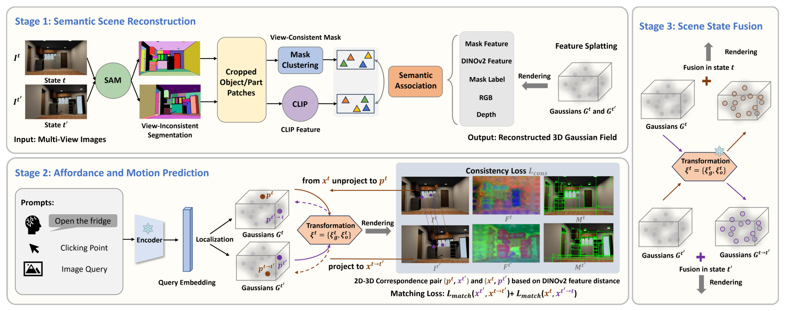
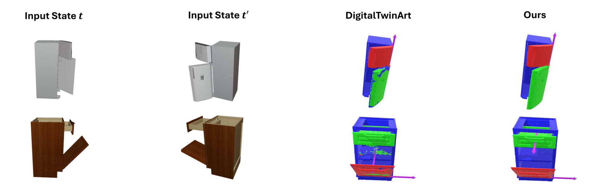
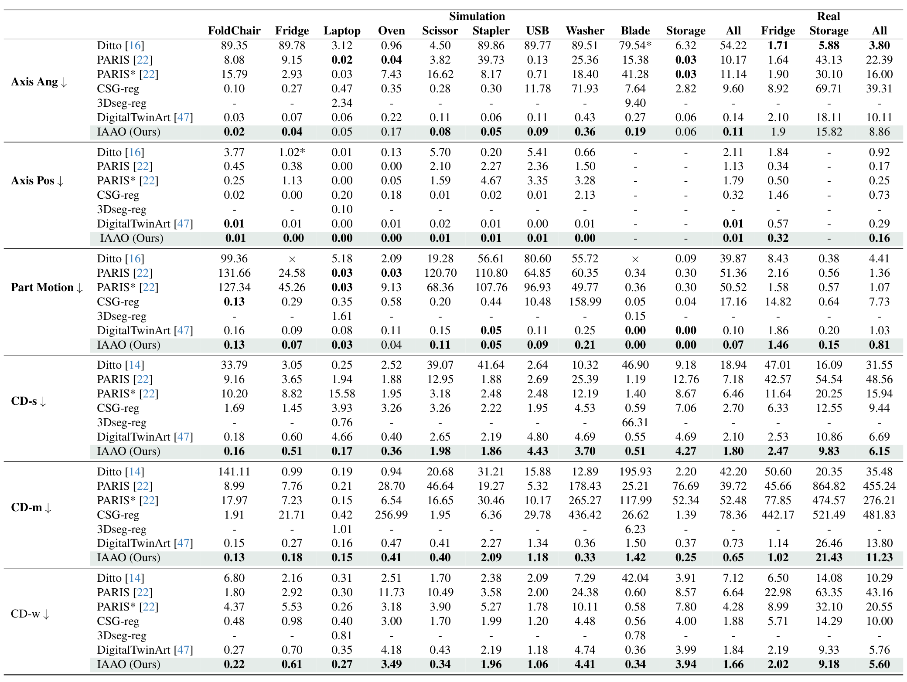
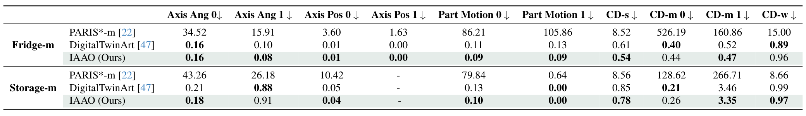

# IAAO：面向三维环境中铰接物体的交互式可供性学习

## 核心信息

- 标题: IAAO: Interactive Affordance Learning for Articulated Objects in 3D Environments
- 标题翻译: IAAO：面向三维环境中铰接物体的交互式可供性学习
- 作者: Can Zhang, Gim Hee Lee
- 机构: 新加坡国立大学计算机科学系
- 发表时间: 2025
- 发表渠道: IEEE/CVF Conference on Computer Vision and Pattern Recognition (CVPR) 2025
- DOI: 10.1109/cvpr52734.2025.01133
- 论文链接: https://doi.org/10.1109/cvpr52734.2025.01133
- 代码 / 项目: https://lulusindazc.github.io/IAAOproject/
- 论文类型: AI_method

## 原文摘要翻译

本文提出 IAAO，一种通过交互让智能体理解环境中铰接物体的显式三维建模框架。不同于以往依赖任务专属网络并对可动部件做强假设的方法，IAAO 利用大型基础模型，分三阶段估计交互可供性与部件铰接关系。

首先，我们借助三维高斯泼溅（3DGS），通过从多视角图像蒸馏掩码特征和视图一致的标签特征，为每个物体状态构建分层特征场与标签场。接着，在三维高斯基元上执行物体级与部件级查询，分离出静态与铰接元素，估计全局变换与局部铰接参数以及可供性。最后，依据估计得到的变换融合并精化来自不同状态的场景，使得基于可供性的物体交互与操作具有鲁棒性。实验结果验证了本文方法的有效性。

## 创新点

1. **在显式三维高斯场中嵌入分层语义（语言对齐特征 + 与类别无关的掩码）**：把 CLIP、SAM、DINOv2 三类基础模型的输出统一蒸馏到 3DGS 高斯基元的低维潜空间中，由解码器在反向传播时还原到二维特征空间。这避免了在高维特征上做完整渲染的成本，也让"点—掩码—文本"三种提示都能在同一套基元上做交互查询。
2. **放弃对静态对齐与已知相机位姿的不现实假设**：用 GeoTransformer 从两状态的高静态部分（不透明度 ≥0.7 的高斯点）做粗配准得到全局变换 $\xi_g^t$，再用 DINOv2 特征相似度在每个部件掩码内做 2D-3D 对应优化局部铰接 $\xi_o^t$。这使方法能直接处理"两状态间存在未对齐、遮挡、相机未标定"等真实场景。
3. **将多视角 SAM 掩码聚类成跨视图一致的 3D 实例与部件标签场**：通过掩码图聚类 + 交叉熵标签损失 $L_{\text{label}}$ 监督高斯场，把"哪些高斯属于同一物体/同一功能部件"这一信息显式烘焙进三维场，为后续可供性查询与铰接分解提供一致的语义骨架。
4. **首个面向多部件、复杂室内场景且不限制部件数量的统一显式可供性加铰接框架**：PARIS、Ditto 等方法只能处理两部件或隐式 NeRF 表示；IAAO 用 3DGS 同时支持两部件、多部件与室内场景，在三个数据集上取得领先或具竞争力的结果。

## 一句话总结

IAAO 把 SAM、CLIP、DINOv2 三类基础模型的二维特征蒸馏到 3DGS 显式高斯场中，用掩码聚类与跨状态语义关联建立一致的部件标签，再用 DINOv2 相似度驱动的 2D-3D 匹配在不假设相机位姿与静态对齐的前提下恢复全局与局部铰接变换，从而在多部件、室内场景下同时给出可供性与铰接重建。

## 研究问题

智能体要在真实室内场景中与功能物体（门把手、抽屉、电器按钮等）交互，必须同时具备两类能力：

- **可供性感知**：知道"哪些部位允许被操作"以及"应当以何种提示（点/掩码/语言）定位它们"。
- **铰接几何重建**：在不知道部件数量、不知道相机位姿、两状态可能存在未对齐/遮挡的前提下，恢复每个可动部件的关节轴线、轴位与跨状态运动。

现有方法的短板（论文 §1 列出）：

- 早期监督方法（Shape2Motion 等）需要昂贵的三维部件标注，且依赖类别专属模型，泛化差。
- Ditto 假设"只有一处可动"，且在已知类别上预训练；PARIS 用 NeRF 直接优化两状态隐式表示，去掉了预训练但对初始化敏感、稳定性差。
- 基于 NeRF 的多部件扩展（LEIA、DigitalTwinArt 等）仍受限于 NeRF 渲染开销与"需要静态对齐"的假设。
- 开放词汇分割方法（LERF、LangSplat、OpenNeRF 等）只能给出语义场，无法直接给可供性，也难以处理跨状态铰接。
- 功能可供性数据集（如 SceneFun3D）依赖高精度点云，实用性受限。

IAAO 要回答的核心问题是：能否用一套显式三维表示加大型基础模型，同时给出①零样本可供性定位、②两状态铰接几何、③可扩展到任意部件数量与室内场景。

## 数据与任务定义

### 数据来源

- **PARIS 两部件数据集**：10 个合成两部件物体加 2 个真实物体；每个物体在两状态下采集 100 个随机视角的彩色、深度与物体掩码。代表类别有 FoldChair、Fridge、Laptop 等共 10 类。
- **合成多部件数据集**：来自 PartNet-Mobility 的两个合成多部件物体，每个含 1 个静态部件与多个可动部件，同样在两状态、100 视角下提供 RGB / 深度 / 掩码。
- **OmniSim 室内场景**：用 OmniGibson 仿真器生成，调节关节旋转得到两状态，提供 RGBD + 交互掩码 + 物体状态指标。

### 评测指标

- 轴角度误差 `Axis Ang Err (°)`：旋转/平移关节轴向量的角度误差。
- 轴位置误差 `Axis Pos Err (0.1 m)`：预测与真值旋转轴之间的最短距离（仅旋转关节）。
- 部件运动误差 `Part Motion Err`：旋转关节用测地距离（°），平移关节用欧氏距离（m）。
- Chamfer-L1 距离：`CD-w` 整表面、`CD-s` 静态部件、`CD-m` 可动部件。

### 评测协议

作者利用 3DGS 模型产生的点云，通过 SuGaR 重建三角网格，再用预测的关节运动把可动部件变换到起始状态 $t$ 以与真值网格对齐。部件对应通过 IAAO 自带的语义 + 掩码标签场确定（PARIS 类方法通过遍历所有真值/预测部件对、选 Chamfer 距离最小者）。报告 PARIS 两部件、多部件两套数据集上 10 个随机种子的均值。

## 方法主线

IAAO 围绕"在显式 3DGS 高斯基元上同时承载分层语义与铰接几何"展开。整体三阶段：语义场景重建 → 可供性与运动预测 → 场景状态融合。

### 机制流程

将多视角两状态图像映射到可交互三维场，按数据流向分为以下四步：

1. **输入与初始化每状态的高斯场**：输入为某状态的多视角带位姿图像；先用运动恢复结构得到的稀疏点云初始化 3DGS 高斯基元，每个高斯携带坐标、不透明度、协方差以及后续添加的低维语义特征。可微光栅化把场渲染到二维视图用于优化；输出为高斯基元集合。
$$\mathcal{I}^t=\{I^t_i\}_{i=1}^{N_t},\quad G^t=\{g^t_p\}_{p=1}^{P_t}$$
2. **高斯场嵌入分层特征与一致掩码标签**：对每个视角用 SAM 生成与类别无关的实例或部件掩码，按掩码图聚类得到三维实例或部件节点集；同时把 CLIP 与 DINOv2 特征蒸馏到高斯的低维潜空间，由三分支小解码器在反向传播时还原为二维特征。标签场用交叉熵损失监督。输出为带分层特征与一致掩码标签的 3DGS 场。
$$O^t,\quad L_{\text{label}},\quad D$$
3. **跨状态语义关联与二维到三维匹配优化铰接**：为两状态各自选代表掩码，渲染特征并用余弦相似度建立亲和矩阵，得到视觉匹配；然后对每个部件估计局部变换，用像素特征相似度在部件掩码内做加权二维到三维对应，并配合掩码特征一致性与二维到三维像素匹配两项损失联合优化。静态部分用不透明度阈值过滤后经全局配准给出粗对齐。输出为每个部件的局部变换与全局变换。
$$\xi^t_o=(R^t_o,T^t_o),\quad \xi^t_g=(s^t_g,R^t_g,T^t_g),\quad L_{\text{mask}},\;L_{\text{match}}$$
4. **依据变换融合两状态 3DGS（场景状态融合）**：用 $\xi_g$ 把 $G^{t'}$ 粗对齐到 $t$，再用 $\xi_o$ 在每个部件内做精修，把两套高斯场合并并过滤伪影，得到"在状态 $t$ 与 $t'$ 都更完整"的可供性交互场。可选地在编辑区域或整场景做后续微调。输出为融合后的 3DGS 场景。

### 模型结构

- **3DGS 高斯基元**：每个高斯 $g^t_p$ 含坐标 $\mathbf{p}_t$、不透明度 $\alpha$、协方差矩阵，以及为各特征分支预留的低维潜向量。
- **解码器 $D$（小型 MLP，三分支输出）**：分别解码到实例级 CLIP 特征、部件级 CLIP 特征、DINOv2 特征三个分支。
- **掩码图聚类**：节点为各视角 SAM 掩码，边表示潜在匹配；按掩码图聚类流程聚类得到三维实例或部件节点，每个节点保留二维掩码列表。
$$V,\;E,\;O^t,\;M^t_o$$

### 训练目标

三阶段共用一个总目标：

$$
L = \lambda_{\text{cons}}(L_{\text{rgb}} + L_{\text{mask}} + L_{\text{label}}) + \lambda_{\text{match}} L_{\text{match}}
$$

各分项含义：

- **$L_{\text{rgb}}$**：两状态之间的 RGB 光栅化一致性。
- **掩码特征一致性损失（公式 3）**：在另一状态的视角下，部件对应的二维掩码上的特征一致性：
$$L_{\text{mask}}(o^{t\to t'})=\sum_n \frac{M^{t'}_o(I^{t'}_n)}{|M^{t'}_o(I^{t'}_n)|}\cdot\|D(\hat{F}^t_o(I^{t'}_n))-F^{t'}_o(I^{t'}_n)\|_2$$
- **$L_{\text{label}}$**：标签场的交叉熵，约束每个高斯在 SAM 监督下保持一致的实例/部件类别。
- **二维到三维像素匹配损失（公式 4）**：对每个三维高斯点，先由像素特征相似度在部件掩码内加权求和得到对应二维像素，再过滤掉投影落不到同一部件掩码的碰撞对，最后比较投影点与二维像素：
$$L_{\text{match}}=\|\pi^{t'}_n(p^{t\to t'})-s^{t'}_{p\to n}(I^{t'}_n)\|_2$$
- **$\lambda_{\text{cons}}, \lambda_{\text{match}}$**：一致性损失与匹配损失的平衡权重（具体值在论文补充材料）。

### 推理与采样链路

推理阶段按以下顺序产出可供性与铰接：

1. 用 CLIP 文本编码器编码任务描述。
2. 计算文本嵌入与高斯特征场中各掩码嵌入的相似度，超过阈值即视为命中可供性掩码 $\{m_a\}_{a=1}^{K_a}$，同时给出可供性标签 $\{l_a\}_{a=1}^{K_a}$。
3. 在复杂室内场景中先用正/负语言查询定位目标物体；再在物体内部做部件级查询，把可动部件从静态中圈出。
4. 对圈出的可动部件，使用训练阶段估出的局部 $\xi_o$ 与全局 $\xi_g$ 在两状态间做插值或预测运动；融合后的 3DGS 场即作为交互接口。

### 关键实现细节

- **静态点筛选**：取不透明度 ≥0.7 的高斯点作为全局配准输入；阈值由经验设定（论文 §3.2）。
- **跨视图 SAM 掩码聚类**：遵循 MaskClustering 的图聚类流程，按视图一致性与 2D-3D 关联合并掩码；同时丢弃被严重遮挡的掩码以避免噪声。
- **二维到三维对应采样**：在部件掩码内对所有像素计算与采样高斯的像素特征相似度，归一化后得到权重，再用加权求和给出对应二维像素；碰撞对过滤（投影必须落在部件掩码内）保证只保留可信匹配。
$$\alpha\to\beta\to s^{t'}_{p\to o},\quad p^{t\to t'}\in o'_{t'}$$
- **多视角深度正则化**：可选使用深度图对 3DGS 做进一步几何正则化（PARIS* 的做法）。
- **网格提取**：用 SuGaR 把 3DGS 表面化成三角网格，再做评测。
- **部件对应方式**：作者强调 IAAO 不假设部件数量已知，部件匹配通过语义 + 掩码标签场确定，而非 PARIS 类方法的穷举对齐。

## 关键结果

### 主结果与强基线

**PARIS 两部件数据集**（原论文表 1）。下表压缩原始 10 个合成 + 3 个真实物体的均值列与"全部均值"列；指标越低越好，IAAO 加粗表示在原表里标为最佳。

| 方法 | 轴角误差(合成均值) | 轴位误差(合成均值) | 部件运动(合成均值) | 静态倒角(均值) | 动部倒角(均值) | 整面倒角(真实均值) |
|---|---|---|---|---|---|---|
| Ditto | 6.32 | – | 39.87 | 18.94 | 50.60 | 10.29 |
| PARIS | 10.17 | – | 51.36 | 7.18 | 39.72 | 43.16 |
| PARIS* | 11.14 | – | 50.52 | 6.46 | 52.48 | 20.55 |
| CSG-reg | 9.60 | – | 17.16 | 2.70 | 78.36 | 10.00 |
| DigitalTwinArt | 0.14 | – | 0.10 | 2.53 | 1.14 | 5.76 |
| **IAAO (Ours)** | **0.11** | – | **0.07** | 2.47 | **1.02** | **5.60** |

原文还分别给出合成与真实两套子列。直观结论：相比此前最强的 DigitalTwinArt，IAAO 在所有均值列上均更优或相当；相比 PARIS 系列，动部倒角从 39.72 与 52.48 跌到 1.02，量级改进近两个数量级。

*图 2：IAAO 三阶段框架总览（语义场景重建 → 可供性与运动预测 → 场景状态融合）。*

**多部件数据集**（原论文表 2）。两类物体 Fridge-m、Storage-m 上对比 PARIS*-m 与 DigitalTwinArt。

| 物体 | 方法 | 轴角误差0↓ | 轴角误差1↓ | 部件运动0↓ | 部件运动1↓ | 静态倒角↓ | 整面倒角↓ |
|---|---|---|---|---|---|---|---|
| Fridge-m | PARIS*-m | 34.52 | 15.91 | 86.21 | 105.86 | 8.52 | 15.00 |
| Fridge-m | DigitalTwinArt | **0.16** | 0.10 | 0.11 | 0.13 | 0.61 | **0.89** |
| Fridge-m | **IAAO** | 0.16 | **0.08** | **0.09** | **0.09** | **0.54** | 0.96 |
| Storage-m | PARIS*-m | 43.26 | 26.18 | 79.84 | 0.64 | 8.56 | 8.66 |
| Storage-m | DigitalTwinArt | 0.21 | **0.88** | 0.13 | **0.00** | 0.85 | **0.99** |
| Storage-m | **IAAO** | **0.18** | 0.91 | **0.10** | **0.00** | **0.78** | 0.97 |

要点：IAAO 在部件运动与静态倒角上略优于 DigitalTwinArt，但在整面倒角、个别子项上略有落后（如 Fridge-m 整面倒角 0.96 对 0.89），整体同一量级，远好于 PARIS*-m。

### 定性结果

论文 Figure 3、4 给出多部件与 PARIS 上的形状重建、部件分割与铰接预测可视化；Figure 5、6 给出 OmniSim 场景级运动快照。下图为 Figure 3 的可读版本：

*图 3：多部件数据集上的形状重建、部件分割与关节预测定性对比（IAAO 与 DigitalTwinArt）。*

*表 1：PARIS 两部件数据集主结果（合成 / 真实）。*

*表 2：多部件数据集（Fridge-m / Storage-m）结果。*

### 消融到底说明了什么

**多部件数据集消融**（原论文表 3）。下表保留原文全部 5 项指标；去掉某项损失后对应结果。

| 配置 | 轴角误差↓ | 轴位误差↓ | 部件运动↓ | 静态倒角↓ | 动部倒角↓ |
|---|---|---|---|---|---|
| Proposed | 0.28 | 0.01 | 0.11 | 0.80 | 0.35 |
| w/o matching | 4.59 | 1.38 | 8.57 | 1.21 | 123.71 |
| w/o mask | 14.82 | 0.01 | 0.28 | 2.59 | 129.14 |
| w/o rgb | 0.56 | 0.01 | 0.17 | 0.81 | 0.42 |
| w/o label | 0.54 | 0.01 | 0.15 | 8.56 | 169.73 |

逐项解读：

- **$L_{\text{match}}$ 是铰接恢复的命脉**：去掉后 Part Motion 从 0.11 飙到 8.57（约 78 倍），CD-m 从 0.35 飙到 123.71（约 354 倍）。这说明仅靠 RGB/掩码/标签一致性不足以恢复局部铰接，必须有 2D-3D 像素级对应。
- **掩码特征/标签损失是部件几何的命脉**：去掉 mask 后 CD-m 从 0.35 飙到 129.14（约 369 倍），与去掉 label 后 CD-m 169.73 同一量级；说明 SAM 的掩码聚类与标签场监督是把高斯"按部件分组"的关键，一旦缺失就退化为按整物体匹配，部件几何随之崩溃。
- **RGB 一致性损失**：去掉后各项指标仅小幅退化，提示 RGB 在该方法里更多是辅助几何正则，而非主信号。
- **总体上**：上述三项损失承担了几乎全部的铰接与部件几何建模能力，第四项起辅助稳定作用。
$$L_{\text{match}},\;L_{\text{mask}},\;L_{\text{label}}\gg L_{\text{rgb}}$$

### 失败或不稳定设置

- 多部件 Fridge-m 的 CD-w 略输 DigitalTwinArt（0.96 vs 0.89）。
- Storage-m 关节 1 是纯平移关节，方法只给出 Part Motion，不给出轴位置（与 PARIS 一致）；意味着对平移关节的统一处理在该论文里未单独展开。
- Table 1 中多个基线在 Fridge / Storage / Blade 等物体上的 `x` 表示失败案例，说明这些类别对所有方法都是难点。

## 深度分析

### 为什么有效

把 2D-3D 对应放在高斯场里做、并配合掩码聚类，是 IAAO 区别于此前方法的核心机制设计：

1. **把语义与铰接放在同一组显式基元上**：3DGS 高斯既是几何载体，又是特征与标签的载体。这避开了 NeRF 类方法"先渲完图再回采特征"的延迟与噪声，也让"部件分割、轴线估计、可供性查询"可以共享一套点集与邻接结构。
2. **分层特征 + 掩码标签场共同充当部件身份**：CLIP 提供语言对齐、SAM 提供几何/部件边界、DINOv2 提供像素级匹配信号；标签场把它们各自的位置一致化，使跨视角的部件指代稳定。这让"对应搜索"不需要昂贵的全局匹配（如在整场景里枚举所有部件对）。
3. **静态 + 局部双层变换分解**：先用 GeoTransformer 在静态高斯上得到粗全局对齐，再用 DINO 相似度驱动的 2D-3D 匹配做部件级精修。该分解让"两状态未对齐 + 部件运动"耦合的问题被拆成两个相对独立的子问题。
4. **2D-3D 对应把 3D-3D 难问题转化为 2D 像素匹配**：直接在两状态的稀疏 3DGS 点云之间找密集对应非常困难，把 3D 高斯投影到状态 $t'$ 的视角、再与该视角下部件掩码内的像素做匹配，相当于把问题投影到信息密度更高的二维空间，再过滤碰撞对保证几何一致。这是消融里 $L_{\text{match}}$ 与 $L_{\text{mask}}$ 贡献如此压倒性的根本原因。

### 复杂度与扩展性

- **训练复杂度**：每个状态独立重建 3DGS（标准 3DGS 训练时长），再加一个跨状态匹配优化阶段；3DGS 的可微光栅化使得解码器 MLP 与掩码/标签/匹配损失都能端到端训练。
- **部件数量可扩展**：方法不预设部件数，每个 3D 实例/部件节点通过 SAM 掩码聚类得到，因此只要多视角图像里 SAM 能切出足够稳定的掩码，理论上部件数可以更多。这一点被论文 Figure 3、6 的多部件、室内场景结果支撑。
- **场景可扩展**：在 OmniSim 室内场景（背景复杂、有多个物体）下 IAAO 仍能工作，这是 NeRF/隐式方法常遇到困难的地方。
- **静态对齐假设**：依赖 GeoTransformer 在两状态的静态部分之间给出合理粗对齐。如果静态部分完全被遮挡或变形，全局 $\xi_g$ 初始化可能失败；论文没有显式讨论退化场景。

### 复现注意点

- **代码已开源**（项目页 https://lulusindazc.github.io/IAAOproject/）：含 3DGS、MaskCLIP、SAM、DINOv2、GeoTransformer 等外部依赖；复现时需确认各基础模型权重与版本的兼容。
- **数据集可得性**：PARIS 两部件与 OmniGibson 均为公开；多部件数据集似乎来自 PartNet-Mobility 二次组装，需自行确认具体物体清单。
- **关键超参**：不透明度阈值 0.7（静态点筛选）、$L_{\text{cons}}$ 与 $L_{\text{match}}$ 的平衡权重（在论文补充材料给出）、2D-3D 对应中的 DINO 相似度 softmax 温度与碰撞过滤阈值。
- **评测可重复性差异**：作者明确指出 IAAO 的部件对应通过语义 + 掩码标签场确定，而 PARIS 类方法通过穷举所有部件对、选 Chamfer 距离最小者；这意味着 IAAO 在评测协议上对小数据集/可动部件形状的偏好与基线不完全可比，需要在复现时注意。
- **网格提取依赖 SuGaR**：评测几何时网格来自 SuGaR，SuGaR 本身的质量会影响 Chamfer 指标的公平性。

## 局限

- **两状态假设**：方法要求输入恰好是同一物体/场景在两个铰接状态下的多视角图像，不能直接推广到视频或多状态序列。
- **对 SAM 掩码质量的依赖**：掩码聚类的稳定性直接受 SAM 在该物体或视角上的表现影响；当 SAM 出现严重过分割或欠分割时（如半透明、强反光、严重遮挡），三维部件节点会出现错位，进而拖累三类主要损失。
- **对 GeoTransformer 粗对齐的依赖**：要求两状态存在足够重叠的静态高斯；如果场景在两状态之间整体被搬运、或者静态部分被遮挡，全局 $\xi_g$ 初始化可能退化。
- **可供性来自 CLIP 文本相似度**：可用性受 CLIP 零样本能力的边界限制；对长尾功能部件（如特定工业旋钮）的"语言 → 区域"对应可能失败；论文没有报告可供性的人为评测分数。
- **不处理非刚体/形变物体**：方法假设旋转或平移关节，不直接覆盖形变（deformable）、流体、铰链组合（multi-DOF）等更复杂的运动学结构。
- **对平移关节的处理薄弱**：Table 2 中 Storage-m 关节 1（纯平移）只给出 Part Motion，不给出轴位置；论文没有给出针对纯平移关节的特别设计。
- **CD-w 在多部件上略输基线**：Fridge-m 0.96 vs DigitalTwinArt 0.89，差距虽小但提示"部件完整几何"在多部件场景下仍有改进空间。

## 我的笔记

- **与可供性定位主线的关联**：本工作把功能可供性与关节运动放在同一套 3DGS 显式表示里，验证了二者可同时学习的可行性。对可供性定位研究的启发是：把它从二维图像或三维点云提升到带铰接的显式三维场，可在同一基元上做可操作区域与可动部件运动学的统一表征，这对机器人操纵尤其重要。
- **关于显式三维高斯加基础模型的范式**：三维高斯加基础模型的组合从 2024 年起逐渐成为开放词汇三维场景理解的主流路径（参考 LangSplat、Feature 3DGS、LERF 等）。IAAO 把这条路径从语义场扩展到语义、铰接与可供性三合一，是该范式的进一步落地。
- **可借鉴做法**：把"2D-3D 对应"投影到目标状态的视角、在部件掩码内做加权匹配、再过滤碰撞对 —— 这套思路可以推广到任意"两状态 3D 重建对齐"任务（不只是铰接物体），值得在自己的 affordance 数据集里尝试。
- **可质疑点**：
  - 评测协议中部件匹配方式的不对称（IAAO 用语义场 vs PARIS 类穷举）让"绝对数字"的可比性变弱；做对比实验时应尽量控制这一变量。
  - 消融只给出了多部件结果，没有给出 PARIS 的对应消融；后续工作可以补做 PARIS 的消融以验证同一结论在不同难度上的稳健性。
  - 论文没有提供训练时长、显存、单物体推理时长的完整报告；对实际机器人部署来说，3DGS + SAM + DINOv2 三件套的工程开销需要单独评估。

## 引用

- Can Zhang, Gim Hee Lee. IAAO: Interactive Affordance Learning for Articulated Objects in 3D Environments. CVPR 2025. DOI: 10.1109/cvpr52734.2025.01133
- 项目主页: https://lulusindazc.github.io/IAAOproject/
- 主要对比方法：
  - Ditto: Jiang et al, CVPR 2022.
  - PARIS / PARIS* / PARIS-m*: Liu et al, ICCV 2023.
  - DigitalTwinArt: Weng et al, CVPR 2024.
  - LEIA: Swaminathan et al, ECCV 2024.
- 基础模型：
  - 3DGS: Kerbl et al, ACM TOG 2023.
  - SAM: Kirillov et al, 2023.
  - MaskCLIP / CLIP: Radford et al, ICML 2021; Dong et al, CVPR 2023.
  - DINOv2: Oquab et al, 2023.
  - GeoTransformer: Qin et al, CVPR 2022.
- 数据集：PartNet-Mobility（SAPIEN）、MultiScan、OmniGibson / Behavior-1k。