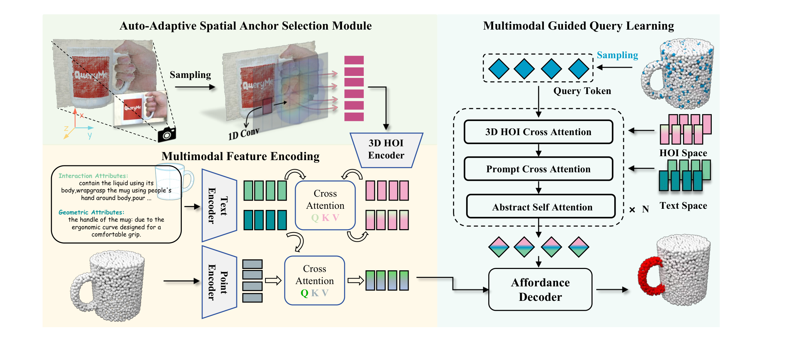
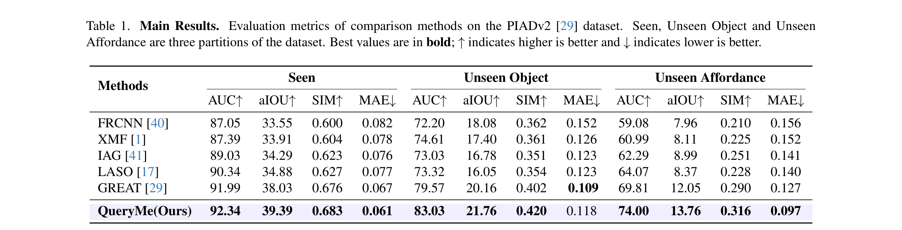
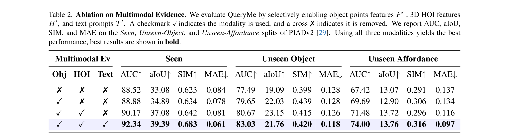
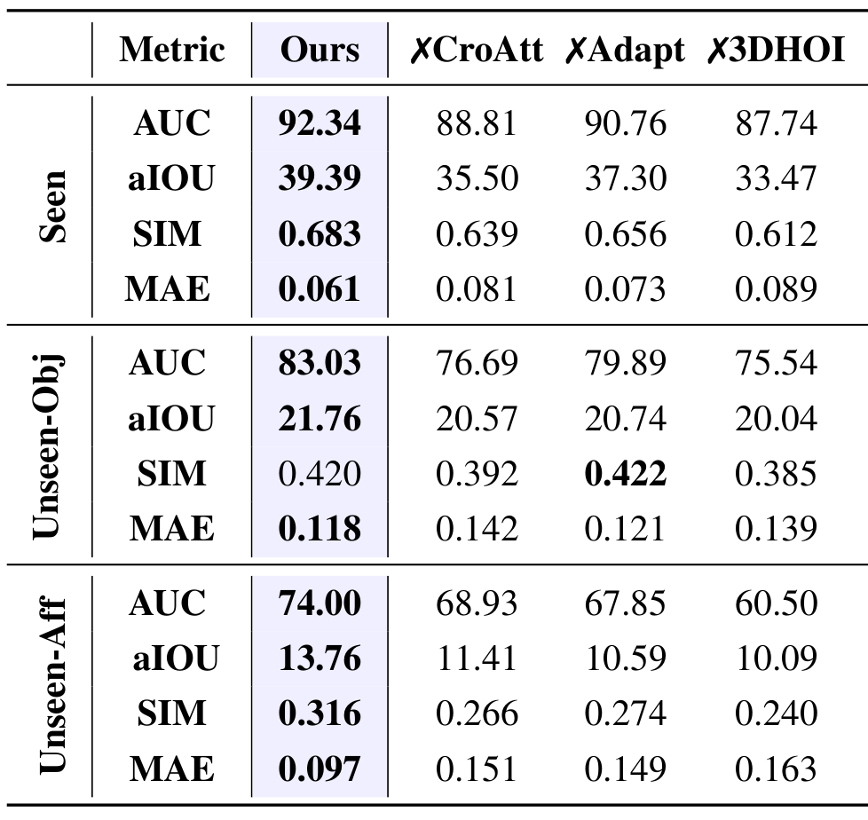

---
tags:
  - papers/robotics
  - papers/computer-vision
aliases:
  - QueryMe
  - Query-Driven Open-Vocabulary 3D Object Affordances Grounding
date: 2026-08-14
venue: CVPR 2026
---

# QueryMe: Query-Driven Open-Vocabulary 3D Object Affordances Grounding from Multimodal Evidence

## 核心信息

- 标题: QueryMe: Query-Driven Open-Vocabulary 3D Object Affordances Grounding from Multimodal Evidence
- 标题翻译: QueryMe：从多模态证据出发的查询驱动开放词汇三维物体功能区域定位
- 作者: Weiyu Zhao, Ru Li, Jiaqi Liu, Sizhe Zhao, Qinglin Liu, Shengping Zhang
- 机构: 哈尔滨工业大学、哈尔滨工业大学（威海）青岛创新发展基地
- 发表时间: 2026
- 发表渠道: CVPR 2026
- DOI: （PDF 元数据未提供）
- arXiv: （PDF 元数据未提供）
- 论文链接: 本地 PDF `E:/my/paper/1-inbox/Zhao_QueryMe_Query-Driven_Open-Vocabulary_3D_Object_Affordances_Grounding_from_Multimodal_Evidence_CVPR_2026_paper.pdf`
- 代码 / 项目: 论文未给出公开仓库链接
- 数据 / 资源: PIADv2（混合 3DIR、3D-AffordanceNet、Objaverse）
- 论文类型: AI_method

## 原文摘要翻译

开放词汇三维物体 affordance grounding 旨在根据任意语义描述识别物体的功能区域。
然而，现有方法通常依赖固定的训练类别和几何先验，缺乏几何不变性与类比推理能力。
由于将二维图像中学到的 affordance 知识迁移到三维点云存在显著域间隙，现有方法难以泛化到形状多样或未见类别的物体，也无法进行有效的类别推理。
为此，我们提出 QueryMe，一个从多模态证据空间学习的查询驱动框架，用于实现开放词汇三维 affordance grounding。
该方法将人物-物体交互图像投影到三维空间，使用自适应空间注意力模块聚焦关键交互区域，并引入多模态查询结构在点云中检索几何一致的功能部件，从而有效融合视觉、语言与几何线索。
借助基于注意力的查询机制，我们的方法能够自适应地定位 affordance 区域，并通过几何相似性进行类比推理，因此对未见场景和物体表现出强泛化能力。
实验结果表明，QueryMe 在未见 affordance grounding 任务上的 AUC 较先前工作提升 4.19%，持续优于现有最先进方法。

## 创新点

- **将二维交互图像显式投影到三维交互空间。**
  与仅在二维图像或三维点云上分别处理的方法不同，QueryMe 使用 VGGT 等前馈重建器把交互图像映射为三维人机交互点云，并设计自适应空间注意力抑制背景噪声。
  这为二维到三维 affordance 知识迁移提供了一条更紧凑的几何通道。
- **提出多模态引导的查询学习机制。**
  在对象点云上初始化一组可学习查询，按“文本先验 → 三维人机交互线索 → 对象点云几何”的顺序逐步注入多模态证据，通过交叉注意力与自注意力细化 affordance 定位。
  这种结构把语言意图、交互视觉和几何形状统一在一个查询解码框架中。
- **面向未见设置实现强泛化。**
  方法不依赖固定类别或手工几何先验，而是通过几何相似性进行类比推理。
  主实验中，未见物体与未见 affordance 两个划分上的提升均明显超过 GREAT 等强基线。
- **验证对重建噪声的鲁棒性。**
  通过向目标对象点云注入不同比例的空间噪声，证明 QueryMe 在 ρ=0.85 时仍保持约 69% 的 AUC，优于 GREAT 的约 63%。
  这说明三维人机交互几何推理能增强对不完美重建的容忍度。

## 一句话总结

QueryMe 通过把二维交互图像重建到三维空间，再用自适应空间注意力与顺序化多模态查询学习融合文本、三维人机交互与点云三类证据，在 PIADv2 的开放词汇三维 affordance 定位任务上优于 GREAT 等基线，尤其在未见物体与未见 affordance 设置下提升明显。

## 研究问题

### 任务定义

开放词汇三维物体 affordance grounding 的任务定义如下。
给定一个三维对象点云，记为 $P$，其维度为：

$$P \in \mathbb{R}^{N \times 3}$$

模型同时接收描述目标交互的文本或图像提示，需要输出每个点的 affordance 概率，记为 $\omega$，维度为：

$$\omega \in \mathbb{R}^{N \times 1}$$

输出结果用于定位物体上可完成指定交互的功能区域。
与封闭集 affordance 检测不同，开放词汇要求模型能够处理训练时未见过的新物体类别或新的 affordance 描述。

### 现有方法的短板

- **固定训练类别与几何先验：** 早期三维 affordance 方法依赖训练集中出现的对象类别和几何结构，面对形状差异大的新物体时泛化差。
- **二维与三维之间的域间隙：** 直接从二维交互图像学习 affordance 再迁移到三维点云，会因图像分布与三维物体 affordance 之间的差异而导致定位不可靠。
- **缺乏几何不变性与类比推理：** 同一物体的不同使用模式、同类物体的形状变化都需要模型具备基于几何相似性的类比能力，而现有方法多使用单一模态，缺少跨模态一致查询机制。

### 作者的解决思路

作者借鉴认知心理学中“人类先识别几何形状，再推断功能属性”的观点，提出一个以三维查询为核心的框架。
该框架不把物体与预定义区域显式配对，而是让查询在对象点云、三维人机交互空间和文本空间中检索几何一致的功能区域。

## 数据与任务定义

### 数据集

实验在 **PIADv2** 上进行。
该数据集混合了 3DIR、3D-AffordanceNet 和 Objaverse，覆盖 43 个对象类别和 24 个 affordance 类别。
论文遵循 GREAT 与 LASO 的评测协议，采用三个标准划分：

| 划分 | 说明 |
|---|---|
| **Seen** | 训练集与测试集共享相同对象类别和 affordance 类别，评估分布内性能。 |
| **Unseen Object** | affordance 类别共享，但部分对象类别在训练时被留出（withheld），测试模型在已知 affordance 下迁移到新物体的能力。 |
| **Unseen Affordance** | 对象类别可能重叠，但部分 affordance 类别在训练时排除，测试对全新 affordance 描述的零样本泛化。 |

### 评测指标

使用四个指标：

- **AUC**：affordance 概率曲线下的面积，越高越好；
- **aIoU**：adaptive IoU，衡量定位区域与真实区域的重合；
- **SIM**：预测热图与标签热图的相似度；
- **MAE**：点级预测概率与标签之间的平均绝对误差，越低越好。

### 实现细节

- 训练设置：50 epochs，batch size 8，学习率 $10^{-5}$，使用 2 张 NVIDIA L20。
- 三维重建：使用 **VGGT** 从单张交互图像获取三维信息。
- 三维骨干：**PointNet++**。
- 文本编码：两个独立 **RoBERTa** 分别编码 Interaction Attributes 与 Geometric Attributes，并通过双向交叉注意力互相增强。

## 方法主线

### 整体流程

输入为对象点云、单张交互图像，以及由 VLM Chain-of-Thought 生成的文本属性 $T=\{T_i,T_g\}$。
模型目标是输出点级 affordance 概率，其中三维人机交互点云表示 $H$ 由交互图像 $I$ 重建得到。

$$\omega = M(H,T,P)$$
整体框架分为四个阶段：

- 自适应空间注意力：从 $H$ 中选择关键交互锚点，抑制背景；
- 多模态特征编码：分别用文本编码器、三维人机交互编码器和对象点云编码器提取特征，并通过交叉注意力对齐；
- 多模态引导查询学习：初始化对象点云上的可学习查询，按 T→H→P 顺序逐层更新；
- Affordance 解码器与损失：将查询与点云特征融合，输出点级 affordance 热图，用 Focal + Dice 损失监督。

### 机制流程

1. **输入阶段。**
   接收对象点云、交互图像和文本属性。
   其中文本属性包括 Interaction Attributes 与 Geometric Attributes。
2. **三维人机交互重建与注意力锚点选择。**
   使用 VGGT 从交互图像重建三维人机交互点云 $H$。
   对 $H$ 全局采样后通过一维卷积和 MLP 预测每个采样点的重要性分数，再距离插值回全点云，得到 $\hat{s}_i$。
3. **多模态特征编码与对齐。**
   文本分支：两个 RoBERTa 编码 $T_i,T_g$，经双向交叉注意力得到 $\tilde{T}$。
   三维人机交互分支：以重要性分数筛选前 k 个采样点，用 PointNet++ 提取局部几何特征，再与文本特征交叉注意力得到融合表示 $H^*$。
   对象点云分支：PointNet++ 编码 $P$ 得 $\tilde{P}$，并与 $\tilde{T}_g$ 做交叉注意力增强几何-语义对齐。
4. **查询学习与解码。**
   在 $P$ 上用最远点采样取位置，初始化查询并加 MLP 位置编码。
   每一层按 T→H→P 顺序做交叉注意力、残差 FFN、再注入位置并做自注意力。
   最终查询与 $\tilde{P}$ 做注意力后经 sigmoid 输出 $\omega$。

*图 2：QueryMe 框架总览。左侧为自适应空间注意力模块，中间为多模态特征编码，右侧为多模态引导查询学习与 affordance 解码器。*

### 关键模块细节

#### 自适应空间注意力（Sec. 3.2）

该模块首先全局采样得到 $P_s=\{p_j\}_{j=1}^{N_s}$，其中 $N_s=pN$。
然后用 MLP 编码坐标，再用一维卷积建模采样点之间的空间连续性。
重要性预测器输出分数 $s_j$ 后，通过距离权重插值回原始点云：

$$
w_{ij}=\frac{1}{\|p_i-p_j\|_2+\epsilon}, \quad \hat{s}_i=\frac{\sum_j w_{ij}s_j}{\sum_j w_{ij}}
$$

这一步保证邻近点具有相近的重要性分数，既保留局部结构一致性，又把计算量集中在高重要性锚点上。

#### 多模态引导查询学习（Sec. 3.4）

查询初始化在对象点云 $P$ 的最远点采样位置上。
作者实验发现，在单帧固定点云场景下三维 RoPE 增益有限，因此使用 MLP 位置编码。
每一层先按文本、三维人机交互、点云的固定顺序做交叉注意力，再经残差 FFN 与自注意力。
查询学习机制的形式化描述如下：

- 输入为初始查询、三种模态特征、空间坐标与层数。
- 每一层中，查询先依次与文本、三维人机交互、点云三种模态特征做交叉注意力，并经过层归一化与前馈网络。
- 完成三种模态更新后，重新注入位置信息，再做自注意力以抽象对象几何结构。
- 最终返回细化后的查询表示，送入 affordance 解码器。

这种顺序被解释为“从语义先验到交互细节再到几何细节”的 coarse-to-fine 信息注入。

#### 损失函数（Sec. 3.5）

总损失为 Focal 损失与 Dice 损失之和：

$$
\mathcal{L}_{\text{total}} = \mathcal{L}_{\text{focal}} + \mathcal{L}_{\text{dice}}
$$

两者都直接监督点级 affordance 热图，无需对 affordance 类别做显式分类监督。

## 关键结果

### 主结果

表 1 报告了 PIADv2 上三个划分的结果。
QueryMe 在绝大多数指标上优于 FRCNN、XMF、IAG、LASO 和 GREAT。

*表 1：PIADv2 主结果。最佳值加粗；↑ 表示越高越好，↓ 表示越低越好。*

关键数字：

- **Seen：** AUC 92.34 / aIoU 39.39 / SIM 0.683 / MAE 0.061。
- **Unseen Object：** AUC 83.03（比 GREAT 79.57 高 3.46）/ aIoU 21.76（高 1.60）/ SIM 0.420（高 0.018）。
- **Unseen Affordance：**
  - AUC 74.00，比 GREAT 高 4.19；
  - aIoU 13.76，比 GREAT 高 1.71；
  - SIM 0.316，比 GREAT 高 0.026；
  - MAE 0.097，比 GREAT 低 0.030。

论文在未见物体设置上注意到，QueryMe 的 MAE 0.118 略高于 GREAT 的 0.109，作者解释这是查询机制给 affordance 区域附近少量非 affordance 点赋予小激活所致。
由于点云仅 2048 点，这一轻微效应在 MAE 计算中被放大，但不影响整体定位精度。

### 模态消融

表 2 通过逐一移除 Obj、HOI、Text 三种模态来验证多模态证据查询机制的有效性。

*表 2：多模态证据消融。Obj、HOI、Text 列的 ✓ 表示使用该模态，✗ 表示移除。*

观察：

- 仅使用对象点云和三维人机交互特征（第三行 {H,P}）已能在三个划分上分别达到 90.17/80.67/71.48 的 AUC，超过 LASO 与 GREAT。
- 加入文本（第四行 {T,H,P}）后三个划分进一步提升至 92.34/83.03/74.00，说明文本先验对泛化尤其关键。
- 同时移除三种模态时 AUC 分别下降 3.82/5.54/6.58，Unseen 设置下退化更明显。

### 组件消融

表 3 评估了交叉注意力、自适应空间注意力和三维人机交互表示三个组件。

*表 3：组件消融。✗CroAtt 表示去掉交叉注意力，✗Adapt 表示去掉自适应空间注意力，✗3DHOI 表示把三维人机交互替换为二维图像特征。*

关键结论：

- 去掉交叉注意力（直接拼接特征）导致 Seen/Unseen-Obj/Unseen-Aff 的 AUC 分别降至 88.81/76.69/68.93，说明注意力对齐优于简单特征拼接。
- 去掉自适应空间注意力后 Unseen-Aff 的 AUC 降至 67.85，表明三维人机交互空间中的背景噪声会损害几何学习。
- 用 ResNet18 从二维交互图像提取特征替代三维人机交互后，Unseen-Aff 的 AUC 跌至 60.50（-13.5），是最大单项退化，直接证明把交互图像投影到三维空间对泛化至关重要。

### 定性结果与鲁棒性

论文通过图 3 和图 4 给出可视化对比。
图 3 展示水龙头、滑板、背包在三个划分下的预测热图。
图 4 将 QueryMe、GREAT 与 Ground Truth 在微波炉开门和袋子提拉任务上对比，QueryMe 能减少过定位并同时标出多个 affordance 区域。
图 5 给出点云噪声注入实验：随机扰动 ρ 比例的点坐标，QueryMe 在 ρ=0.85 时仍保持约 69% 的 AUC，明显优于 w/o. 三维人机交互和 GREAT 的退化曲线。

由于候选图存在正文环绕污染，图 3、4、5 以占位形式保留说明；原文定位：Sec. 4.3 图 3/图 4，Sec. 4.4 图 5。

## 深度分析

### 为什么有效

QueryMe 的核心收益来自三个互补设计：

- **三维化交互线索：** 把二维交互图像投影到三维空间后，模型学习的是与对象几何直接对应的手-物交互结构，而不是二维图像像素分布。表 3 中 ✗3DHOI 的大幅退化是最直接的证据。
- **注意力驱动的多模态融合：** 交叉注意力让文本先验、三维人机交互特征和对象几何在不同表示空间之间双向选择，比拼接更能利用每种模态的判别信息。表 3 中 ✗CroAtt 的退化证明了这一点。
- **查询机制的位置约束：** 查询与对象点云位置一一对应，并通过自注意力抽象对象内在几何结构，使 affordance 预测既有局部定位精度，又能利用全局几何类比。

### 复杂度与扩展性

- 三维人机交互重建依赖 VGGT，每张图像需一次前馈重建。与直接使用二维特征相比，这增加了推理开销。
- 文本属性由 VLM Chain-of-Thought 生成，训练阶段和推理阶段都需要调用 VLM。
- 查询学习采用标准 Transformer 交叉注意力，层数与查询数决定显存占用。论文未给出具体数值，但 2048 点云和 PointNet++ 骨干使整体计算量可控。

### 复现注意点

- 训练数据：PIADv2 的构建细节需参考 GREAT 原文，尤其是 VLM 生成 Interaction/Geometric Attributes 的提示模板。
- 重建器：VGGT 的版本与权重会直接影响三维人机交互特征质量。若更换为其它单目重建器，需要重新校准自适应空间注意力中的 top-k 与采样比例。
- 文本编码器：使用两个独立 RoBERTa 而非共享参数，切换为 CLIP 等文本编码器会改变开放词汇能力，需重新验证。

## 局限

### 论文明确提到的局限

- **MAE 在 Unseen Object 上略有上升：** 论文将原因归为查询机制对邻近非 affordance 点的小激活扩散。
- **实验仅在 PIADv2 上进行：** 43 类对象、24 类 affordance 的覆盖范围有限，结论外推到真实机器人场景需谨慎。

### 审稿人与复现者视角的额外局限

1. **重建质量依赖 VGGT：** 真实世界遮挡、低纹理、运动模糊等场景下的重建失败未被系统研究；论文仅在点云噪声注入中模拟几何扰动，未涉及结构缺失。
2. **文本生成质量缺乏消融：** VLM 生成的 Interaction/Geometric Attributes 若出错，模型没有显式纠错机制；不同 VLM 或提示模板对最终性能的影响未知。
3. **查询顺序固定为 T→H→P：** 论文未证明这是最优顺序；对于某些 affordance，几何约束可能比语义先验更重要。
4. **公开代码与权重缺失：** 缺少公开实现与预训练权重，复现难度较高。
5. **统计显著性检验缺失：** 主表数字领先，但是否具有统计显著性未知。

## 我的笔记

### 与本项目研究路线的关联

本项目当前以 **GEAL（CVPR 2025）** 为 baseline，计划走 **“MLLM 意图教师 + 生成式完整几何”** 的旗舰组合。
QueryMe 与本项目的交汇点值得记录：

- **共同点：** 都面向开放词汇三维 affordance grounding；都把二维信息引入三维空间；都关注 unseen 泛化。
- **差异点：**
  - QueryMe 把交互图像投影到三维点云并显式做查询学习，而 GEAL 走的是三维高斯桥 + DINOv2 一致性蒸馏，推理只跑三维分支。
  - QueryMe 使用 VLM 生成的文本属性作为先验，但不把 MLLM 作为端到端推理组件；本项目设想的 MLLM 意图教师是在训练阶段蒸馏 MLLM 的意图嵌入到轻量三维分支。
  - QueryMe 没有涉及完整几何补全，对遮挡或内部 affordance 区域的处理能力未知；这正是本项目路线②“生成式完整几何”想要解决的问题。
- **可借鉴组件：**
  - 自适应空间注意力（全局采样+一维卷积+重要性插值）可作为处理含噪三维输入的前置模块。
  - T→H→P 的渐进查询学习范式可参考，但需验证顺序是否最优。
  - PIADv2 的三个划分可作为本项目自造 partial→full affordance grounding 基准时的评测参考。

### 可继续追问的问题

1. 若将 QueryMe 的三维人机交互重建替换为本项目设想的生成式完整几何模块，是否能在遮挡物体的内部 affordance 区域取得一致增益？
2. QueryMe 的文本分支能否升级为 MLLM 意图嵌入蒸馏，从而在推理阶段消除对 VLM 的依赖？
3. 多模态查询学习中的位置编码与查询顺序，是否可以针对生成式完整点云（而非固定 2048 点云）重新设计？

## 引用

- Zhao et al., 2026. "QueryMe: Query-Driven Open-Vocabulary 3D Object Affordances Grounding from Multimodal Evidence." CVPR 2026.
- 本地 PDF：`E:/my/paper/1-inbox/Zhao_QueryMe_Query-Driven_Open-Vocabulary_3D_Object_Affordances_Grounding_from_Multimodal_Evidence_CVPR_2026_paper.pdf`
- 数据集：PIADv2（混合 3DIR、3D-AffordanceNet、Objaverse）
- 关键基线：GREAT、LASO、IAG、XMF、FRCNN
