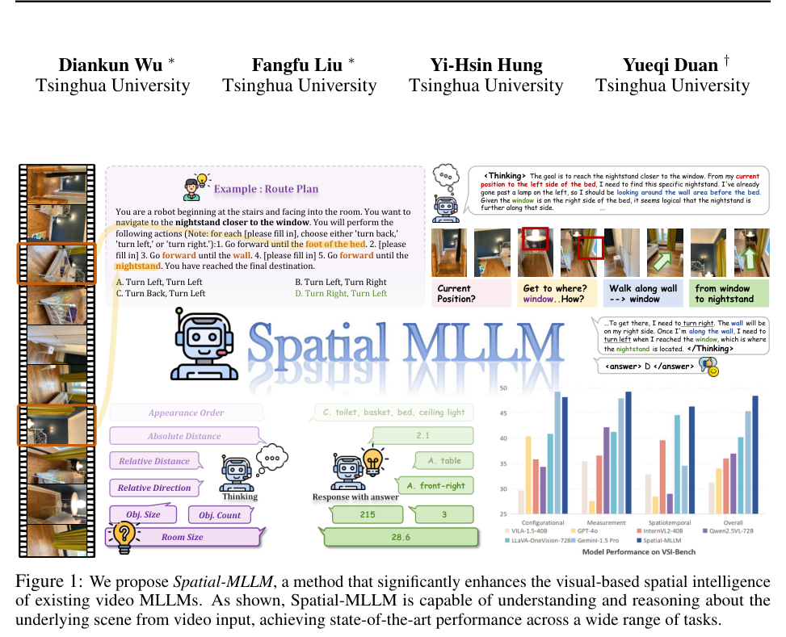
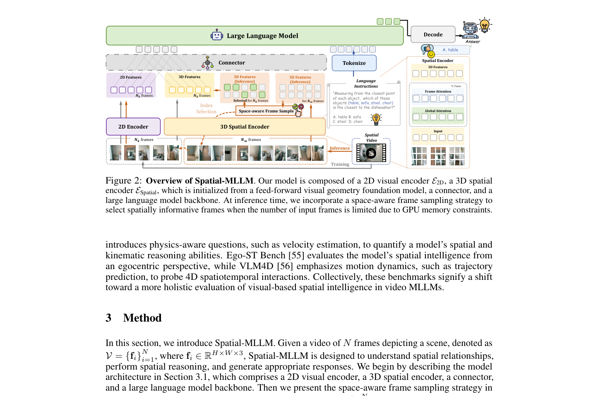
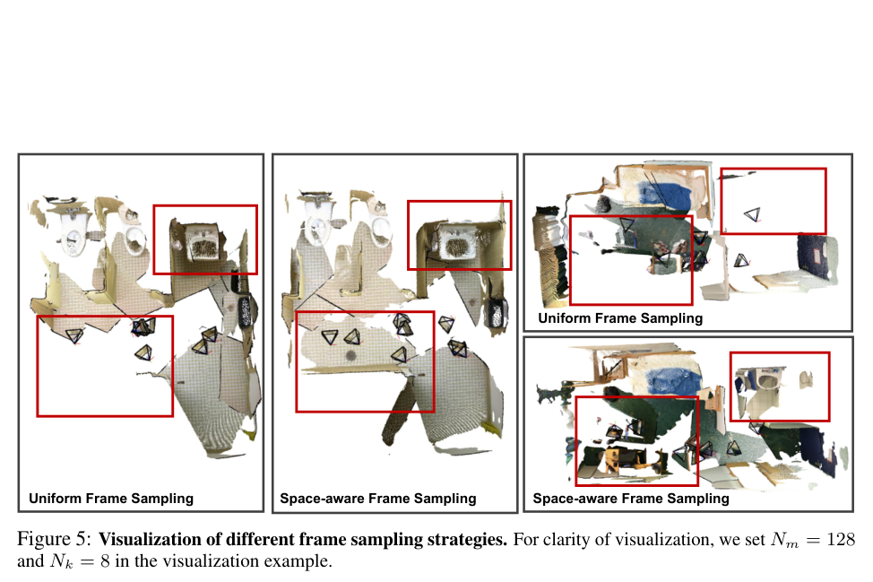
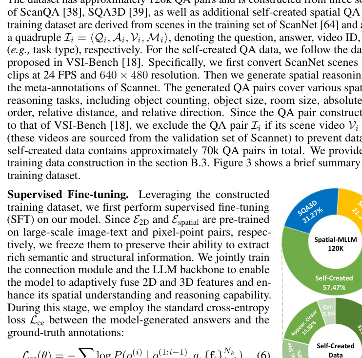
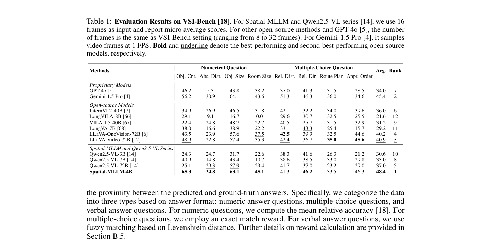
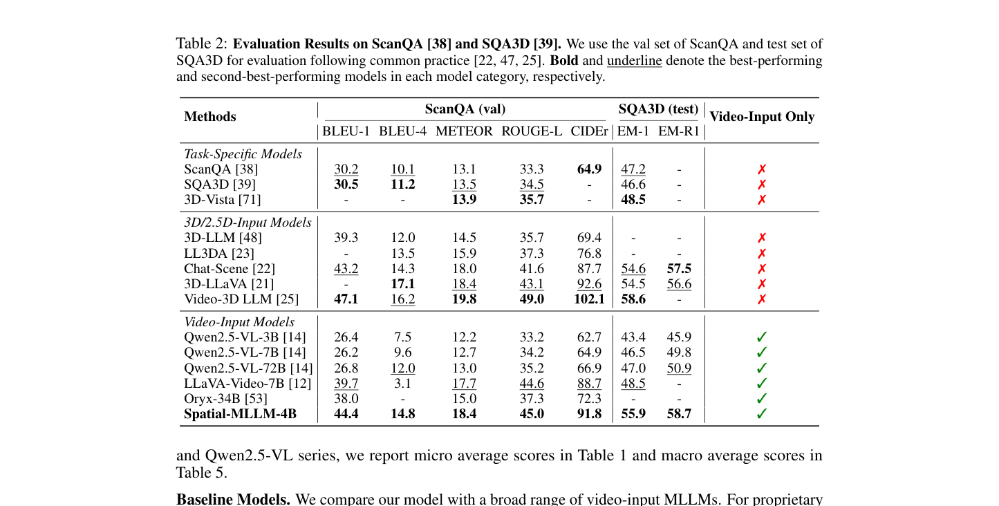
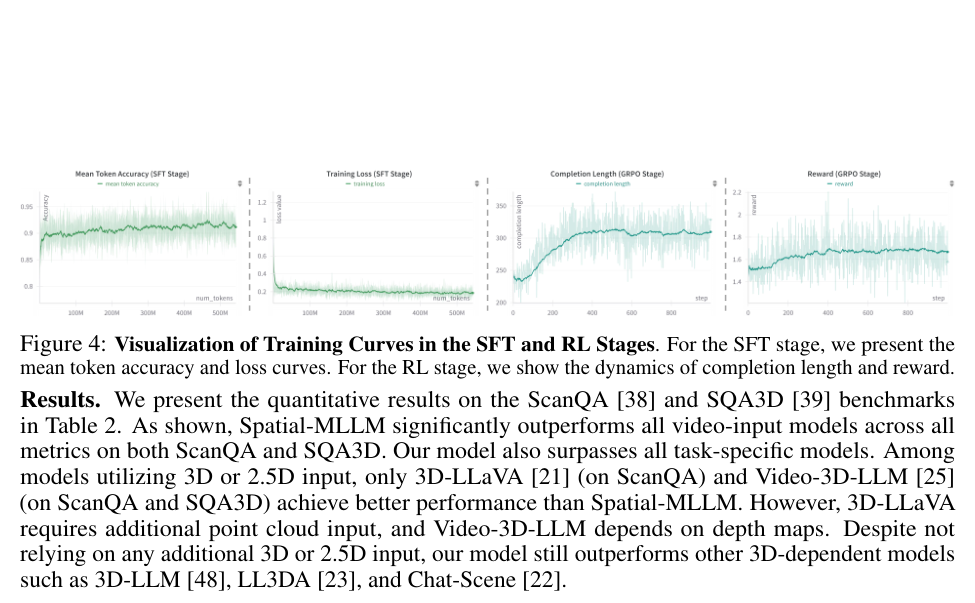
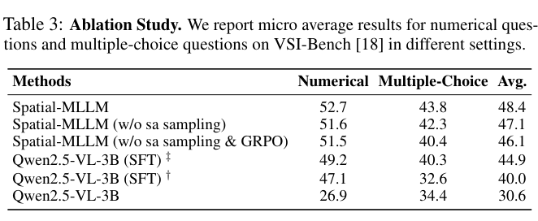
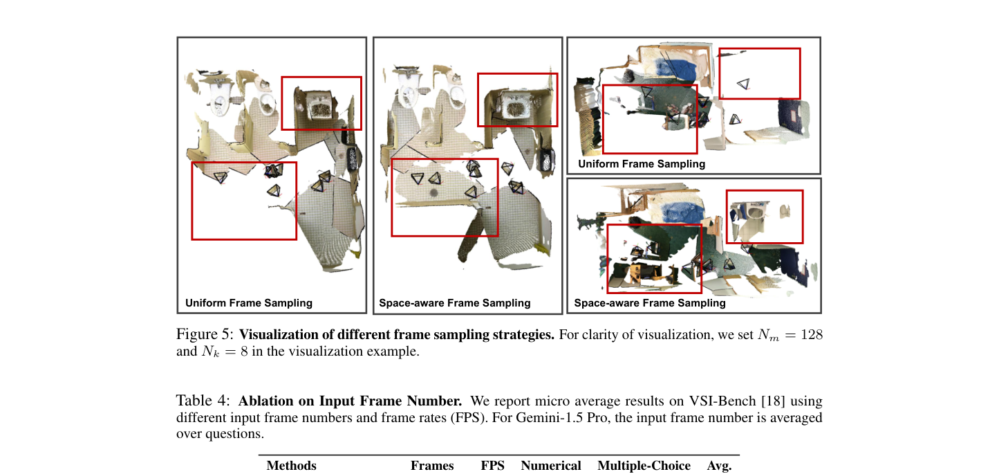

# Spatial-MLLM：用视觉几何基础模型的结构先验增强视频 MLLM 的空间智能

## 核心信息

- 标题: Spatial-MLLM: Boosting MLLM Capabilities in Visual-based Spatial Intelligence
- 标题翻译: Spatial-MLLM：提升多模态大语言模型在基于视觉的空间智能上的能力
- 作者: Diankun Wu\*（吴殿坤）, Fangfu Liu\*（刘芳甫）, Yi-Hsin Hung（洪亦歆）, Yueqi Duan†（段岳圻）
- 机构: 清华大学（Tsinghua University），自动化系/TSI 相关组
- 发表时间: arXiv v1 2025-05-29；v2 2026-05-19
- 发表渠道: NeurIPS 2025（正文首页标注 39th Conference on Neural Information Processing Systems）
- arXiv: 2505.23747
- 论文链接: https://arxiv.org/abs/2505.23747
- 项目主页: https://diankun-wu.github.io/Spatial-MLLM/
- 代码: https://github.com/diankun-wu/Spatial-MLLM （CCF 导读页标注为 THU-SI/Spatial-MLLM，以项目主页为准）
- 数据 / 资源: Spatial-MLLM-120k，约 120k 空间 QA 对，由 ScanQA 训练集、SQA3D 与自建数据三部分构成
- 论文类型: AI_method
- 基类模型: Qwen2.5-VL-3B + VGGT，总参数约 4.9B（文中称 Spatial-MLLM-4B）
- 硬件: Intel(R) Xeon(R) Gold 6430 + 80G NVIDIA A800

## 原文摘要翻译

多模态大语言模型（MLLM）的近期进展显著提升了 2D 视觉任务性能，但提升其空间智能仍是挑战。现有 3D MLLM 往往依赖额外的 3D 或 2.5D 数据来引入空间感知，这限制了它们在只有 2D 输入（图像或视频）场景中的可用性。本文提出 Spatial-MLLM，一个纯粹从 2D 观测进行基于视觉的空间推理的新框架。不同于依赖 CLIP 类视觉编码器（为语义理解而优化）的传统视频 MLLM，我们的核心洞察是**释放前馈式视觉几何基础模型中强大的结构先验**。具体地，我们提出双编码器架构：一个预训练 2D 视觉编码器提取语义特征，一个 3D 空间编码器（由视觉几何模型的骨干网络初始化）提取 3D 结构特征；再用一个连接器把两类特征整合为统一的视觉 token 以增强空间理解。此外，我们在推理时提出**空间感知帧采样策略**，从视频序列中挑选空间信息量最大的帧，确保在 token 长度受限时模型仍聚焦于对空间推理至关重要的帧。除架构改进外，我们从多个来源构建训练数据集（Spatial-MLLM-120k），并用监督微调（SFT）与 GRPO 训练模型。在多个真实数据集上的大量实验表明，Spatial-MLLM 在一系列基于视觉的空间理解与推理任务上取得了当前最优性能。

## 一句话总结

Spatial-MLLM 把 VGGT 这类前馈视觉几何基础模型的骨干当作"结构先验提取器"，与 Qwen2.5-VL 的语义编码器组成双编码器并逐元素相加融合，辅以基于体素最大覆盖的推理期帧采样和 SFT+GRPO 两阶段训练，在纯 2D 视频输入下把 VSI-Bench 从 30.6 拉到 48.4，超过 Gemini-1.5 Pro 的 45.4。


*图 1：Spatial-MLLM  teaser。左：多任务类型（计数、尺寸、距离、方向、出现顺序、路线规划）；右：与其他开源/闭源模型在 VSI-Bench 上的柱状对比。*

## 研究问题

**任务设定：visual-based 3D spatial intelligence（基于视觉的 3D 空间智能）。** 作者明确区分两种场景：

1. **有额外 3D/2.5D 数据**（点云、相机参数、深度图）与 2D 视觉输入并用——这是 3D MLLM 的主流设定（LL3DA、Chat-Scene、3D-LLaVA、Video-3D LLM 等）；
2. **只有单目视频**——这是本文针对的场景。此时每帧只提供场景的局部观测，没有全局表征（点云或带位姿深度图）可用作输入，模型必须从不完整线索中推断全局空间布局，并把这些局部观测在内部整合为一个连贯的隐式全局表征。

**作者识别的核心瓶颈（原文论点，非分析者推演）：** 现有视频 MLLM 的视觉编码器主要在图文对（以 image-caption 为主）上按 CLIP 范式预训练，这使其擅长捕捉高层语义内容，但在只有 2D 视频输入时缺乏结构与空间信息。因此当前视频 MLLM 在空间推理任务上的表现普遍劣于时间理解等其他任务，且显著落后于人类。

**注意（分析者补充）：** 这里的"部分观测"是**时间/视角维度上的部分性**——假设有一段覆盖全场景的漫游视频（VSI-Bench 中典型场景视频超过 2000 帧）。这与本人关注的"单视角/遮挡导致的几何不完整、需要生成式补全"并非同一问题，不可直接类比。

## 方法主线

### 整体架构

四部分组成：2D 视觉编码器 $E_{2D}$、3D 空间编码器 $E_{Spatial}$、连接器 Connector、LLM 骨干 $f_\theta$。

输入：$N$ 帧场景视频 $V=\{f_i\}_{i=1}^N$，推理时选出 $N_k$ 帧（$N_k \ll N$）。


*图 2：Spatial-MLLM 架构。训练时 2D 编码器与 3D 空间编码器同时接收 $N_k$ 帧，Connector 把两路 token 对齐并逐元素相加后送入 LLM。推理时额外用空间感知帧采样从 $N_m=128$ 帧中选出 $N_k=16$ 帧，并把预计算的结构特征复用。*

```
视频 N 帧
   ├─ 均匀子采样 Nm=128 帧 ─→ VGGT 骨干+相机头+深度头 ─→ 点图 ─→ 体素化 ─→ 贪心最大覆盖 ─→ 选出 Nk=16 帧
   │
   ├─ E_2D（Qwen2.5-VL ViT，冻结）      ─→ e_2D  语义特征
   └─ E_Spatial（VGGT backbone，冻结）  ─→ e_3D  结构特征（另有 e_c 相机特征、e_register，融合阶段不用）
                                          ↓
                                    Rearrange（时空对齐）
                                          ↓
                                    2-layer MLP ×2 → 逐元素相加
                                          ↓
                                    统一视觉 token → LLM → 答案
```

### 模块细节

**1）双编码器（原文 3.1 节）**

2D 分支沿用 Qwen2.5-VL 的视觉编码器设计：

$$e_{2D}=E_{2D}\big(\{f_i\}_{i=1}^{N_k}\big),\quad e_{2D}\in\mathbb{R}^{N_k'\times \lfloor H/p_{2D}\rfloor\times\lfloor W/p_{2D}\rfloor\times d_{2D}}$$

其中 $p_{2D}$、$d_{2D}$ 为 patch 大小与特征维度；视频输入时相邻两帧被分组，故 $N_k'=\lceil N_k/2\rceil$。

3D 分支使用 VGGT 的特征骨干，交替进行 frame-wise self-attention 与 global self-attention，以跨帧聚合空间信息：

$$e_{3D}, e_c, e_{register}=E_{Spatial}\big(\{f_i\}_{i=1}^{N_k}\big),\quad e_{3D}\in\mathbb{R}^{N_k\times\lfloor H/p_{3D}\rfloor\times\lfloor W/p_{3D}\rfloor\times d_{3D}}$$

原文明确：**融合阶段只用 $e_{3D}$**，因为它承载输入帧的稠密结构信息；相机特征 $e_c$ 与 register token 只用于帧采样分支。

**2）连接器（原文 3.1 节 + 附录 B.2）**

先对 $e_{3D}$ 做时空对齐：$e'_{3D}=\text{Rearrange}(e_{3D})$，使其与 $e_{2D}$ 在时序帧数与空间网格上一致；再用轻量连接器融合：

$$e=\text{Connector}(e_{2D}, e'_{3D}),\quad e\in\mathbb{R}^{S\times d_{llm}}$$

附录 B.2 给出精确做法（这一段是复现关键，正文没有）：

- 两个编码器的空间 patch size 均为 **14**；
- 2D 编码器额外做空间 2×2 merge + 时序每 2 帧 merge，因此其输出 token 数恰为 3D 编码器的 **1/8**（不计 register 与 camera token）；
- 对 $e_{3D}$ 施加**与 2D 编码器完全相同的时空 merge 策略**，重排为序列，保证两路 token 在位置与数量上精确对齐；
- 两路各用一个 **两层 MLP** 投影到 LLM 隐维度，然后**逐元素相加**（element-wise addition）融合。

原文自评：虽然可以用更复杂的融合（如 cross-attention），但发现上述做法已足够有效，留作未来工作。

**3）空间感知帧采样（原文 3.2 节 + 附录 B.1）——本文最具"可迁移"价值的模块**

动机：显存限制下只能喂给视频 MLLM 有限帧（VSI-Bench 设置为 8–32 帧，而典型场景视频超过 2000 帧）。通用视频理解用均匀采样即可，但空间理解要求**最大化对底层场景的覆盖**，均匀采样做不到。

流程（三步）：

- **(a) 场景几何预处理**：均匀子采样 $N_m=128$ 帧 $\{f_i^m\}$，用 VGGT 骨干 + 相机头 $f_c$ + 深度头 $f_d$ 解出相机外参/内参与深度：
  $$\{E_i^m, K_i^m\}_{i=1}^{N_m}=f_c(e_c),\qquad \{D_i^m\}_{i=1}^{N_m}=f_d(e_{3D})$$
  再通过深度反投影得到 3D 点图：
  $$P_i^m = D_i^m\cdot {K_i^m}^{-1}[u|v|1]^\top\cdot {E_i^m}^{-1}$$
  原文说明：VGGT 也能从稠密 3D 特征直接解码点图，但他们发现**用深度+相机反投影更准确**。每个点还带有深度头给出的置信度 $c(p)\in[0,1]$。

- **(b) 体素化与覆盖计算**：先用置信度筛出有效点集
  $$P_{valid}=\bigcup_{i=1}^{N_m}\{p\in P_i^m \mid c(p)>0.1\ \wedge\ c(p)\ge \text{Percentile}(\{c(p)\},50\%)\}$$
  再对其包围盒做体素离散化。为处理 VGGT 输出的相对尺度，体素边长自适应设为包围盒最短边的 $1/\lambda$：
  $$\Delta = \frac{1}{\lambda}\cdot\min\big(\max(P_{valid})-\min(P_{valid})\big),\quad \lambda=20$$
  每帧覆盖的体素集合：$V(f_i^m)=\{\lfloor (p-\min(P_{valid}))/\Delta \rfloor \mid p\in P_i^m\cap P_{valid}\}$。

- **(c) 最大覆盖贪心选择**：
  $$\max_{S\subseteq\{1..N_m\}}\Big|\bigcup_{i\in S}V(f_i^m)\Big|\quad \text{s.t. } |S|=N_k$$
  这是经典最大覆盖问题（Nemhauser 等证明贪心对子模函数有 $1-1/e$ 近似保证），用 Algorithm 1 的贪心迭代实现：每轮选"新增覆盖最大"的帧，直到选满 $N_k$ 或新增覆盖为 0。


*图 5：均匀采样与空间感知采样的点图覆盖对比。可见空间感知采样覆盖了更多短暂出现的视角（红框为遗漏区域），而均匀采样在相机静止时容易出现冗余视角。*

**关键工程细节（易被忽略但很重要）：** 选出 $N_k$ 帧后**无需重新计算**它们的 3D 特征，直接从预算好的 $e_{3D}^m$ 中取用即可（$e_{3D}^k \subset e_{3D}^m$）。这意味着采样分支的 VGGT 前向只跑一次。

**4）训练数据与两阶段训练（原文 3.3 节 + 附录 B.3–B.5）**

**数据构成（Spatial-MLLM-120k，约 120k QA 对，四元组 $\langle Q_i, A_i, V_i, M_i\rangle$）：**

| 来源 | 占比 |
|---|---|
| ScanQA 训练集 | 21.26% |
| SQA3D | 21.27% |
| 自建空间 QA | 57.47%（约 70k） |


*图 3：Spatial-MLLM-120k 数据构成（ScanQA 21.26%，SQA3D 21.27%，自建 57.47%）与自建数据内部任务类型分布。*

任务类型分布：相对方向 31.64%、相对/绝对距离 30.95%、出现顺序 15.82%、房间/物体尺寸 16.09%、计数 5.5%。

自建数据流程：ScanNet 场景 → 24 FPS、640×480 连续视频片段；用 ScanNet 元数据（alpha-shape 算房间尺寸与中心、每物体实例 OBB、NYU40 标签重映射、投影 2D 语义标注用于出现顺序）生成七类空间 QA。**防泄漏：若某条数据的场景视频被 VSI-Bench 使用（VSI-Bench 视频源自 ScanNet 验证集），则剔除该条。**

**SFT 阶段：** 冻结 $E_{2D}$ 与 $E_{Spatial}$（保留其语义/结构提取能力），联合训练连接器与 LLM 骨干。Adam，1 epoch，global batch 16，线性学习率峰值 $10^{-5}$，分辨率 640×480，帧数上限 16。

**Cold Start（冷启动）：** 200 步，目的是让模型适应正确推理格式。用 Qwen2.5-VL-72B 对 $N_s=5000$ 个子采样样本各生成 $K=3$ 条独立推理链，按 reward 取每条样本的最优路径，再按**题型自适应阈值**过滤——每种题型内部取 reward 的 50% 分位数作阈值 $\tau_{t(i)}$，要求 $\hat r_i \ge \tau_{t(i)}$ 且 $\hat r_i > 0$（避免全局阈值造成的题型失衡）。最终得到 **2459 条**冷启动样本。

**GRPO 阶段：** 每问题 8 次 rollout，采样温度 1.0，KL 系数 $\beta=0.04$，学习率 $10^{-6}$，**仅 1000 步**（受算力限制）。目标函数：

$$\mathcal{J}_{GRPO}(\theta)=\mathbb{E}_{q,o_i}\left[\frac{1}{G}\sum_{i=1}^G \min\Big(\frac{\pi_\theta(o_i|q)}{\pi_{\theta_{old}}(o_i|q)}A_i,\ \text{clip}\big(\frac{\pi_\theta(o_i|q)}{\pi_{\theta_{old}}(o_i|q)},1\pm\epsilon\big)A_i\Big) - \beta \mathbb{KL}[\pi_\theta\|\pi_{ref}]\right]$$

其中 $A_i=\dfrac{r_i-\text{mean}(r_1..r_G)}{\text{std}(r_1..r_G)}$。

奖励设计（附录 B.5，$\lambda_1=\lambda_2=1$）：

$$\text{Reward}(A_{pred},A_{gt})=\lambda_1 R_{format} + \lambda_2\begin{cases} R_{MC}, & \text{多选}\\ R_{MRA}, & \text{数值}\\ R_{Verbal}, & \text{文本}\end{cases}$$

- 多选：$R_{MC}=\mathbb{I}(\psi(A_{pred})=\psi(A_{gt}))$，$\psi$ 为去空白归一化，精确匹配；
- 数值：$R_{MRA}=\frac{1}{|T|}\sum_{\tau\in T}\mathbb{I}\big(\frac{|\alpha(A_{pred})-\alpha(A_{gt})|}{|\alpha(A_{gt})|+\epsilon}<\tau\big)$，$T=\{0.50,0.55,...,0.95\}$，$\epsilon=10^{-8}$；
- 文本：$R_{Verbal}=1-\dfrac{D_{Lev}(\phi(A_{pred}),\phi(A_{gt}))}{|\phi(A_{pred})|+|\phi(A_{gt})|}$，Levenshtein 比率；
- 另加**推理长度奖励**（follow Video-R1），鼓励更长的思考。

⚠️ 待核对：正文中 $R_{Verbal}$ 的分母写作 $|\phi(A_{pred})|+|\phi(A_{gt})|$，而标准 Levenshtein ratio 通常分母为两串长度之和、分子为编辑距离，形式自洽；但严格实现应以官方代码为准。

**推理设置：** $N_m=128$，$N_k=16$，温度 0.1，top-p 0.001（原文解释：空间推理需要一定的确定性），分辨率 640×480。

## 实验与结果

### 主实验 1：VSI-Bench（Table 1，micro average，Spatial-MLLM 与 Qwen2.5-VL 系列均用 16 帧）


*表 1：VSI-Bench 上各方法对比。加粗与下划线分别表示最佳与次佳开源模型。Spatial-MLLM-4B 平均 48.4，超过 Gemini-1.5 Pro 的 45.4。*

| 方法 | Obj. Cnt. | Abs. Dist. | Obj. Size | Room Size | Rel. Dist. | Rel. Dir. | Route Plan | Appr. Order | **Avg.** | Rank |
|---|---|---|---|---|---|---|---|---|---|---|
| *闭源* | | | | | | | | | | |
| GPT-4o | 46.2 | 5.3 | 43.8 | 38.2 | 37.0 | 41.3 | 31.5 | 28.5 | 34.0 | 7 |
| Gemini-1.5 Pro | 56.2 | 30.9 | **64.1** | 43.6 | **51.3** | **46.3** | **36.0** | 34.6 | 45.4 | 2 |
| *开源* | | | | | | | | | | |
| InternVL2-40B | 34.9 | 26.9 | 46.5 | 31.8 | 42.1 | 32.2 | 34.0 | 39.6 | 36.0 | 6 |
| LongVILA-8B | 29.1 | 9.1 | 16.7 | 0.0 | 29.6 | 30.7 | 32.5 | 25.5 | 21.6 | 12 |
| VILA-1.5-40B | 22.4 | 24.8 | 48.7 | 22.7 | 40.5 | 25.7 | 31.5 | 32.9 | 31.2 | 9 |
| LongVA-7B | 38.0 | 16.6 | 38.9 | 22.2 | 33.1 | 43.3 | 25.4 | 15.7 | 29.2 | 11 |
| LLaVA-OneVision-72B | 43.5 | 23.9 | 57.6 | 37.5 | 42.5 | 39.9 | 32.5 | 44.6 | 40.2 | 4 |
| LLaVA-Video-72B | 48.9 | 22.8 | 57.4 | 35.3 | 42.4 | 36.7 | 35.0 | **48.6** | 40.9 | 3 |
| *Qwen 系列* | | | | | | | | | | |
| Qwen2.5-VL-3B | 24.3 | 24.7 | 31.7 | 22.6 | 38.3 | 41.6 | 26.3 | 21.2 | 30.6 | 10 |
| Qwen2.5-VL-7B | 40.9 | 14.8 | 43.4 | 10.7 | 38.6 | 38.5 | 33.0 | 29.8 | 33.0 | 8 |
| Qwen2.5-VL-72B | 25.1 | 29.3 | 57.9 | 29.4 | 41.7 | 37.0 | 23.2 | 29.0 | 37.0 | 5 |
| **Spatial-MLLM-4B** | **65.3** | **34.8** | 63.1 | **45.1** | 41.3 | 46.2 | 33.5 | 46.3 | **48.4** | **1** |

**读表要点：**
- 4B 模型超过 Gemini-1.5 Pro（45.4）+3.0，超过同基类的 Qwen2.5-VL-3B（30.6）**+17.8**。
- 但**并非全面超越 Gemini**：Rel. Dist（41.3 vs 51.3，-10.0）与 Route Plan（33.5 vs 36.0，-2.5）两项仍明显落后；Obj. Size（63.1 vs 64.1）微差。这说明增益集中在计数、绝对距离、房间尺寸、出现顺序等"可从几何直接读出"的量，而 relative distance 这类需要跨物体精细比较的任务仍弱。
- Route Plan 是所有模型共同的难点（GPT-4o 31.5、Gemini 36.0），Spatial-MLLM 33.5 甚至低于 Gemini，改进幅度最小。

### 主实验 2：ScanQA (val) 与 SQA3D (test)（Table 2）


*表 2：ScanQA val 与 SQA3D test 结果。Spatial-MLLM-4B 在纯视频输入类别中全面第一，但未超过使用深度图的 Video-3D LLM 与使用点云的 3D-LLaVA。*

| 方法 | 输入 | BLEU-1 | BLEU-4 | METEOR | ROUGE-L | CIDEr | EM-1 | EM-R1 |
|---|---|---|---|---|---|---|---|---|
| *任务专用* | | | | | | | | |
| ScanQA | ✗ | 30.2 | 10.1 | 13.1 | 33.3 | 64.9 | 47.2 | - |
| SQA3D | ✗ | 30.5 | 11.2 | 13.5 | 34.5 | - | 46.6 | - |
| *3D/2.5D 输入* | | | | | | | | |
| 3D-LLM | ✗ | 39.3 | 12.0 | 14.5 | 35.7 | 69.4 | - | - |
| LL3DA | ✗ | - | 13.5 | 15.9 | 37.3 | 76.8 | - | - |
| Chat-Scene | ✗ | 43.2 | 14.3 | 18.0 | 41.6 | 87.7 | 54.6 | 57.5 |
| 3D-LLaVA | ✗ | - | 17.1 | 18.4 | 43.1 | **92.6** | 54.5 | 56.6 |
| Video-3D LLM | ✗ | **47.1** | **16.2** | **19.8** | **49.0** | **102.1** | **58.6** | - |
| *纯视频输入* | | | | | | | | |
| Qwen2.5-VL-3B | ✓ | 26.4 | 7.5 | 12.2 | 33.2 | 62.7 | 43.4 | 45.9 |
| Qwen2.5-VL-7B | ✓ | 26.2 | 9.6 | 12.7 | 34.2 | 64.9 | 46.5 | 49.8 |
| Qwen2.5-VL-72B | ✓ | 26.8 | 12.0 | 13.0 | 35.2 | 66.9 | 47.0 | 50.9 |
| LLaVA-Video-7B | ✓ | 39.7 | 3.1 | 17.7 | 44.6 | 88.7 | 48.5 | - |
| Oryx-34B | ✓ | 38.0 | - | 15.0 | 37.3 | 72.3 | - | - |
| **Spatial-MLLM-4B** | **✓** | **44.4** | 14.8 | 18.4 | 45.0 | 91.8 | 55.9 | **58.7** |

**读表要点：**
- 在"纯视频输入"这一栏内**全面第一**，且大幅超过同为视频输入的 Qwen2.5-VL-72B（EM-1 47.0 → 55.9，+8.9）。
- 但**仍未超过最强的 3D/2.5D 输入方法**：CIDEr 91.8 < 3D-LLaVA 92.6 < Video-3D LLM 102.1；EM-1 55.9 < Video-3D LLM 58.6。原文的结论表述是诚实的——只说"超过其他 3D 依赖模型如 3D-LLM、LL3DA、Chat-Scene"，不声称全面 SOTA。
- 注：这两项训练数据源（ScanQA、SQA3D 训练集）就在 Spatial-MLLM-120k 中，属同分布评测，跨方法比较时需注意。

### 消融实验


*图 4：训练曲线。SFT 阶段给出 mean token accuracy 与 loss；RL 阶段给出 completion length 与 reward 的动态。*

**Table 3：架构 / 数据 / 采样 / RL 的贡献分解（VSI-Bench micro avg）**


*表 3：消融实验。全量 Spatial-MLLM 48.4；去掉空间感知采样 47.1；再去掉 GRPO 46.1；Qwen SFT‡ 44.9；原始 Qwen2.5-VL-3B 30.6。*

| 方法 | Numerical | Multiple-Choice | **Avg.** |
|---|---|---|---|
| Spatial-MLLM（全量） | 52.7 | 43.8 | **48.4** |
| w/o space-aware sampling | 51.6 | 42.3 | 47.1 |
| w/o sa sampling & w/o GRPO | 51.5 | 40.4 | 46.1 |
| Qwen2.5-VL-3B (SFT)‡ | 49.2 | 40.3 | 44.9 |
| Qwen2.5-VL-3B (SFT)† | 47.1 | 32.6 | 40.0 |
| Qwen2.5-VL-3B（原始） | 26.9 | 34.4 | 30.6 |

（†: 用 R1-V 训练框架；‡: 在 R1-V 基础上进一步对问题 token 施加 loss mask，与 Spatial-MLLM 训练流程对齐）

**⚠️ 关键解读（分析者计算，非原文给出）——收益的绝大部分来自数据，不是架构：**

| 增量 | 幅度 |
|---|---|
| 原始 3B → Qwen2.5-VL-3B SFT‡（**数据贡献**） | 30.6 → 44.9，**+14.3** |
| Qwen SFT‡ → Spatial-MLLM w/o sa & GRPO（**架构贡献**） | 44.9 → 46.1，**+1.2** |
| + GRPO（**RL 贡献**） | 46.1 → 47.1，**+1.0** |
| + space-aware sampling（**采样贡献**） | 47.1 → 48.4，**+1.3** |

这是本论文最需要警惕的一张表：双编码器架构本身只贡献 **1.2 个点**，而训练数据贡献 **14.3 个点**。原文在 3.3 节的措辞（"both models underperform compared to the SFT version of Spatial-MLLM, which validates the effectiveness of the proposed architecture"）在方向上正确，但**没有把这个量级差异摆到台面上**。若审稿人追问"是不是换个数据集就能拿到大部分收益"，作者需要更有力的证据。

**Table 4：输入帧数消融**


*表 4：不同输入帧数下的 VSI-Bench 结果。空间感知采样在 8/16/32 帧均优于均匀采样，边际递减。*

| 方法 | 帧数 | FPS | Numerical | MC | **Avg.** |
|---|---|---|---|---|---|
| Spatial-MLLM | 8 / 16 / 32 | N/A | 50.8 / 52.7 / 53.1 | 41.2 / 43.8 / 45.3 | 46.1 / 48.4 / 49.3 |
| Spatial-MLLM (w/o sa) | 8 / 16 / 32 | N/A | 48.2 / 51.6 / 52.4 | 39.2 / 42.3 / 44.2 | 43.8 / 47.1 / 48.4 |
| Gemini-1.5 Pro | 12.2 / 29.6 / 117.1 | 0.1 / 0.25 / 1 | 43.1 / 48.8 / 49.7 | 35.7 / 37.8 / 44.0 | 39.5 / 43.5 / 46.9 |
| Qwen2.5-VL-3B | 8 / 16 / 32 | N/A | 20.2 / 26.9 / 28.3 | 33.1 / 34.4 / 35.7 | 26.5 / 30.6 / 31.9 |

- 空间感知采样在各帧数下**一致优于**均匀采样，但**边际递减**：8 帧 +2.3、16 帧 +1.3、32 帧 +0.9。符合直觉——帧数越多，均匀采样越接近全覆盖，贪心的相对优势自然缩小。
- 效率对比很亮眼：Spatial-MLLM **16 帧（48.4）> Gemini-1.5 Pro 约 117 帧（46.9）**，即用约 1/7 的帧数超过 Gemini。
- 但注意 sa@8（46.1）仍劣于 uniform@16（47.1）：**采样策略不能完全替代更多帧**，作者未强调这一点。

## 局限

**作者自述（原文 Sec. 5 Limitations and Future Work）：**
1. 模型规模与训练数据规模仍有进一步扩展空间；
2. 本工作主要面向视觉空间智能，只在相关数据集与基准上训练评测；
3. 未来方向：探索融入空间结构信息能否进一步惠及通用视频理解与推理任务。

**分析者补充的局限：**
4. **VGGT 在推理期仍需运行**——$E_{Spatial}$ 参与融合、帧采样也要跑 VGGT 骨干+相机头+深度头。因此"无需 3D 输入"≠"推理零重模型"，这点极易被误读；
5. **RL 只训了 1000 步**（算力受限），GRPO 的真实上限未探明；
6. **两个编码器全程冻结**——双编码器之间没有任何训练期交互，融合只靠两层 MLP + 逐元素相加。作者自己承认更复杂融合（cross-attention）未探索；
7. **评测集中于 ScanNet 系室内场景**（ScanNet/ScanNet++/ARKitScenes），室外、动态物体、长时序场景未验证；
8. 训练数据里 ScanQA / SQA3D 各占约 21%，而评测也在 ScanQA val 与 SQA3D test 上，跨方法比较存在数据同分布优势；
9. 未报告显存占用、推理时延、FLOPs 等效率量化指标，只有帧数对比；
10. 未给出失败案例可视化与错误类型分析。

## 深度分析

### 为什么有效

三个可分离的机制。第一，**结构先验的互补性**：VGGT 在 pixel-point 对上训练，其特征天然编码多视角几何一致性；CLIP 范式编码器在 image-caption 上训练，特征编码语义。二者在信息类型上近似正交，逐元素相加即可把两类证据叠加进同一 token——这也是为什么最简单的融合就能起效。第二，**帧采样的信息论动机清晰**：把"选帧"从时间轴上的均匀覆盖改写为 3D 空间体素的最大覆盖，直接对齐评测目标（问的是场景几何，就该最大化几何覆盖）；且子模性保证了贪心的近似比。第三，**GRPO + 题型自适应冷启动**让模型学会长链空间推理，尤其利好 route planning 这类需要多步推断的题型。

### 复杂度与扩展性

- 训练：4.9B 参数，冻结两个编码器只训连接器+LLM，SFT 1 epoch（120k 样本，batch 16）。瓶颈在 VGGT 骨干的前向（128 帧预算 + 16 帧训练）与 LLM 的序列长度。
- 推理：VGGT 需跑两路（128 帧预算做采样 + 16 帧提特征，后者可复用前者结果），再加 Qwen2.5-VL-3B 的编码与解码。**这不是轻量推理方案。**
- 可扩展点：融合方式（cross-attention、gating）、编码器解冻联合微调、更强的几何骨干（π³、MegaSam）、更长 RL 训练。

### 复现注意点

1. 两个编码器 patch size 都是 14，且**必须对 $e_{3D}$ 施加与 2D 编码器完全相同的 2×2 空间 merge + 每 2 帧时序 merge**，否则 token 无法逐元素对齐（附录 B.2，正文未写）。
2. 帧采样中 VGGT 有点图直解与"深度+相机反投影"两条路，**作者明确说后者更准**，复现时不要图省事走直解。
3. 置信度过滤是双条件：$c(p)>0.1$ **且** $c(p)\ge$ 50 分位；体素边长 $\lambda=20$。这两个超参对覆盖结果敏感，未做敏感性扫描。
4. 自建数据时**必须剔除与 VSI-Bench 重合的 ScanNet 验证集视频**，否则主实验不可信。
5. 冷启动的过滤是**按题型的 50% 分位自适应阈值**，不是全局阈值——这一步是为了避免题型失衡，直接用全局阈值会掉点。
6. GRPO 的推理长度奖励参照 Video-R1，但正文引用的是 [12] LLaVA-Video，引用与实现来源需以官方代码核对。

## 我的笔记：对本人 affordance grounding 研究的可借鉴点与风险

> 以下为**分析者推演**，非论文事实，需与前文区分。

**① 直接相关性有限——它不做 affordance。** Spatial-MLLM 解的是场景级空间 QA（计数、距离、方向、路线规划、出现顺序），输出是文本答案，**不做逐点/逐区域的功能可供性 grounding**。它不能作为本人工作的直接 baseline，只能作为"空间理解能力组件"的参照。

**② 🚨 撞红线警告：把 GEAL 的 DINOv2 换成 VGGT 是"换编码器"，按本人既定原则不构成新颖性。** 本论文最诱人的一点是"用 VGGT 的结构先验替代纯语义 2D 教师"。但如果本人的做法只是把 GEAL 一致性蒸馏目标里的 DINOv2 教师替换成 VGGT，那么：
- 组件替换，非架构级/范式级改动 → 审稿一句话可驳回；
- 而且 Spatial-MLLM 已经把"VGGT 作结构先验注入 MLLM"这条路占了，滞后跟进更无 novelty。
**结论：不要走"DINO→VGGT"这条路。** 若要用 VGGT，必须让它在架构中承担 GEAL 原本没有的新角色（例如显式产出完整几何以支撑②的生成式补全、提供遮挡下的几何先验），而不是替换对齐目标里的编码器。

**③ 真正可复用的三件"非 novelty 工具"。**
- **空间感知帧采样（体素最大覆盖）**：任务无关、与架构解耦，可直接移植到本人的 partial-observation 设定中做"最具信息量的视角/帧选择"。但它是**优化手段**，不能作为 novelty 卖点，只能放进 method 的一小节。
- **Cold Start 的题型自适应阈值过滤**（按题型取 reward 50% 分位）：这是一个干净的训练 recipe，避免了全局阈值造成的题型失衡，值得照搬。
- **GRPO 的奖励三分设计**（精确匹配 / MRA / Levenshtein 比率）：把这一套迁移到 affordance 任务时，需把 $R_{MRA}$ 换成区域级指标（如 aIoU / SIM），$R_{Verbal}$ 换成 affordance 标签匹配。

**④ 护城河对照：本人"推理零重模型"的优势在本论文上成立。** Spatial-MLLM 在推理期必须跑 VGGT（提特征 + 帧采样双路），是"无需 3D 数据输入"而非"无需几何模型推理"。本人路线 ①+② 若能做到推理时只跑轻量 3D 分支、不跑 MLLM 也不跑 TRELLIS/VGGT，则效率叙事仍未被本文占据——这与之前盘点的 NAVER Labs（ECCV 2026，冻结 ViT + 极小头做实时 affordance 图）是**不同威胁源**，需分别应对。

**⑤ 消融方法论警示（最该抄的一点）。** Table 3 暴露了一个真实问题：架构只贡献 +1.2，数据贡献 +14.3。本人写论文时**必须预先设计能证明"架构不可分解"的消融**（去掉意图引导补全 / 去掉补全反哺意图，性能应显著塌方），并主动报告各组件的贡献量级，而不是只报最终 SOTA。否则同样的质疑会落到本人头上。

**⑥ "部分观测"的定义差异要写清楚。** 本文的 partial 是**时间/视角维度**（长漫游视频里挑帧），本人的 partial 是**几何维度**（单视角/遮挡下的不完整点云需生成式补全）。在 related work 里必须显式区分，否则会被审稿人误认为已做。

## 批判性质疑清单

1. 架构 +1.2 / 数据 +14.3：若把自建 70k QA 直接喂给 Qwen2.5-VL-7B 或 72B，是否能达到甚至超过 Spatial-MLLM-4B？论文没有这个对照（只对照了 3B）。**这是最大的可攻击点。**
2. 融合方式只有逐元素相加，未与 cross-attention / gating 对比；且两个编码器全冻结，等于承认"融合层还没认真做"。
3. VSI-Bench 上 Rel. Dist（-10.0）与 Route Plan（-2.5）输给 Gemini，原文未在正文中讨论这两项退步的原因。
4. ScanQA / SQA3D 的训练集样本占了训练数据的 42.5%，同分布评测下的增益需打折。
5. 帧采样需要额外的 VGGT 128 帧前向，其耗时占推理总开销的比例未报告——若占比过高，"少帧数"的效率叙事会打折扣。

## Active Recall 自测题

1. Spatial-MLLM 的双编码器分别由什么初始化？训练时哪些模块被冻结、哪些被更新？
2. $E_{Spatial}$ 输出三种特征（$e_{3D}$、$e_c$、$e_{register}$）分别用在哪里？
3. 为什么 2D 编码器输出的 token 数恰为 3D 编码器的 1/8？融合前如何对齐？融合的具体算子是什么？
4. 空间感知帧采样把选帧形式化成了什么组合优化问题？为什么可以用贪心？近似比是多少？
5. 点图 $P_i^m$ 是怎么从深度和相机参数算出来的？为什么作者不用 VGGT 的点图直解？
6. 有效点 $P_{valid}$ 的置信度双条件是什么？体素边长 $\Delta$ 如何自适应确定？$\lambda$ 取多少？
7. Spatial-MLLM-120k 的三部分来源与占比？任务类型分布？防泄漏怎么做？
8. Cold Start 的过滤规则是什么？为什么用题型自适应阈值而非全局阈值？最终留下多少条？
9. GRPO 的奖励由哪几项构成？数值题、多选题、文本题分别用什么度量？
10. 从 Table 3 拆解：数据、架构、GRPO、帧采样各贡献多少点？为什么这个分解对论文的 novelty 主张是威胁？
11. Spatial-MLLM 在 VSI-Bench 上哪两项输给 Gemini-1.5 Pro？
12. "无需 3D 输入"与"推理零重模型"是否等价？Spatial-MLLM 属于哪一种？
13. 若把 GEAL 的 DINOv2 教师换成 VGGT，按本人既定方法论原则，这算不算新颖性？为什么？

## 原文定位

| 内容 | 位置 |
|---|---|
| 双编码器公式 (1)(2)、连接器 (3)(4) | 正文 Sec. 3.1，p.4–5 |
| 空间感知帧采样 (5)、最大覆盖形式化 | 正文 Sec. 3.2，p.5–6 |
| 训练数据构成、SFT/cold start/GRPO 概述 | 正文 Sec. 3.3，p.6 |
| 实现细节（超参、硬件、推理设置） | 正文 Sec. 4.1，p.7 |
| VSI-Bench 主结果 | Table 1，p.7 |
| ScanQA / SQA3D 结果 | Table 2，p.8 |
| 架构/数据/RL/采样消融 | Table 3，p.9 |
| 帧数消融 | Table 4，p.10 |
| 训练曲线（SFT loss / RL reward & completion length） | Figure 4，p.9 |
| 帧采样可视化对比（point map 覆盖） | Figure 5，p.10 |
| 点图反投影 (8)、$P_{valid}$ (9)、体素 (10)(11)、最大覆盖 (12) | 附录 B.1，p.22 |
| 贪心采样伪代码 | Algorithm 1，p.23 |
| 融合细节（patch 14、1/8 token、两层 MLP、逐元素相加） | 附录 B.2，p.22 |
| 数据构建三阶段、七类 QA 模板 | 附录 B.3，p.23–24 |
| Cold Start 细节与伪代码 | 附录 B.4 + Algorithm 2，p.24–25 |
| 奖励公式 (13)(14)(15)(16) | 附录 B.5，p.24–25 |
| SFT / GRPO 的 system 与 user prompt | Figure 6，p.26 |
| 局限与未来工作 | 正文 Sec. 5，p.10 |

## 引用

1. Wu D., Liu F., Hung Y.-H., Duan Y. *Spatial-MLLM: Boosting MLLM Capabilities in Visual-based Spatial Intelligence*. NeurIPS 2025. arXiv:2505.23747. https://arxiv.org/abs/2505.23747
2. Wang J., Chen M., Karaev N., Vedaldi A., Rupprecht C., Novotny D. *VGGT: Visual Geometry Grounded Transformer*. CVPR 2025. （3D 空间编码器初始化与帧采样的几何来源）
3. Bai S., et al. *Qwen2.5-VL Technical Report*. arXiv:2502.13923, 2025. （2D 编码器与 LLM 骨干基类）
4. Yang J., Yang S., Gupta A. W., Han R., Li F.-F., Xie S. *Thinking in Space: How MLLMs See, Remember, and Recall Spaces* (VSI-Bench). arXiv:2412.14171, 2024. （主评测基准 + 自建数据的生成流程来源）
5. Shao Z., et al. *DeepSeekMath: Pushing the Limits of Mathematical Reasoning in Open Language Models* (GRPO). arXiv:2402.03300, 2024.
6. Guo D., et al. *DeepSeek-R1: Incentivizing Reasoning Capability in LLMs via RL*. arXiv:2501.12948, 2025. （cold start 与长 CoT 来源）
7. Chen L., Li L., Zhao H., Song Y. *R1-V: Reinforcing Super Generalization Ability in VLMs with Less Than $3*. 2025. （Table 3 中 Qwen2.5-VL-3B SFT 对照的训练框架）
8. Nemhauser G. L., Wolsey L. A., Fisher M. L. *An Analysis of Approximations for Maximizing Submodular Set Functions—I*. Mathematical Programming 14(1):265–294, 1978. （最大覆盖贪心的近似保证）
9. Azuma D., et al. *ScanQA: 3D Question Answering for Spatial Scene Understanding*. CVPR 2022. （训练与评测数据）
10. Ma X., et al. *SQA3D: Situated Question Answering in 3D Scenes*. arXiv:2210.07474, 2022. （训练与评测数据）
11. Dai A., et al. *ScanNet*. CVPR 2017. （自建数据的场景来源）
12. Darcet T., Oquab M., Mairal J., Bojanowski P. *Vision Transformers Need Registers*. arXiv:2309.16588, 2023. （register token）
