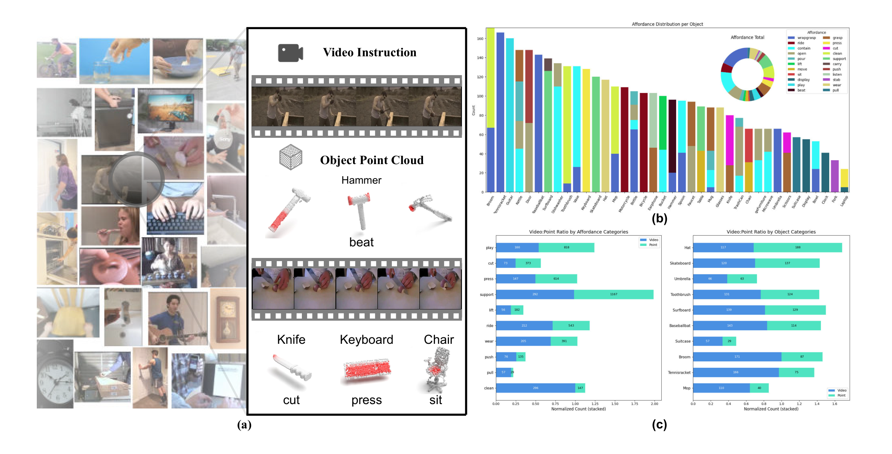

# VAGNet：基于视频人-物交互的三维可供性定位

## 核心信息
- 标题: VAGNet: Grounding 3D Affordance from Human-Object Interactions in Videos
- 标题翻译: 基于视频人-物交互的三维可供性定位
- 作者: Aihua Mao, Kaihang Huang, Yong-Jin Liu, Chee Seng Chan, Ying He
- 机构: 华南理工大学 (SCUT); 清华大学 (THU); 马来亚大学 (UM); 南洋理工大学 (NTU)
- 发表时间: 2026-02-24
- 发表渠道: arXiv preprint
- DOI: 10.48550/arxiv.2602.20608
- arXiv: 2602.20608
- 论文链接: http://arxiv.org/abs/2602.20608v1
- 代码 / 项目: 论文承诺代码与数据集将公开，文中未给具体仓库链接；截至本笔记撰写时按论文标题在 GitHub 未直接检索到官方仓库，需以作者后续发布为准。
- 数据 / 资源: PVAD（Point-Video Affordance Dataset），首个 HOI 视频与 3D 点云配对的可供性数据集；约 3,763 段视频、36,765 个点云、38 个物体类别、22 种可供性类型；视频来源 UCF101/HMDB 等，点云来源 3DAffordanceNet/PIADv2。
- 论文类型: AI_method

## 原文摘要翻译
3D 物体可供性定位旨在识别物体上支持人-物交互的区域，是具身视觉推理的关键能力。现有方法大多依赖静态视觉或文本线索，忽视了可供性本质上由动态动作定义的事实，因而常常难以定位真实交互中的接触区域。本文提出不同视角：人类通过观察并模仿动作而非仅仅审视形状来学习使用物体。受此启发，本文提出视频引导的 3D 可供性定位任务，利用动态交互序列提供功能监督。为此，本文提出 VAGNet 框架，将视频衍生的交互线索与 3D 结构对齐，以解决静态线索无法处理的歧义。为支撑该新任务，本文构建了 PVAD——首个 HOI 视频与 3D 配对的可供性数据集，提供了先前工作中缺失的功能监督。PVAD 上的大量实验表明，VAGNet 取得当前最优性能，显著优于基于静态线索的方法。代码与数据集将公开发布。

## 创新点
1. 提出新任务——视频引导的 3D 物体可供性定位，将可供功能性监督的来源从单张 HOI 图像或形状先验拓展为完整 HOI 视频序列，把 affordance 由几何属性重新定义为动作驱动的关系；该任务定义此前在 3D 可供性方向未被系统建立。
2. 设计 VAGNet 的双模块耦合架构：MCAM 在 2D 空间用上下文注意力把投影前景与视频帧背景对齐，再经跨注意力将 2D 交互线索注入 3D 点云特征；STFM 在时间维将已对齐的 3D 特征与视频特征做跨注意力融合。两者分别承担帧级证据在 3D 表面的锚定与时序演化在 3D 空间中的展开。
3. 构建 PVAD——首个大规模 HOI 视频与 3D 点云配对的可供性数据集，包含 3,763 段视频、36,765 个点云、38 个类别、22 种可供性类型；视频被裁剪至最长 10 秒并保证单次完整 HOI，并划分为 Seen 与 Unseen 两套评测协议。
4. 在 PVAD 上以一致设置证明：相较当前静态最优方法 GREAT，VAGNet 在 Seen 设定下 aIoU 提升 2.73 个点，SIM 提升 0.02。在 Unseen 设定下 AUC 提升 1.48，aIoU 提升 1.67，MAE 由 0.265 降至 0.201，验证了动态视频线索相对于静态图像的系统性增益。

## 一句话总结
VAGNet 把可供性从基于形状或单图的静态几何推理升级为以 HOI 视频作动态功能监督，借助 MCAM 与 STFM 的 2D-3D-时空耦合在自建 PVAD 上显著超越静态基线，并首次为该方向建立视频与点云配对基准。

## 研究问题
核心要解决的技术问题是：现有 3D 可供性定位方法（基于点云、2D 图像或文本静态线索）在形状相似但功能不同的部件上失效，例如刀刃与刀柄、瓶口与瓶身，因为单帧或单视角承载不了接触、施力与滑动等动作定义的功能证据。具体而言，作者识别出三处共同短板：视角遮挡与单图透视造成的功能歧义；形状相似部件的功能混淆；复杂多接触点交互中真实接触区域难以被静态线索显化。由此提出视频引导设定，将动作序列作为功能监督的主源而非辅助。

## 数据与任务定义
任务定义。给定物体点云 P 与对应 HOI 视频 V，模型输出逐点可供性掩码 A_pred，满足 A_pred = f(P, V)。评测在点云级别进行，采用与 3D 可供性主流一致的四项指标。四项指标为 AUC、aIoU、SIM、MAE。其中 aIoU 沿用 PIAD 与 PIADv2 的小 bin 设定。
数据集 PVAD。要支撑视频与点云配对这一新设定，最大的工程障碍是保证视频中出现的物体与其 3D 点云在几何上可对齐。PVAD 的构建策略：视频主要取自 UCF101 与 HMDB 等人类动作识别数据集，并辅以其他公开来源；点云主要取自 3DAffordanceNet 与 PIADv2；每段视频都被预处理为单次完整的 HOI 片段并裁剪至最长 10 秒；沿用既有做法切分为 Seen 与 Unseen 两个设定——Seen 中物体与可供性配对在训练与测试间共享，Unseen 中测试阶段的配对在训练中未出现。整体规模约 3,763 段视频、36,765 个点云、38 个物体类别、22 种可供性类型。

## 方法主线

### 机制流程
VAGNet 的端到端执行链可拆为 4 个串联步骤。

1. **输入与三路编码** — 模态共三类：点云、其 affordance-aware 2D 投影与 HOI 视频。点云 P 经 PointNet++ 编码为 Fp。2D 投影 I 经 ResNet18 编码为 Fi。视频 V 经冻结的 TimeSformer 编码为 Fv。
2. **MCAM 的 2D 上下文对齐** — 将 Fi 视作前景，将视频每一帧 Fv 视作背景。在 3×3 滑窗内做上下文注意力，得到相似度矩阵。再用该矩阵把背景 patch 重建为对齐后的前景，逐帧沿时间维拼接后由 MLP 压缩为统一表示 F2d。
3. **2D 注入与 STFM** — 以 Fp 线性投影为查询，F2d 投影为键与值。跨注意力输出与 Fp 相加并经点云解码器上采样，得到上下文对齐的 3D 特征 F3d。随后 STFM 沿时间维将 F3d 与视频特征融合，并拼接为时空特征 Ff。
4. **可供性解码与损失** — Ff 经含 sigmoid 的轻量 MLP 输出 A_pred。训练损失为 Focal 与 Dice 的加和。

关键公式如下。上下文注意力相似度：

$$
A_t = \text{softmax}\!\left(\frac{\langle f,\, b_t \rangle}{\sqrt{d}}\right) \in \mathbb{R}^{L\times L},\quad d = 3\times 3\times C
$$

2D 上下文聚合与时序压缩：

$$
F_{2d} = \phi(\text{BN}(W_2\cdot \phi(W_1\cdot F_{cat})))
$$

2D 到 3D 的跨注意力注入：

$$
F_a = F_p + \text{softmax}\!\left(\frac{Q^T K}{\sqrt{d'}}\right)V^T,\quad F_{3d} = \text{Up}(F_a)
$$

时空融合：

$$
F_{pv} = \Theta(\text{CrossAttn}(\bar{F}_{3d},\, \bar{F}_v)),\quad F_f = \Theta([F_{3d},\, F_{pv}])
$$

最终损失：

$$
L_{total} = L_{focal} + L_{dice}
$$

### 模型结构
VAGNet 由三条编码流与两大耦合模块组成。3D 流用 PointNet++ 提取 Fp。2D 流先用 affordance-aware 视角规划把点云投影为 I，再由 ResNet18 编码为 Fi。视频流由冻结的 TimeSformer 编码为 Fv。MCAM 实现前景与背景的上下文注意力以及 2D 空间内的视频与投影对齐，再经跨注意力把 2D 上下文注入 3D 分支。STFM 在时间维把已对齐的 3D 特征 F3d 与视频特征做跨注意力融合。整网只有视频编码器冻结，3D 与 2D 分支以及 MCAM 与 STFM 端到端训练。

*图1：动机。静态线索依赖单张图像或形状先验，在视角遮挡、形状相似部件与多接触交互下失效；视频线索通过手部接触、动作轨迹与接触演化揭示可供性。*

*图2：VAGNet 架构。点云 P、其二维投影 I 与交互视频 V 分别编码；MCAM 在二维空间用上下文注意力对齐 Fi 与 Fv 得到 F2d，再经跨注意力注入点云并解码为 F3d；STFM 沿时间把 F3d 与 Fv 融合为 Ff，最终解码为预测掩码 A_pred。蓝色雪花表示冻结，红色火焰表示训练的模块，c 表示拼接。*

*图3：PVAD 数据集概览。红色高亮为可供性区域；展示各可供性类别的视频数量分布，以及典型物体-可供性配对的视频与点云计数。*

### 训练目标
逐点二分类热图监督。损失为 Focal 与 Dice 的加和，两者组合是处理不平衡前景与背景任务的标准选择。优化器为 AdamW，初始学习率 1e-4，权重衰减 1e-6，余弦学习率调度。训练 60 epoch，batch size 12。

### 推理与采样链路
推理时只跑训练好的 3D 分支（PointNet++ + 投影分支 + MCAM 注入 + STFM + 解码器），不再需要 LLM 类的重型教师。但需注意：MCAM 所需的视频特征在推理时同样由 TimeSformer 提供，故 VAGNet 并非零视频推理，而是零重模型推理。这与 GEAL 等的轻量化叙事口径不同，原文也未声称可去掉视频输入。每段视频均匀采样 8 帧。

### 关键实现细节
① 投影相机由 view planning 主动搜索富含动态交互线索的视角，使 I 与视频接触区域在视角上对齐。
② MCAM 省略了标准上下文注意力中的传播步骤，因为投影前景仅含物体而视频背景含手与环境，内容差异过大。
③ 跨注意力缩放因子 d' 等于通道维 C；上下文注意力缩放因子 d 等于 3×3×C。
④ 视频编码器选用 Kinetics-600 预训练权重以利用其人体运动先验，训练时冻结。
⑤ 评测时图像与 3D 基线统一取视频单帧作 HOI 图像输入，以对齐 PIAD/PIADv2 协议。
⑥ VAGNet-img 变体将同一张图像复制 T 次拼成伪视频，以做公平对照。

## 关键结果

### 主结果与强基线
在 PVAD 上的对比基线包括三组：形状补全类 XMF（适配为 affordance mask 生成）；图像与 3D 对齐类 IAGNet 与 GREAT；以及由 PointTalk 改造的视频与 3D 融合基线（记为 Baseline）。报告 Seen 与 Unseen 两个设定下的 AUC、aIoU、SIM、MAE：

| Method (Type) | Seen AUC | Seen aIoU | Seen SIM | Seen MAE | Unseen AUC | Unseen aIoU | Unseen SIM | Unseen MAE |
| --- | --- | --- | --- | --- | --- | --- | --- | --- |
| XMF (image-3D, completion) | 90.83 | 35.85 | 0.668 | 0.074 | 57.22 | 8.05 | 0.268 | 0.315 |
| IAGNet (image-3D) | 93.04 | 39.77 | 0.682 | 0.072 | 58.91 | 10.19 | 0.297 | 0.305 |
| GREAT (image-3D, static SOTA) | 93.75 | 40.23 | 0.703 | 0.066 | 59.83 | 10.42 | 0.302 | 0.265 |
| VAGNet-img (ours, image input) | 93.74 | 41.58 | 0.707 | 0.065 | 60.22 | 11.03 | 0.287 | 0.248 |
| Baseline (video-3D, PointTalk adapted) | 89.35 | 34.15 | 0.604 | 0.096 | 55.38 | 7.71 | 0.254 | 0.322 |
| VAGNet (ours, video input) | 94.33 | 42.96 | 0.723 | 0.061 | 61.31 | 12.09 | 0.304 | 0.201 |

关键差距如下。相对当前静态最优方法 GREAT，VAGNet 在 Seen 设定下取得关键增益。其中 aIoU 提升 2.73 个点，SIM 提升 0.02。在 Unseen 设定下，AUC 较 GREAT 提升 1.48。aIoU 提升 1.67，MAE 由 0.265 降至 0.201，泛化差距明显。

两点值得注意的是：VAGNet-img 即使只接收单张图像仍优于既有静态方法，说明 MCAM 与 STFM 结构本身具有架构级收益；直接把 PointTalk 视频与点云融合套到 affordance 上反而掉到 XMF 之下，说明视频与 3D 融合并非免费午餐，affordance 任务对融合方式敏感。

### 消融到底说明了什么
消融在 Seen 与 Unseen 两个设定上分别报告，构造四个变体以隔离 MCAM、STFM 与整个 2D 分支的贡献：

| Variant | Seen AUC | Seen aIoU | Seen SIM | Seen MAE | Unseen AUC | Unseen aIoU | Unseen SIM | Unseen MAE |
| --- | --- | --- | --- | --- | --- | --- | --- | --- |
| w/o 2D branch and MCAM | 92.97 | 39.94 | 0.682 | 0.072 | 59.26 | 11.64 | 0.288 | 0.279 |
| w/o STFM | 93.83 | 39.78 | 0.694 | 0.066 | 59.88 | 10.25 | 0.302 | 0.304 |
| w/o MCAM (keep STFM) | 93.87 | 41.86 | 0.711 | 0.064 | 60.89 | 11.98 | 0.297 | 0.263 |
| Full VAGNet | 94.33 | 42.96 | 0.723 | 0.061 | 61.31 | 12.09 | 0.304 | 0.201 |

解读如下。去掉整个 2D 分支与 MCAM 后，STFM 失去 3D 锚定。此时只能将点云特征 Fp 与视频特征 Fv 直接融合。所有指标全面下滑且 Unseen aIoU 跌至 11.64，说明 STFM 必须依赖 MCAM 提供的视频与 3D 锚定才能发挥效果。单独去掉 STFM 也会掉点，Unseen aIoU 跌至 10.25，跌幅大于去 MCAM 的情形。说明 STFM 的时序融合对 Unseen 泛化尤为关键。去掉 MCAM 但保留 STFM。Seen 设定下仍接近 VAGNet-img 水平，但 Unseen 显著低于全量（11.98 对 12.09），证明 MCAM 的视频证据在 3D 表面的锚定对未见配对是必需的。结论：MCAM 与 STFM 不可互相替代，缺一会损害不同子集的泛化能力。

## 深度分析

### 为什么有效
可解释为三方面的协同。第一，2D 空间内的前景与背景对齐绕开了直接把 3D 点云与视频帧在 3D 空间做时空融合的算力与对齐困难，通过 affordance-aware 投影把点云降到与视频同构的 2D 域，使帧间注意力可以直接作用于同一物体在两域中的表达。第二，2D 到 3D 跨注意力加点云解码器把视频上下文以软几何对应的方式贴回 3D 表面，避免了显式建立点与像素对应。第三，STFM 在时间维做跨注意力让 3D 表面点同时关注过去、现在与未来的视频上下文，从而把接触如何发生编码到 F3d 的逐点表达中。VAGNet-img 在仅接收单图时仍优于既有静态基线这一事实，进一步把收益的来源切到 MCAM 与 STFM 结构本身。

### 复杂度与扩展性
训练与推理均可在单卡 RTX 4090 上完成。训练设置 60 epoch，batch size 12，使用 24G 显存。计算瓶颈主要是冻结的 TimeSformer：每段视频采 8 帧并做空间与时间联合注意力，参数与显存随帧数与分辨率线性增长，文中未给出精确 FLOPs 或参数量。结构上的可扩展点：视频编码器可替换为更强的 video MLLM 类教师，但需承担更多推理成本；MCAM 的 2D 上下文注意力天然适配任何 2D 视频 backbone，替换 ResNet18 或 TimeSformer 不会破坏结构；STFM 跨注意力为双线性级别，N 与 L 共同决定其显存与时间开销，对稠密点云需注意上界。

### 复现注意点
① 视频预处理：每段必须裁到最长 10 秒并保证完整呈现一次 HOI，裁剪不当会让动作上下文断裂。② 投影：view planning 选取的相机参数直接决定 MCAM 对齐质量，复现时需使用与原论文一致的流程，否则 2D 上下文会与视频中的真实接触区域错位。③ 视频编码器必须冻结，否则 8 帧的有限监督会把 TimeSformer 的运动先验洗掉并显著放大算力需求。④ 评测时图像与 3D 基线应严格使用视频单帧作 HOI 图像输入，以对齐 PIAD/PIADv2 协议。⑤ PVAD 本身尚未给出官方代码与下载链接（截至本笔记），第三方复现需先核对数据集是否已公开发布。⑥ Focal 与 Dice 的权重为简单的 1:1 相加，未做权重敏感性扫描。

*图4：定性对比。VAGNet 与 IAGNet、GREAT、Baseline 在 Seen 与 Unseen 实例上的预测热力图对比（每物体配两帧采样视频，红色表示高概率）。在多视角或多接触情形（如骑自行车、坐椅子）优势明显。*

*图6：单指令多可供性场景。锤子视频同时含敲打与缠绕抓取，VAGNet 自动聚焦当前主导的敲打区域，说明其时序建模能识别当前片段的功能主旨。*

*图7：单指令多物体场景。同一视频含多个物体-可供性配对，VAGNet 在不同物体查询下正确定位各自功能区域而不被其他交互物体混淆。*

## 局限
① 视频依赖而非真正零视频：推理阶段仍需输入 HOI 视频，作者未声称 VAGNet 可在没有视频时退化到静态基线水平；这与零重模型的轻量化叙事并不等价。
② PVAD 的物体覆盖与交互复杂度受限：3,763 视频、38 类、22 可供性，Unseen 设定下所有方法的 aIoU 都跌到 12 左右，提示该规模与类别多样性对未见配对的泛化仍是开放问题。
③ 8 帧采样粒度的局限：均匀采 8 帧固定了时间建模粒度，对长视频或快接触动作可能漏掉关键接触瞬间；未给出帧数敏感性分析。
④ 投影视角依赖 view planning：camera 由 view planning 主动选取，文中未量化不同视角或极端遮挡情形下的鲁棒性。
⑤ 缺少失败案例与可解释性分析：仅给出可视化与数值结果，未对视频被裁断、动作不完整、多物体干扰等典型失败模式做系统诊断。
⑥ 作者承认的下游方向：将视频引导扩展到 4D 场景；引入语言监督（动作动词或自然语言描述）；设计可扩展且更高效的 3D 与视频融合架构以服务实时机器人。

## 我的笔记
对本人 affordance grounding 研究的可借鉴点有四。

第一，VAGNet 的 affordance-aware 投影加 MCAM 上下文注意力为把动态视频压回 3D 表面提供了一种范式。该范式与本人路线②在结构上对称：本人将 MLLM 意图视作被先验蒸馏的动态线索，其中 MCAM 对应意图在 3D 表面的锚定，STFM 对应意图在 3D 时空中的展开。这意味着路线②的 novelty 论证可将 VAGNet 用视频、我们用 MLLM 意图作为对照，但需强调我们以 ① 加 ② 互相引导并蒸馏进 3D 分支的不可解耦性。

第二，PVAD 的构建流程可作为本人 partial 到 complete 新基准的参考。但 PVAD 假设点云完整，与本人关心的部分观测加生成式补全路线正交，不能直接拼。

第三，与 GREAT、GEAL 的对照如下。VAGNet 走动态视频到 2D 对齐再到 3D 注入的路径。本人若以 GEAL 为基线走 MLLM 意图教师到一致性蒸馏再到轻量 3D 分支的路径，二者在零重模型推理这一点上同向。但 VAGNet 仍需视频输入，未做到零视频。而本人在 GEAL 上蒸馏掉该教师后，推理时不需要它也不需要视频——这恰是与 VAGNet 的关键差异，也是路线① 加 ② 的轻量蒸馏叙事的护城河来源。

第四，检索状态：PVAD 与 VAGNet 代码及数据集在文中承诺开源，但截至本笔记未给出仓库地址。第三方复现前需先确认其可用性，并优先验证 view planning 投影与 8 帧均匀采样两个环节是否在公开实现中保留。

## 引用
1. Mao A., Huang K., Liu Y.-J., Chan C. S., He Y. *VAGNet: Grounding 3D Affordance from Human-Object Interactions in Videos*. arXiv preprint arXiv:2602.20608, 2026. http://arxiv.org/abs/2602.20608v1。
2. Qi C. R., Yi L., Su H., Guibas L. J. *PointNet++: Deep Hierarchical Feature Learning on Point Sets in a Metric Space*. NeurIPS 2017. (VAGNet 3D encoder/decoder)。
3. Bertasius G., Wang H., Torresani L. *Is Space-Time Attention All You Need for Video Understanding?* (TimeSformer). ICML 2021. (VAGNet video encoder)。
4. He K., Zhang X., Ren S., Sun J. *Deep Residual Learning for Image Recognition*. CVPR 2016. (ResNet18)。
5. Deng S., Xu X., Wu C., Chen K., Jia K. *3D AffordanceNet: A Benchmark for Visual Object Affordance Understanding*. CVPR 2021. (PVAD point-cloud source)。
6. Shao Y., Zhai W., Yang Y., Luo H., Cao Y., Zha Z.-J. *GREAT: Geometry-Intention Collaborative Inference for Open-Vocabulary 3D Object Affordance Grounding*. CVPR 2025. (static SOTA baseline)。
7. Yang Y., Zhai W., Luo H., Cao Y., Luo J., Zha Z.-J. *IAGNet: Grounding 3D Object Affordance from 2D Interactions in Images*. ICCV 2023. (static baseline)。
8. Yu J., Lin Z., Yang J., Shen X., Lu X., Huang T. S. *Generative Image Inpainting with Contextual Attention*. CVPR 2018. (MCAM contextual attention source)。
9. Lin T.-Y., Goyal P., Girshick R., He K., Dollár P. *Focal Loss for Dense Object Detection*. ICCV 2017. (training loss)。
10. Milletari F., Navab N., Ahmadi S.-A. *V-Net: Fully Convolutional Networks for Volumetric Medical Segmentation*. 3DV 2016. (Dice loss)。
11. Xie Y., Feng T., Zhang X., Luo X., Guo Z., Yu W., Chang H., Ma F., Yu F. R. *PointTalk: Audio-Driven Dynamic Lip Point Cloud for 3D Gaussian-Based Talking Head Synthesis*. AAAI 2025. (video-3D fusion baseline)。
12. Aiello E., Valsesia D., Magli E. *Cross-Modal Learning for Image-Guided Point Cloud Shape Completion*. NeurIPS 2022. (XMF baseline)。
13. Zeng R., Wen Y., Zhao W., Liu Y.-J. *View Planning in Robot Active Vision: A Survey of Systems, Algorithms, and Applications*. Computational Visual Media 2020. (VAGNet projection view-planning)。
