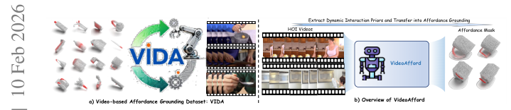
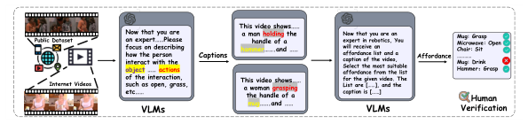
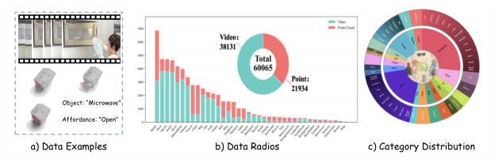
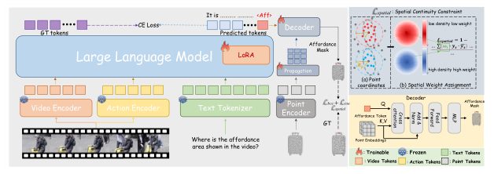
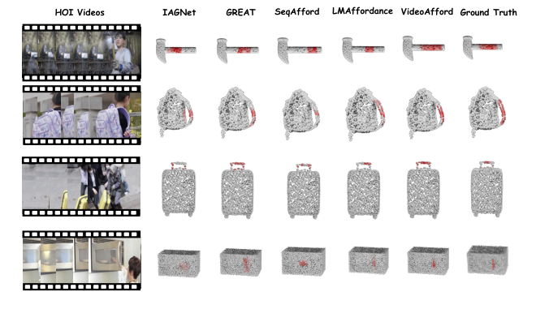

# VideoAfford：从人机交互视频中通过多模态大语言模型进行三维可操作区域定位

## 核心信息

- 标题: VideoAfford: Grounding 3D Affordance from Human-Object-Interaction Videos via Multimodal Large Language Model
- 标题翻译: VideoAfford：从人机交互视频中通过多模态大语言模型进行三维可操作区域定位
- 作者: Hanqing Wang, Mingyu Liu, Xiaoyu Chen, Chengwei Ma, Yiming Zhong, Wenti Yin, Yuhao Liu, Zhiqing Cui, Jiahao Yuan, Lu Dai, Zhiyuan Ma, Hui Xiong
- 机构: 香港科技大学（广州）、浙江大学、上海科技大学、华中科技大学、山东大学
- 发表时间: 2026-02-10（arXiv v1）
- 发表渠道: arXiv 预印本 arXiv:2602.09638；ACL 2026 主会（arXiv 搜索索引评论字段标注，待核官方会议论文集）
- DOI: 10.48550/arXiv.2602.09638
- arXiv: [arXiv:2602.09638](https://arxiv.org/abs/2602.09638)
- 论文链接: https://arxiv.org/abs/2602.09638
- 代码 / 项目: 论文声明将公开发布（截至当前未提供链接）
- 数据 / 资源: VIDA 数据集——约 3.8 万条人机交互视频 / 16 类可操作区域 / 约 2.2 万个点云 / 38 种物体类别；论文声明将公开发布
- 论文类型: 方法论 + 数据集（新任务范式提出 + 新基准构建 + 多模态大语言模型基线方法）

## 研究问题

> 原文事实：现有三维可操作区域定位方法主要依赖静态线索（语言、图像、人机交互图像），难以提供动态交互的时序与因果上下文。本文提出的中心研究问题是：能否从人机交互演示视频中提取动态交互先验，并迁移到三维物体可操作区域分割，从而突破静态线索的局限？

- 子问题一：如何构建一个大规模、视频-点云配对的三维可操作区域基准，以支持视频驱动设定下的公平评测？
- 子问题二：如何将一个视频多模态大语言模型赋予额外的可操作区域分割能力，使其世界知识推理与细粒度定位在同一框架内完成？
- 子问题三：如何建模视频中的动态交互先验（动作），并将其与三维几何特征有效融合？

## 原文摘要翻译

> 三维可操作区域定位旨在高亮三维物体上的可操作区域，对机器人操作至关重要。先前研究主要聚焦从静态线索（语言、图像）学习可操作区域知识，难以提供足够动态交互上下文以揭示时序与因果线索。为缓解此困境，本文收集了全面的基于视频的三维可操作区域数据集 VIDA，包含约 3.8 万条人机交互视频，覆盖 16 类可操作区域、38 种物体类别与约 2.2 万个点云。基于 VIDA，本文提出强基线方法 VideoAfford，它激活一个多模态大语言模型并赋予其额外的可操作区域分割能力，使世界知识推理与细粒度定位能在统一框架内实现。为增强动作理解，本文利用一个潜在动作编码器从人机交互视频中提取动态交互先验。此外，本文引入空间感知损失使模型获得全面的三维空间知识。大量实验表明本文模型显著超越已有基线，并展现出强大的开放世界泛化与可操作区域推理能力。所有数据集与代码将公开发布。

## 创新点

1. 任务层面：首次提出视频驱动的三维物体可操作区域定位范式，将人机交互视频的动态交互先验迁移到三维可操作区域分割。
2. 数据层面：构建 VIDA，首个大规模视频-点云配对的三维可操作区域基准（约 3.8 万视频 / 约 2.2 万点云 / 16 类 / 38 物体）。
3. 方法层面：以视频多模态大语言模型为骨干、RenderNet 为潜在动作编码器、空间感知 Dice 损失为空间约束的统一框架，在 Seen 与 Unseen 设置下均显著超越现有基线。

## 一句话总结

VideoAfford 通过构建首个视频驱动的三维可操作区域数据集 VIDA，并以视频多模态大语言模型加动作编码器加空间感知损失的架构实现从人机交互演示视频到三维物体可操作区域掩码的端到端推理，在 Seen 与 Unseen 设置下均取得最优性能；但其核心增益主要来自多模态大语言模型世界知识与动态先验的叠加，模块间耦合较浅，且 Unseen 绝对性能仍偏低。

*图 1：VideoAfford 任务与方法概览。（左）VIDA 数据集：视频驱动的可操作区域定位基准；（右）VideoAfford 架构：从人机交互视频提取动态交互先验并迁移到三维可操作区域分割。*

## 数据与任务定义

### 任务定义（原文公式 1）

给定一条人机交互视频与一句自然语言指令，以及该视频中操作对象的三维点云，模型需预测点云上每个点的可操作区域概率图（取值在 0 到 1 之间）。形式化表述为：

$$A_{\text{mask}} = F_{\theta}(V, T, P_c)$$

其中 $\theta$ 为可学习参数。评测采用阈值化后的交并比（mIoU）与 AUC、相似性（SIM）、平均绝对误差（MAE）等指标。

> 分析者推演：该设定本质是「视频条件 + 语言条件 + 点云」到「逐点可操作区域概率」的映射，与用户路线①的「轻量三维分支推理」目标形态不同——本文推理时仍依赖完整视频多模态大语言模型。

### VIDA 数据集规模与来源

- 视频规模：约 3.8 万条人机交互视频（原文表 3 标注 Videos 38131）。
- 点云规模：约 2.2 万个三维点云（Points 21934）。
- 物体类别：38 种。
- 可操作区域类别：16 类（如抓取、按压、扭转、掀开等）。

### 数据采集流程（原文事实）

- 视频聚合：从公开人机交互视频库与互联网收集人机交互视频。
- 视觉语言模型标注：用 GPT-4o 为每个视频生成描述性字幕，从中提取物体与动作关键词。
- 可操作区域匹配：视觉语言模型分析视频动作与可操作区域类别的对应关系。
- 人工校验：对所有自动标注结果进行人工检查与修正。

*图 2：数据收集与校验流水线。先利用视觉语言模型为视频生成字幕并提取物体与动作关键词，再经人工校验得到可操作区域标注。*

### 训练与评估配对策略

> 原文事实：训练时视频与点云为松散的一对多配对（一个物体点云可对应多条视频），评估时才采用严格的一对一配对。

### Seen 与 Unseen 划分

- Seen：训练时见过的物体-可操作区域组合，评测泛化到新视频/新实例。
- Unseen：训练时未出现的物体-可操作区域组合，评测零样本泛化能力。

### 与现有三维可操作区域数据集对比

| 数据集 | 输入模态 | 物体中心级 | 视频驱动 | 点云来源 |
| --- | --- | --- | --- | --- |
| 3D-AffordanceNet | 点云 + 文本 | 是 | 否 | 合成模型 |
| PIAD 系列数据集 | 点云 + 文本/图像 | 是 | 否 | 真实扫描 |
| SceneFun3D | 点云 + 文本 | 是 | 否 | 真实场景 |
| EGO-SAG | 视频 + 点云 | 否（场景级） | 是 | 真实扫描 |
| VIDA（本文） | 视频 + 点云 + 文本 | 是 | 是 | 真实扫描 |

*图 3：VIDA 数据集统计。展示视频与点云的样本示例、各可操作区域类别的数量分布及总量。*

## 背景与缺口

### 领域背景（原文事实）

- 二维可操作区域分割（Thermos 等；Do 等；Luo 等）难以迁移到真实三维环境。
- 基于人机交互图像的静态先验：GREAT（Shao 等）、IAGNet（Yang 等）、3DAffordanceLLM（Chu 等）。
- 基于语言指令的语言引导：LASO（Zhu 等）、SeqAfford（Yu 等）、SceneFun3D（Delitzas 等）。
- 利用基础模型世界知识：AffordanceLLM（Qian 等）、3DAffordanceLLM（Chu 等）。
- 视频驱动可操作区域：OPPA、VRB、2HandedAfforder 均限于二维表示；EGO-SAG 是唯一从视频学习三维可操作区域的工作，但聚焦场景级粗粒度掩码，不提供物体中心级细粒度分割。

### 核心缺口（作者论点）

现有方法缺乏动态交互的时序与因果线索；EGO-SAG 虽用视频但仅为场景级粗粒度，且非物体中心。VIDA 加 VideoAfford 首次实现物体中心的视频驱动三维细粒度分割。

### 分析者补充缺口定位

本文填满了用户 gap map 中的 G6（视频时序可操作区域）——且是以 ACL 2026 级别工作填满。这意味着若走视频方向，必须找到比本文更深的切入点（如蒸馏到轻量分支、双向耦合等）。

## 方法主线

### 整体架构

VideoAfford 由四个组件构成：视频编码器（LanguageBind）、潜在动作编码器（RenderNet）、视频多模态大语言模型（Video-LLaVA，仅 LoRA 微调）、轻量三维解码器。所有编码器（视频、动作、点云）均冻结，仅大语言模型经 LoRA 微调并训练可操作区域解码器。

### 机制流程

**步骤一 —— 多模态编码**：给定人机交互视频 $V$ 与文本指令 $T$，用 LanguageBind 视频编码器稀疏采样 $N=8$ 帧得到视频令牌；用 RenderNet 动作编码器提取潜在动作嵌入并压缩为 2 个动作令牌（每个 1024 维）；文本经分词器得到文本令牌。

**步骤二 —— 多模态大语言模型推理与可操作区域嵌入提取**：三类令牌拼接后输入大语言模型（Llama，LoRA 微调秩为 128）。大语言模型输出理解文本（记为 J），由视频、动作与文本共同决定。遵循 LISA 协议，扩展词表注入特殊令牌 `<AFF>` 表示可操作区域世界知识；取其隐状态经线性投影得可操作区域查询嵌入（记为 A_m）。

$$J = g(m(V), e(V), T)$$

$$A_m = \text{proj}(H_{\text{aff}})$$

**步骤三 —— 三维特征提取与上采样**：点云经冻结的 Uni3D 编码器提取语义丰富的点嵌入；再经几何引导上采样（Point-BERT 风格）传播为稠密点特征。

$$P_s = f(P_c)$$

$$P_d = \text{Up}(P_s, o(P_c))$$

**步骤四 —— 可操作区域解码与空间约束**：查询嵌入 $A_m$ 作为查询，稠密点特征 $P_d$ 作为键值，经交叉注意力融合得 $A_f$；再经多层感知机输出最终掩码 $A_{\text{mask}}$。训练目标为四项加权和：

$$\mathcal{L} = \lambda_1 \mathcal{L}_{\text{ce}} + \lambda_2 \mathcal{L}_{\text{dice}} + \lambda_3 \mathcal{L}_{\text{spatial}} + \lambda_4 \mathcal{L}_{\text{reg}}$$

### 模块细节

**三维视觉编码器（Uni3D）**：采用预训练 Uni3D（Zhang 等，CVPR 2023）作为三维视觉编码器骨干，在大规模文本-图像-点云配对数据上预训练。冻结参数，仅用于提取语义特征。输出经几何引导上采样模块（最远点采样加近邻分组加 PointNet++ 风格传播）得到稠密特征。

> 待核对：原文公式（3）中将稠密特征维度写作「点数 × 2048 × 3」，疑似渲染错误，实际应为「上采样后点数 × 特征维度」。具体数值待核附录。

**潜在动作编码器（RenderNet）**：采用 RenderNet（Liu 等，2025）作为潜在动作编码器。设计动机源自「静止只是动态平衡的快照」——即静态图像中的可操作区域本质上是动态交互过程的快照。对输入视频采样若干帧，RenderNet 提取潜在动作嵌入并压缩为 2 个令牌（每个 1024 维），记为 A_c = m(V)。

> 待核对：原文公式（6）写动作嵌入维度为「帧数 × 2 × 1024」，但正文说明「压缩成两个令牌」，两者矛盾。实际应为「2 × 1024」或每帧产生 2 个令牌共「帧数 × 2 × 1024」。待核附录实现。

**空间感知损失（邻域高斯加权 Dice）**：对每个点，定义其半径范围内的空间邻域（包含邻近点集合）。邻域密度越高，该点预测的监督权重越大，从而强制预测在空间上连续、抑制孤立噪声点。形式化近似为：

$$\mathcal{L}_{\text{spatial}} = \sum_i w_i \cdot \text{Dice}(A_{\text{mask},i}, \hat{A}_{\text{mask},i}),\quad w_i \propto \exp\!\left(-\frac{|N_i|}{2\sigma^2}\right)$$

**多模态大语言模型骨干（Video-LLaVA）**：采用 Video-LLaVA（Lin 等，2023）作为视频多模态大语言模型，含图像编码器、视频编码器（LanguageBind）、文本分词器与大语言模型（Llama 系列）。所有编码器冻结，仅通过 LoRA（秩 128）微调大语言模型并训练可操作区域解码器。

**轻量解码器**：轻量 Transformer 解码器，交叉注意力以查询嵌入为查询、稠密点特征为键值，多层感知机头部输出每个点的可操作区域概率。

*图 4：VideoAfford 完整架构。底部为人机交互视频经视频编码器与动作编码器编码后输入大语言模型（LoRA 微调），`<AFF>` 令牌提取可操作区域嵌入；右侧点云经 Uni3D（冻结）编码后几何引导上采样为稠密特征；右上角为空间连续性约束示意（低密度低权重、高密度高权重）；解码器中可操作区域查询与点特征经交叉注意力与多层感知机输出掩码。*

## 关键结果

### 主实验结果（表 2）

| 方法 | 类型 | Seen mIoU↑ | Unseen mIoU↑ |
| --- | --- | --- | --- |
| VideoAfford（本文） | 多模态大语言模型 | 28.20 | 10.95 |
| GREAT | 多模态大语言模型 | 23.62 | 8.22 |
| LMAffordance | 多模态大语言模型 | 约 22（待核） | 待核 |
| IAGNet | 非多模态大语言模型 | 20.39 | 7.97 |
| SeqAfford | 非多模态大语言模型 | 约 19（待核） | 待核 |

> 原文事实：本文在 Seen 与 Unseen 下均取得最优；Seen mIoU 28.20 相对非多模态大语言模型最佳 IAGNet（20.39）提升 +8.04，相对多模态大语言模型最佳 GREAT（23.62）提升 +4.58。

### 消融实验

| 变体 | Seen mIoU↑ | 说明 |
| --- | --- | --- |
| 基线（无动作编码器、无空间损失） | 20.16 | 仅多模态大语言模型加解码器 |
| 加动作编码器 | 21.49 | 相对基线 +1.33 |
| 加空间损失 | 24.58 | 相对基线 +4.42 |
| 完整模型（本文） | 28.20 | 相对基线 +8.04 |

> 原文事实：空间损失贡献最大（+4.42），动作编码器贡献较小（+1.33）。说明性能提升主要来自多模态大语言模型世界知识与空间正则化，动作编码器的动态先验增量有限。

> 待核对：Unseen 设置下各变体数值原文表 3 未完整给出，上表 Unseen 仅完整模型数值（10.95）确证，其余待核。

### 实现细节

- 三维视觉编码器：冻结 Uni3D（CVPR 2023）。
- 动作编码器：冻结 RenderNet（2025）。
- 大语言模型：Video-LLaVA 骨干，LoRA 秩 128 微调。
- 采样帧数：8 帧为最优（原文帧数消融表 4，具体数值待核）。
- 训练算力：4×H200 约 11 小时。

*图 5：定性可视化对比。每行示例左侧为人机交互视频输入，右侧依次为 IAGNet、GREAT、SeqAfford、LMAffordance、VideoAfford（本文）与真值的预测；红色深度表示可操作区域概率，本文预测最接近真值。*

## 深度分析

### 架构层面

1. 拼接式集成、耦合较浅：VideoAfford 四大组件（视频编码器、动作编码器、大语言模型、三维解码器）主要是拼接式集成——动作令牌仅作为额外输入拼接入大语言模型，三维解码器的查询来自大语言模型 `<AFF>` 令牌隐状态投影，但不存在从三维分支回传到大语言模型的反馈信号。这与用户路线①+②的双向耦合要求差距明显。
2. 核心增益来源辨析：消融表明空间损失贡献最大（+4.42），动作编码器贡献较小（+1.33）。性能提升主要来自多模态大语言模型本身的世界知识（基线 20.16 已接近 IAGNet 的 20.39）与空间正则化的工程贡献；动作编码器的动态先验增量有限，与其作为核心卖点之一的定位不完全匹配。

### 数据层面

3. 训练时视频-点云松散配对可能导致模型学到类别级统计偏置，而非真正的视频-几何对应关系；评估时严格配对才暴露真实泛化，存在潜在信息泄漏风险。
4. VIDA 标注依赖 GPT-4o 自动生成加人工校验，可能存在系统性偏差（如对某些可操作区域类别的偏好）或遗漏。

### 与用户研究路线的关系

5. 与 VSAD 的对比缺失：VSAD 是唯一的另一个视频加点云三维可操作区域数据集（场景级），但对比表未给出其详细数字，主实验也未将其作为基线。考虑到 VSAD 同样使用视频输入，缺少直接比较是一个遗憾。
6. 与路线①的矛盾点：用户路线①要求多模态大语言模型教师仅训练时使用、推理零多模态大语言模型；而本文推理时仍运行完整视频多模态大语言模型，二者在效率叙事上方向相反。本文的价值在于证明了「视频动态先验可迁移」，为路线①的「蒸馏到轻量三维分支」提供了可借鉴的教师信号。
7. G6（视频时序）缺口填充确认：本文加 VIDA 直接坐实 G6 已被填满，且为 ACL 2026 级别工作。若走视频方向，必须找到比本文更深的切入点。
8. 与路线②（生成式完整几何补全）暂无直接耦合点：本文不做遮挡/内部补全，属于「partial 观测直接预测」范式，与用户「补全反哺意图、意图引导补全」的双向耦合路线不冲突但也不重叠。

## 局限

1. 算力需求高：训练需 4×H200 约 11 小时，推理需运行完整视频多模态大语言模型加 RenderNet 加 Uni3D，不适合边缘部署。
2. 标注质量依赖视觉语言模型流水线：VIDA 标注流程依赖 GPT-4o 自动生成加人工校验，可能存在系统性偏差或遗漏。
3. Unseen 性能绝对值偏低：Unseen mIoU 仅 10.95%，说明零样本泛化能力有限。
4. 训练时视频-点云松散配对可能导致类别级统计偏置。
5. 未提供显式局限章节，作者仅声明将继续探索无标注人机交互视频的潜力。

## 我的笔记

### 与 GEAL baseline 的关系

- 用 RenderNet 的潜在动作嵌入替代或补充 GEAL 的 DINOv2 特征作为意图教师信号。
- 将 Video-LLaVA 的 `<AFF>` 令牌隐状态蒸馏到 GEAL 的轻量三维分支。
- 但这需要解决视频输入在推理时的效率问题（GEAL 推理零二维，无法接受视频输入）。

### 对路线①+②旗舰组合的意义

- 正向：本文证明了「视频动态先验可迁移到三维可操作区域」，为路线①的离线多模态大语言模型教师提供了额外的动作先验来源。
- 警示：本文推理时保留完整多模态大语言模型，效率低，与用户「推理零多模态大语言模型」护城河相反；若借鉴，必须将其蒸馏掉。
- 路线②独立成篇风险：单纯「给 GEAL 加生成式完整几何补全」已被判无新颖性；本文不涉补全，故不构成直接竞争，但提示 G6 已空，视频方向需更深切入点。

### 未来方向

- 无标注人机交互视频的利用：作者明确指出下一步方向是挖掘无标注视频潜力（自监督或半监督范式）。
- 多模态大语言模型蒸馏到轻量三维分支：将视频推理能力蒸馏到纯三维网络，实现推理零多模态大语言模型（与路线①高度一致）。
- 双向耦合架构：让三维几何信息回传影响多模态大语言模型的可操作区域推理（当前仅有单向多模态大语言模型到三维）。
- 更精细的时空建模：当前仅采样 8 帧并用 RenderNet 压缩为 2 个令牌，信息损失较大；可探索时序 Transformer 或视频扩散模型作为更强动作编码器。
- 跨物体关系可操作区域：当前仅单物体；未来可扩展到多物体场景下的关系型推理（与 G3 方向相关）。
- 具身闭环验证：当前仅在数据集指标上评估；下一步应在真实机器人平台上验证操作可行性。

### 原文定位

本文属于「视频驱动三维可操作区域」的开山级工作（任务提出 + 数据集 + 强基线），定位于 ACL 2026 主会。对用户而言，它是 G6 缺口的填补者，也是路线①「动作先验教师」的可借鉴来源，但不是路线②（生成式补全）的竞争者。

### Active Recall Questions

1. VideoAfford 的四个组件分别是什么？哪些被冻结、哪些被训练？
2. 空间感知损失如何通过邻域密度加权来强制预测的空间连续性？
3. 消融实验中，动作编码器与空间损失各自贡献了多少 Seen mIoU？这说明了什么？
4. VIDA 在训练时与评估时的视频-点云配对策略有何不同？潜在风险是什么？
5. 为什么本文与用户路线①在效率叙事上方向相反？路线①应如何借鉴本文？
6. 本文填满了用户 gap map 中的哪个缺口？若走视频方向还需什么更深的切入点？

## 引用

@article{wang2026videoafford, title={VideoAfford: Grounding 3D Affordance from Human-Object-Interaction Videos via Multimodal Large Language Model}, author={Wang, Hanqing and Liu, Mingyu and Chen, Xiaoyu and Ma, Chengwei and Zhong, Yiming and Yin, Wenti and Liu, Yuhao and Cui, Zhiqing and Yuan, Jiahao and Dai, Lu and Ma, Zhiyuan and Xiong, Hui}, journal={arXiv preprint arXiv:2602.09638}, year={2026}, note={Accepted by ACL 2026 Main}}

> 中文速引：Wang 等. VideoAfford：从人机交互视频中通过多模态大语言模型进行三维可操作区域定位. ACL 2026 主会（arXiv:2602.09638）.
