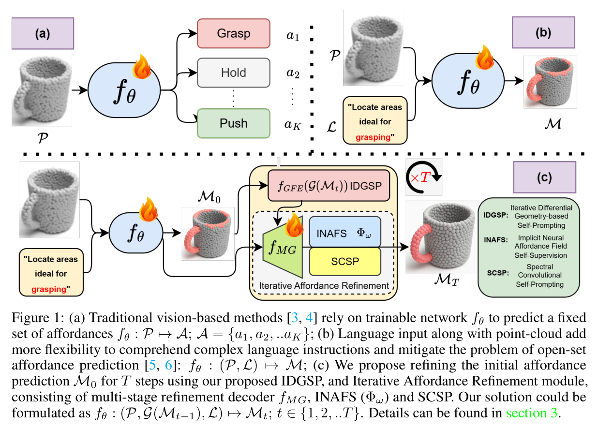
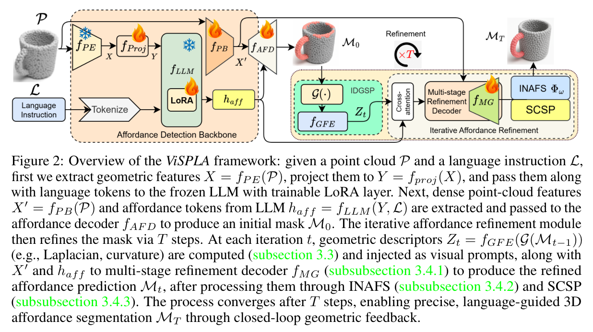
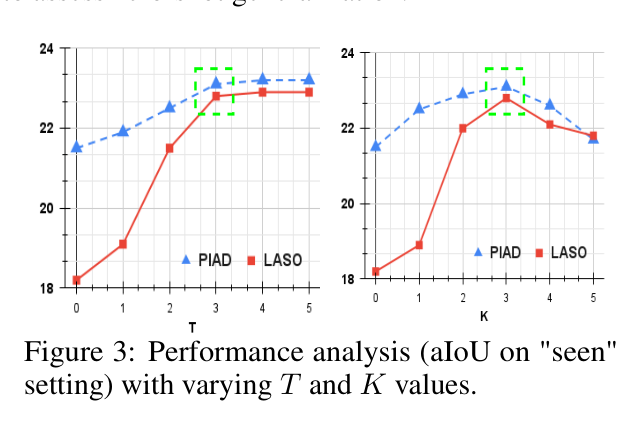
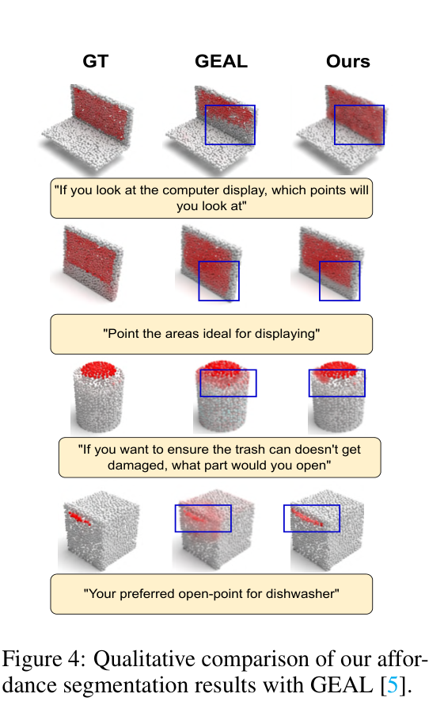
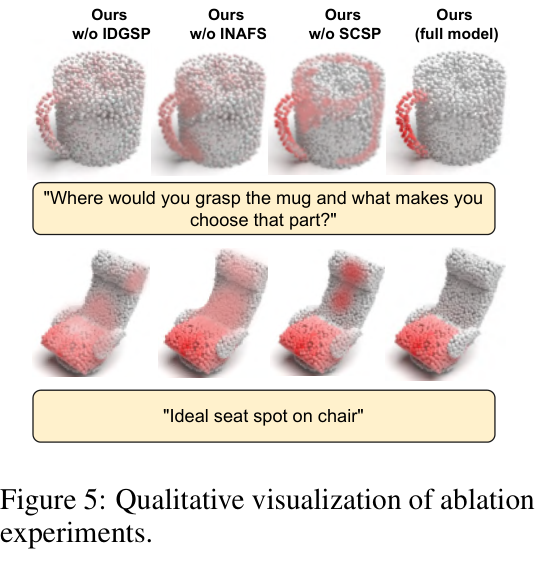

# ViSPLA：视觉迭代自提示机制用于语言引导的三维可操作区域学习

## 核心信息

- 标题: ViSPLA: Visual Iterative Self-Prompting for Language-Guided 3D Affordance Learning
- 标题翻译: ViSPLA：视觉迭代自提示机制用于语言引导的三维可操作区域学习
- 作者: Hritam Basak, Zhaozheng Yin
- 机构: Stony Brook University（石溪大学计算机科学系）
- 发表时间: 2025（NeurIPS 2025 主会）
- 发表渠道: 39th Conference on Neural Information Processing Systems (NeurIPS 2025)
- 论文链接: 项目页（论文中给出"Project Website"占位，未在正文显示 URL；arXiv 链接待补）
- 代码 / 项目: **不公开**——NeurIPS Checklist Q5 回答为 "No"，作者声明 "we do not release the code for this work. However, sufficient details are provided in the paper to ensure reproducibility."
- 数据 / 资源: PIAD 与 LASO 两个公开数据集；不发布新资产
- 论文类型: 方法论（在 3D-AffordanceLLM 骨架上添加几何反馈驱动迭代自提示）

## 研究问题

> 原文事实：现有语言引导三维可操作区域方法在两个层面受限：(1) 仍依赖固定的 K 类可操作区域词汇表，无法处理开放集与多步指令；(2) 单遍前向推理（single-pass）缺乏迭代精化能力，难以在复杂几何上得到精确边界。本文提出中心问题：能否把"上一轮预测的可操作区域掩码"作为"几何自提示"，驱动模型做多轮闭环精化，从而把语言理解与低阶几何感知统一起来？

- 子问题一：如何将掩码的微分几何特征（Laplacian、法向导数、曲率）抽取为可学习的视觉提示？
- 子问题二：如何在不引入额外监督的前提下，对三维表面学习一个连续概率可操作区域场？
- 子问题三：如何在频域对掩码做多尺度精化，从而同时捕捉粗结构与细边界？

## 原文摘要翻译

> 我们研究语言引导的三维可操作区域预测问题，它是与无结构环境交互的具身智能体的核心能力。现有方法往往依赖固定的可操作区域类别，或要求外部专家提示，限制了其跨物体泛化与解读多步指令的能力。本文提出 ViSPLA，一种新颖的迭代自提示框架，利用预测掩码的内蕴几何属性进行持续精化。我们将可操作区域检测重新定义为一个语言条件分割任务：给定三维点云与语言指令，模型预测一组精化后的可操作区域掩码，每一轮掩码都受 Laplacian、法向导数与曲率场等微分几何反馈引导。该反馈被编码成视觉提示，驱动多阶段精化解码器，使模型能够自校正并适应复杂空间结构。为进一步提升精度与一致性，我们引入隐式神经可操作区域场（Implicit Neural Affordance Fields, INAFS），在三维表面上定义连续概率区域，无需额外监督。此外，频域卷积自提示（Spectral Convolutional Self-Prompting, SCSP）模块工作在点云的频域上，实现多尺度精化，同时捕捉粗粒度与细粒度结构。大量实验表明，ViSPLA 在两个基准数据集上对已见与未见物体均取得当前最优。该框架通过将语言理解与低阶几何感知统一进迭代精化范式，建立了开放世界三维可操作区域推理的新范式。

## 创新点

1. 任务范式：将语言引导三维可操作区域检测重塑为"语言条件 + 几何自提示"的多轮闭环任务，形式化为 $M_t = f_\theta(P, \mathcal{G}(M_{t-1}), \mathcal{L})$；$t \in \{1,\ldots,T\}$。
2. 几何自提示机制 IDGSP：从上一轮掩码抽取 Laplacian、法向导数、平均/主曲率，经可学习编码器转化为几何特征 $Z_t$，作为视觉提示注入精化解码器。
3. 多阶段精化解码器 + 跨注意力：动态对齐语言令牌 $h_{aff}$ 与几何特征 $Z_t$、稠密点特征 $X'$，桥接高层语义与低阶几何。
4. 隐式神经可操作区域场（INAFS）：$\Phi_\omega: \mathbb{R}^3 \times \mathbb{R}^d \to [0,1]$，通过能量最小化（平滑项 + 边界保真项 + Laplacian-高斯曲率对齐项）实现无监督精化。
5. 频域卷积自提示（SCSP）：在归一化图 Laplacian $L = I - D^{-1/2}AD^{-1/2}$ 的谱域上做可学习滤波，跨 K=3 个频段多尺度精化掩码。
6. 多任务损失统一：$\mathcal{L} = \lambda_{txt}\mathcal{L}_{txt} + \lambda_{mask}\mathcal{L}_{mask} + \lambda_{IDGSP}\mathcal{L}_{IDGSP} + \lambda_{INAFS}\mathcal{L}_{INAFS} + \lambda_{SCSP}\mathcal{L}_{SCSP}$。

## 一句话总结

ViSPLA 在 3D-AffordanceLLM 骨架上引入"掩码→微分几何→掩码"的闭环迭代精化机制（IDGSP+INAFS+SCSP），在 PIAD 与 LASO 两个语言引导三维可操作区域基准上以 +0.6/+0.8 aIoU 优势超过 GEAL 并刷新 SOTA；其新颖性集中在"几何反馈驱动的多轮自提示"这一新机制，而非骨干替换，但不开源代码、未显式展示在骨架上的成本增量、未处理部分观测场景，与用户路线①（MLLM 教师仅训练时用、推理零 LLM）和路线②（生成式完整几何补全）均不直接竞争。


*图 1：三种范式对比。（a）传统固定类别视觉方法 $f_\theta: \mathcal{P} \mapsto \mathcal{A}$；（b）语言引导单遍方法 $f_\theta: (\mathcal{P}, \mathcal{L}) \mapsto \mathcal{M}$；（c）本文迭代自提示范式 $f_\theta: (\mathcal{P}, \mathcal{G}(\mathcal{M}_{t-1}), \mathcal{L}) \mapsto \mathcal{M}_t$，含 IDGSP/INAFS/SCSP 三件套。*


*图 2：ViSPLA 整体框架。左侧 Affordance Detection Backbone 沿用 3D-AffordanceLLM（Point-BERT/ULIP-2 点编码器 $f_{PE}$ + Point Transformer 点主干 $f_{PB}$ + Phi-3.5-mini-instruct LLM w/ LoRA + LISA-风格解码器 $f_{AFD}$）输出初始掩码 $\mathcal{M}_0$；右侧 Iterative Affordance Refinement 闭环：$\mathcal{G}(\mathcal{M}_{t-1}) \to f_{GFE} \to \mathcal{Z}_t \xrightarrow{\text{CrossAttn}} \mathcal{M}_t$，再经 INAFS 与 SCSP 进一步精化。*

## 数据与任务定义

### 任务定义

沿用 3D-AffordanceLLM 的 IRAS（Instruction Reasoning Affordance Segmentation）任务形式：给定三维点云 $\mathcal{P} \in \mathbb{R}^{N \times 3}$ 与自然语言指令 $\mathcal{L}$，预测每个点的可操作区域二值掩码 $\mathcal{M} \in \{0,1\}^N$。

本文创新在于把单遍映射 $f_\theta: (\mathcal{P}, \mathcal{L}) \mapsto \mathcal{M}$ 拓展为多轮迭代：

$$\mathcal{M}_t = f_\theta(\mathcal{P}, \mathcal{G}(\mathcal{M}_{t-1}), \mathcal{L}); \quad t \in \{1, 2, \ldots, T\}$$

$$\mathcal{M}_0 = f_\theta(\mathcal{P}, \mathcal{L})$$

其中 $\mathcal{G}$ 是从上一轮掩码抽取微分几何描述子的几何提示生成器。

评测指标：aIoU↑、AUC↑、SIM↑、MAE↓。Seen / Unseen 划分遵循 LASO 原作者定义（Unseen 故意排除训练中未见的"可操作区域-物体"组合以评测零样本泛化）。

### 数据集

| 数据集 | 规模 | 类别 | 文本标注 | 来源 |
| --- | --- | --- | --- | --- |
| PIAD | 7,012 点云 | 与 LASO 同类 | 无原文标注，本文从 LASO 问句池采样补全 | IAGNet (ICCV 2023) |
| LASO | 19,751 点云-语言对，8,434 实例，23 物体类，17 可操作区域类 | 23 / 17 | 有 | LASO (CVPR 2024) |

> 原文事实：PIAD 自身无文本标注，本文从 LASO 的问题池采样语言指令注入 PIAD，以确保语义与目标可操作区域类型对齐。

> 分析者推演：在 PIAD 上采样 LASO 文本可能导致评测分布与 LASO 训练分布部分重叠，存在轻微泄漏风险（PIAD 与 LASO 的物体类别一致），需关注 Seen/Unseen 划分的语义严格性。

## 背景与缺口

### 领域背景（原文事实）

- 二维可操作区域检测：AffordanceNet (Do 等)、Locate (Li 等)、Phrase-based (Lu 等) 等局限于粗粒度或固定词汇表。
- 基于人机交互图像：IAGNet (ICCV 2023) 等。
- 三维数据集驱动：3D-AffordanceNet (Deng 等)、PartNet (Mo 等)。
- 语言引导：LASO (CVPR 2024) 等存在"一对一文本-可操作区域映射"假设，缺少多步组合推理能力。
- MLLM 应用于三维：PointLLM、ShapeLLM、Chat-3D、LL3DA、3D-LLM 等主要做物体级指代与场景级对话，缺乏可操作区域级细粒度分割。
- 3D-AffordanceLLM (Chu 等，arXiv:2502.20041, 2025)：引入 `<AFF>` token + 自定义解码器，做单遍指令到掩码映射，无反馈环。

### 作者核心论点

现有方法主要缺陷：(1) 单遍推理无法迭代精化；(2) 多数方法只利用语言而不利用几何；(3) 高层语义与低阶几何脱节；(4) 缺少细粒度、几何一致的边界。本文以几何自提示为切口填补上述四缺口。

### 分析者补充缺口定位

- 仍属 G2（语言引导三维可操作区域）方向，不涉及 G3 跨物体关系、G4 新类型发现、G6 视频时序。
- 不涉生成式完整几何补全（与路线②无关），不涉及部分观测场景。
- 与 GEAL 属于同一任务、同两个数据集的同期竞争者，PIAD Seen aIoU 23.1 vs 22.5（+0.6），LASO Seen 22.8 vs 22.0（+0.8），Unseen 9.2 vs 8.7 / 17.1 vs 16.7。
- 与 3D-AffordanceLLM 属于同一骨干家族（均基于 Phi-3.5 + Point-BERT/ULIP-2 + LISA 解码器），ViSPLA 在其上添加几何反馈环。
- 用户 gap map 中"G2 + 几何自提示闭环"未见其他顶会工作占据——但本质仍是单骨干 + 后处理范式，未触碰"换编码器/换骨干/换教师"等架构级增量。

## 方法主线

### 整体架构

三个组件：
1. **Affordance Detection Backbone**：复用 3D-AffordanceLLM；含 $f_{PE}$（Point-BERT/ULIP-2 点编码器）、$f_{PB}$（Point Transformer 点主干）、$f_{proj}$（线性投影）、$f_{LLM}$（Phi-3.5-mini-instruct + LoRA）、$f_{AFD}$（LISA-风格可操作区域解码器）。
2. **Iterative Differential Geometry-based Self-Prompting (IDGSP)**：从 $\mathcal{M}_{t-1}$ 抽取微分几何描述子，经可学习 $f_{GFE}$ 编码为 $\mathcal{Z}_t$。
3. **Iterative Affordance Refinement**：含多阶段精化解码器 $f_{MG}$（cross-attention 融合 $h_{aff}$、$\mathcal{Z}_t$、$X'$）、INAFS（隐式场自监督）、SCSP（频域精化）。

> 原文事实：骨干完全冻结，仅训练 LoRA、$f_{AFD}$ 与本文新增的自提示模块（IDGSP/INAFS/SCSP）。这与 GEAL 的"全训三件套"路线不同——GEAL 训练的是 DINOv2→PointNet++ 一致性蒸馏学生。

### 机制流程

**步骤一 — 多模态编码**：点云 $\mathcal{P}$ 经 $f_{PE}$ 抽取几何特征 $X \in \mathbb{R}^{m \times c}$，再经 $f_{proj}$ 投影到 LLM 令牌空间 $Y \in \mathbb{R}^{m \times d}$；文本 $\mathcal{L}$ 分词为语言令牌。

**步骤二 — LLM 推理与 `<AFF>` 嵌入**：$Y$ 与 $\mathcal{L}$ 拼接入 $f_{LLM}$（仅 LoRA 微调），抽取 `<AFF>` token 的隐状态 $h_{aff}$。同时 $f_{PB}$ 输出稠密点特征 $X' \in \mathbb{R}^{N \times c'}$。$f_{AFD}$ 融合 $h_{aff}$ 与 $X'$ 给出初始掩码 $\mathcal{M}_0 = f_{AFD}(h_{aff}, X')$。

**步骤三 — 微分几何提示生成（IDGSP）**：对 $\mathcal{M}_{t-1}$ 计算 5 个描述子：

$$\mathcal{G}(\mathcal{M}_{t-1}) = \{\nabla^2 \mathcal{M}_{t-1},\ \nabla \mathcal{M}_{t-1} \cdot n,\ \mathcal{H}(\mathcal{M}_{t-1}),\ \kappa_1(\mathcal{M}_{t-1}),\ \kappa_2(\mathcal{M}_{t-1})\}$$

其中 $\nabla^2\mathcal{M}$ 为掩码的 Laplacian（局部曲率变化），$\nabla\mathcal{M} \cdot n$ 为沿表面法向的导数，$\mathcal{H}$ 为平均曲率，$\kappa_1,\kappa_2$ 为主曲率。这些描述子编码掩码的边界感知与拓扑属性，反映可操作区域的物理合理性。$\mathcal{Z}_t = f_{GFE}(\mathcal{G}(\mathcal{M}_{t-1})) \in \mathbb{R}^{N \times d}$。

> 待核对：原文未给出 $f_{GFE}$ 的具体网络结构（多层感知机？PointNet？小型 Transformer？），从架构图推测为可学习小型编码器，附录缺失故具体形式未知。

**步骤四 — 多阶段精化**：$h_{aff}^{(t)} = \text{CrossAttn}(h_{aff}, \mathcal{Z}_t)$，$\mathcal{M}_t = f_{MG}(h_{aff}^{(t)}, X')$。这一过程重复 $T$ 轮。

**步骤五 — INAFS 隐式场精化**：在 $\mathcal{M}_t$ 之上学习 $\Phi_\omega: \mathbb{R}^3 \times \mathbb{R}^d \to [0,1]$，通过能量最小化：

$$\mathcal{E}(\Phi_\omega) = \int_\Omega \|\nabla \Phi_\omega(x)\|^2 dx + \lambda_1 \int_{\partial\Omega} (\Phi_\omega(x) - \mathcal{M}(x))^2 dx + \lambda_2 \int_\Omega (|\triangle\Phi_\omega(x)| - \beta \|\kappa(x)\|)^2 dx$$

三项分别为：空间平滑（梯度范数最小化）、边界保真（与当前掩码在 $\partial\Omega$ 一致）、几何对齐（$\Phi_\omega$ 的 Laplacian 与高斯曲率 $\kappa = \kappa_1 \cdot \kappa_2$ 对齐）。最后阈值化 $\mathcal{M}_{refined} = \{x \in \mathcal{P} \mid \Phi_\omega(x) > 0.5\}$。

> 待核对：原文说 INAFS 是在 $\mathcal{M}_t$ 之上"refinement"，但形式化定义里 $\mathcal{M}(x)$ 究竟对应 $\mathcal{M}_0$、$\mathcal{M}_t$ 还是 $\mathcal{M}_{refined}$ 不清晰；附录未含具体代码。

**步骤六 — SCSP 频域精化**：把点云看作离散流形，构造归一化 Laplacian $L = I - D^{-1/2}AD^{-1/2}$，对掩码做谱分解 $\hat{\mathcal{M}} = \sum_{i=1}^N \alpha_i u_i$，$\alpha_i = \langle \mathcal{M}, u_i \rangle$，其中 $\{u_i\}$ 为 $L$ 的特征向量，$\{\lambda_i\}$ 为特征值。学习可微频谱 filter $g(\lambda_i)$，得 $\hat{\mathcal{M}}_{t+1} = \sum_{i=1}^N g(\lambda_i) \alpha_i^{(t)} u_i$。共 K=3 个频段。

### 多任务损失

$$\mathcal{L} = \lambda_{txt} \mathcal{L}_{txt} + \lambda_{mask} \mathcal{L}_{mask} + \lambda_{IDGSP} \mathcal{L}_{IDGSP} + \lambda_{INAFS} \mathcal{L}_{INAFS} + \lambda_{SCSP} \mathcal{L}_{SCSP}$$

- $\mathcal{L}_{txt}$：LLM 响应自回归交叉熵；
- $\mathcal{L}_{mask}$：初始掩码 BCE + Dice；
- $\mathcal{L}_{IDGSP} = \sum_{t=1}^T \lambda_t \|\mathcal{M}_t - \mathcal{M}_{t-1}\|_{W^{2,2}}^2 + \alpha \|\nabla^4 \mathcal{M}_T\|_2^2$，含 Sobolev $W^{2,2}$ 范数（同时约束值与一阶/二阶导数）+ Tikhonov 双调和正则 $\alpha \|\nabla^4 \mathcal{M}_T\|_2^2$；
- $\mathcal{L}_{SCSP} = \sum_{t=1}^T \sum_{k=1}^K \gamma_k \|W_k(\hat{\mathcal{M}}_t - \hat{\mathcal{M}}_{t-1})\|_F^2 + \tau \text{TV}(\mathcal{M}_T)$，含频段一致性 + 终态全变差。

迭代权重 $\lambda_t = 0.8^t$ 渐进式降低一致性约束；$\alpha = 0.1$（Tikhonov）、$\lambda_1 = 0.5, \lambda_2 = 0.3, \beta = 0.05$（INAFS）、$K=3, \gamma_1=1.0, \gamma_2=0.7, \gamma_3=0.4, \tau=0.2$（SCSP）。


*图 3：超参敏感度。在 PIAD/LASO Seen aIoU 上扫描 T（迭代次数）与 K（频段数）。T=3 与 K=3 同时取得最优（绿色虚线框），再增大边际收益消失而计算代价陡升。T=0 → SCSP/INAFS/IDGSP 全失效时 PIAD 21.5、LASO 18.2；T=3 时 PIAD 23.3、LASO 23.0（与表 2 一致）。*


*图 4：定性对比（GT vs GEAL vs 本文）。4 组样本（laptop 屏幕、trash can 开口、dishwasher 开启点、display area）：蓝色矩形标注本文相对 GEAL 的改进区域。*


*图 5：消融定性对比（mug 抓取与 chair 坐面）。4 列从左至右：完整模型、w/o SCSP、w/o INAFS、w/o IDGSP。可见去掉任一组件都导致掩码退化——IDGSP 去掉后掩码最差（边界最不规整），INAFS 去掉后掩码连续性差，SCSP 去掉后细结构丢失。*

## 关键结果

### 主实验（表 1）

| 数据集 | 划分 | 指标 | Ours | GEAL | 3DAffLLM† | LASO | IAGNet |
| --- | --- | --- | --- | --- | --- | --- | --- |
| PIAD | Seen | aIoU↑ | **23.1** | 22.5 | 21.5 | 19.7 | 20.5 |
| PIAD | Seen | AUC↑ | **85.8** | 85.0 | 82.6 | 84.2 | 84.9 |
| PIAD | Seen | SIM↑ | **0.664** | 0.601 | 0.643 | 0.590 | 0.545 |
| PIAD | Seen | MAE↓ | **0.089** | 0.092 | 0.104 | 0.096 | 0.098 |
| PIAD | Unseen | aIoU↑ | **9.2** | 8.7 | 7.4 | 8.0 | 8.0 |
| PIAD | Unseen | AUC↑ | **73.1** | 72.5 | 71.0 | 69.2 | 71.8 |
| PIAD | Unseen | SIM↑ | **0.431** | 0.390 | 0.413 | 0.386 | 0.352 |
| PIAD | Unseen | MAE↓ | **0.099** | 0.102 | 0.115 | 0.118 | 0.127 |
| LASO | Seen | aIoU↑ | **22.8** | 22.0 | 18.2 | 20.8 | 17.8 |
| LASO | Seen | AUC↑ | **87.3** | 86.7 | 84.9 | 87.3 | 82.3 |
| LASO | Seen | SIM↑ | **0.651** | 0.634 | 0.622 | 0.629 | 0.561 |
| LASO | Seen | MAE↓ | **0.090** | 0.092 | 0.104 | 0.093 | 0.109 |
| LASO | Unseen | aIoU↑ | **17.1** | 16.7 | 15.3 | 14.6 | 12.9 |
| LASO | Unseen | AUC↑ | **81.5** | 80.9 | 78.7 | 80.2 | 77.8 |
| LASO | Unseen | SIM↑ | **0.571** | 0.567 | 0.542 | 0.507 | 0.443 |
| LASO | Unseen | MAE↓ | **0.103** | 0.106 | 0.124 | 0.119 | 0.129 |

> 原文事实：相对 GEAL 在 Seen 上 +0.6/+0.8 aIoU（PIAD/LASO）、+10.48%/+2.69% SIM；Unseen 上 +0.5/+0.4 aIoU、+4.1%/+0.7% SIM。提升以 SIM 与 AUC 为主，aIoU 边际较小（接近饱和）。

> 待核对：原文第 8 页段落称 "GEAL: 22.0→16.7 aIoU on PIAD"，但 Table 1 显示 GEAL PIAD Seen = 22.5、Unseen = 8.7，数字 22.0→16.7 实际对应 LASO 数据集（22.0/16.7）。原文段落疑似标注错误，或 PIAD/Laso 混淆，待核 appendix。

### 消融（表 2）

按组件启用顺序看增量贡献（基线 = 仅 3D-AffordanceLLM 骨干）：

| IDGSP | INAFS | SCSP | PIAD Seen aIoU | LASO Seen aIoU | PIAD Unseen aIoU | LASO Unseen aIoU |
| --- | --- | --- | --- | --- | --- | --- |
| ✗ | ✗ | ✗ | 21.5 | 18.2 | 7.4 | 15.3 |
| ✗ | ✗ | ✓ | 22.1 | 19.5 | 8.0 | 16.0 |
| ✗ | ✓ | ✓ | 22.9 | 20.3 | 8.5 | 16.5 |
| ✓ | ✓ | ✓ | **23.1** | **22.8** | **9.2** | **17.1** |

> 原文事实：SCSP 提供初次增量 +0.6/+1.3 aIoU（PIAD/LASO Seen）；加入 INAFS 增量 +0.8/+0.8；IDGSP 提供最大单点增量 +2.5 aIoU（LASO Seen，20.3→22.8）。

> 分析者推演：消融表只展示"累加"而非"单变量"，缺失：(1) "IDGSP 单独"（无 INAFS/SCSP）、(2) "INAFS 单独"（无 IDGSP/SCSP）。SCSP 单变量效应可观察，但 INAFS 与 IDGSP 的独立贡献无法直接拆解——只能从累加推断。

> 待核对：累加路径下 IDGSP 仅 +2.5（LASO Seen），但 IDGSP 与 INAFS 协同时贡献可能被人为放大（基线已含 SCSP）。建议核读附录是否提供单变量消融。

### 跨数据集泛化（表 3，LASO→PIAD）

| 方法 | Seen aIoU | Unseen aIoU | Seen SIM | Unseen SIM |
| --- | --- | --- | --- | --- |
| 3DAffLLM | 17.6 | 10.8 | 0.57 | 0.425 |
| GEAL | 18.4 | 11.6 | 0.59 | 0.44 |
| Ours w/o SCSP | 18.9 | 11.8 | 0.595 | 0.445 |
| Ours (Full) | **19.7** | **12.5** | **0.61** | **0.465** |

> 原文事实：在 LASO 上训练、PIAD 上评测，全模型仍优于 GEAL +1.3/+0.9 aIoU（Seen/Unseen）。即使去掉 SCSP 仍优于 GEAL，验证几何自提示的可迁移性。

### 实现细节

- 基础 LLM：Phi-3.5-mini-instruct，LoRA 微调。
- 点编码器：Point-BERT（ULIP-2 预训练）；点主干：Point Transformer。
- 特征维度 $d = 512$；$f_{proj}$ 为简单线性层。
- Affordance Decoder：LISA 架构的 3D 适配版本（具体头数/层数未列）。
- 迭代轮数 $T = 3$（图 3 验证）。
- 优化器：AdamW，初始学习率 $4 \times 10^{-5}$，余弦调度，预热比 0.03。
- 批大小 16，20 epochs。
- **算力**：4×NVIDIA V100 GPU，~12 小时。

## 深度分析

### 架构层面

1. **闭环几何反馈是核心新机制**：与 GEAL 的"2D→3D 一致性蒸馏"和 3D-AffordanceLLM 的"单遍指令到掩码"形成第三种范式。本质是把"mask 的微分几何"作为"prompt"喂回解码器，是把控制论中的反馈环引入 LLM 解码器的一次工程化尝试。
2. **耦合深度有限**：闭环只发生在掩码-几何层，没有反向影响 $h_{aff}$ 的 LLM 表征。LLM 只在 $t=0$ 时被调用一次（隐状态 $h_{aff}$ 在所有迭代中复用）。这与用户路线①+②要求的"双向耦合"差距明显。
3. **训练/推理成本不降反升**：T=3 轮迭代 + 谱分解 + 隐式场优化，远比 GEAL 的单遍蒸馏学生重。NeurIPS Checklist Q8 给出 4×V100 12 小时，与 GEAL 的 4×4090 训练时长接近但推理成本更高。
4. **不开源是显著局限**：作者在 NeurIPS Checklist Q5 明确 "No"，意味着审稿与第三方均无法验证实现细节（包括 IDGSP 的 $f_{GFE}$ 网络结构、INAFS 的实现细节、SCSP 谱滤波的频段划分），可能引发"无法复现"的 reviewer 质疑。

### 几何自提示的批判性解读

5. **IDGSP 的"微分几何"是 mask 的几何而非表面几何**：严格说，$\nabla^2 \mathcal{M}$ 等算的是"掩码场的几何"，而非"点云表面的几何"。两者在稀疏或噪声点云上可能严重偏离。原文表述 "captures local curvature variation of the mask" 是诚实的，但宣传"intrinsic geometric cues"存在语义滑动。
6. **T=3 即饱和是过拟合早期信号**：图 3 显示 T=3 之后曲线平台甚至下降，这与"迭代精化"的直觉相悖——若真在精化边界，应随 T 单调收敛。可能的解释：(a) 几何提示信号在第 3 轮已被耗尽；(b) IDGSP 损失 $\lambda_t = 0.8^t$ 衰减过快；(c) 谱域/隐式场仅做平滑而无新信号注入。
7. **SCSP 单独贡献最小**：表 2 显示 SCSP 单独 +0.6/+1.3 aIoU（PIAD/LASO Seen），是三个组件中最弱，且去掉 SCSP 后跨数据集仍优于 GEAL。这意味着 SCSP 是可省略组件，主要新颖性靠 IDGSP + INAFS。

### 与用户研究路线的精确关系

8. **直接竞争者**：与 GEAL 在同一任务、同一数据集、同一年（SOTA 类 PIAD/LASO）正面交锋。若用户路线①+② 或路线② 仍以 GEAL 为 baseline 在 PIAD/LASO 报告，**ViSPLA 必须作为对比基线**——否则审稿人会追问"为什么不与 NeurIPS 2025 SOTA 对比"。
9. **路线①（MLLM 意图教师 + 蒸馏到 3D 分支）**：
   - ViSPLA 用 MLLM 但**不蒸馏**——LLM 在每条推理时仍参与（$h_{aff}$ 需 LLM 输出），且 T=3 轮迭代更重。ViSPLA 占据"MLLM 推理"赛道，与路线①"推理零 MLLM"方向相反。
   - 但 ViSPLA 证明"MLLM 隐状态 $h_{aff}$ + 几何自提示"在 PIAD/LASO 上能涨点，间接支持路线①的"MLLM 隐状态作为教师信号"假设——可作为路线①的引用支撑（"MLLM 隐状态确实包含有效信号"），但不可作为路线①的对比基线（因为路线①目标是去掉 MLLM）。
10. **路线②（生成式完整几何补全）**：
   - ViSPLA **不做补全**。输入仍是完整点云，输出仍是部分掩码。与"partial→full affordance grounding"无关。
   - 但 INAFS 的"隐式场"概念与 Affostruction 的 TRELLIS 输出有概念相似（都是连续场表征），若用户路线② 写"我们把生成式场引入 affordance grounding"，可引用 INAFS 作为"隐式场先验已被研究但缺生成能力"的对照。
11. **是否构成"换编码器"红线违反**：
   - 用户红线："换文本编码器/换对齐编码器 = 组件替换，无架构级 novelty"。
   - ViSPLA **没有换骨干**（沿用 3D-AffordanceLLM 的 Phi-3.5 + Point-BERT），仅在解码端加几何反馈环。其新颖性可辩护为"解码器范式升级"而非"组件替换"——但严格说，T=3 迭代 + 谱分解 + 隐式场属于"后处理管线堆叠"而非"端到端架构创新"，审稿仍有理由判 novelty 不足。
   - 用户路线②被裁为"单纯加生成式补全 = 组件堆叠"，同理：单纯 ViSPLA 的几何自提示环也可被视为"组件堆叠"。但 ViSPLA 至少在 PIAD/LASO 上明显涨点（+0.6 aIoU PIAD Seen），证明其闭环机制有可测量的工程价值；用户路线②若只补全而不涨点，处境更难。
12. **缺口地图定位**：
   - 用户 G2（语言引导）：ViSPLA 巩固 G2 SOTA，但 G2 本身已被 GEAL/LASO/3DAffLLM 等多篇占满，ViSPLA 是 G2 内部的精化而非 G2 拓展。
   - 用户 G6（视频时序）：未被填，ViSPLA 输入仍是图像/点云 + 语言，无视频。
   - 用户 G3 跨物体：未被填，ViSPLA 单物体中心。
   - 用户 G1 partial→full：未被填，ViSPLA 不做补全。

### 数据与评测层面

13. **PIAD 文本标注的泄漏隐患**：PIAD 原文无标注，本文从 LASO 问句池采样——这意味着 PIAD 评测文本与 LASO 训练文本分布高度重叠，Seen/Unseen 的零样本性受质疑（即使物体未见，文本-可操作区域组合可能已被 LASO 训练过）。
14. **缺乏统计显著性**：NeurIPS Checklist Q7 答 "NA"，未报告误差棒、置信区间或显著性检验。aIoU 23.1 vs 22.5 的差距（+0.6）属于单次运行结果，可能落在 seed 波动范围内。
15. **下游具身任务缺失**：仅在数据集指标上评估，未给出机器人/仿真器上的实际抓取成功率。与 VAGNet（人类演示视频）和 Affostruction（实际任务迁移）形成对照。

## 局限

1. **不开源代码**：NeurIPS Checklist Q5 明确 "No"，审稿与第三方均无法验证 $f_{GFE}$、INAFS 实现、SCSP 频段划分等关键实现细节。
2. **未报告统计显著性**：NeurIPS Checklist Q7 答 "NA"，单次 seed 报告 aIoU 23.1 vs GEAL 22.5 的差距可能落在方差内。
3. **迭代+谱分解推理成本高**：T=3 轮 + 每轮特征分解 + 隐式场优化，远比 GEAL 的单遍蒸馏学生重，不适合边缘部署。
4. **不处理部分观测**：仅在完整点云上评估，未建立 partial→full 设定。
5. **PIAD 文本标注泄漏**：从 LASO 问句池采样注入 PIAD，文本分布重叠影响 Unseen 评测严格性。
6. **作者自承局限**：附加计算开销、铰接/可变形物体困难、未来需自适应迭代控制与场景级扩展。

## 我的笔记

### 与 GEAL baseline 的关系

- ViSPLA 与 GEAL **同任务、同数据集、同年 SOTA 对手**，必须在论文 Related Work / Experiment 中对比。
- ViSPLA 的"骨干冻结 + 后处理精化"路线 vs GEAL 的"骨干冻结 + 一致性蒸馏"路线，**两条独立路径**：
  - GEAL：通过冻结 2D 教师（DINOv2）→ 可学习 3D 学生（PointNet++），推理只跑 3D 分支。
  - ViSPLA：复用 3D-AffordanceLLM 骨干，加几何反馈闭环，推理需 LLM + 多轮迭代。
- 用户路线①（MLLM 教师 + 蒸馏到 3D）若成功，**可以同时压制 ViSPLA 与 GEAL**：用 MLLM（Phi-3.5-mini / Qwen-VL / GPT-4V）作为教师信号蒸馏到轻量 3D 分支，推理只需 3D 分支——既快又利用 MLLM 知识。

### 对路线①+② 旗舰组合的意义

- **正面**：ViSPLA 证明 MLLM $h_{aff}$ + 几何反馈在 PIAD/LASO 上有效，可作为路线① MLLM 教师信号的"几何版"参考；但 ViSPLA 不蒸馏，与路线①方向相反，仅是"MLLM + 几何"组合存在性的旁证。
- **反面**：ViSPLA 占据 NeurIPS 2025 SOTA 位置，若用户论文投稿于 2026 顶会，**必须把 ViSPLA 作为直接基线对比**，并证明路线①+② 在 aIoU / AUC / SIM / MAE 上系统性超过。
- **警示**：ViSPLA 不开源（Q5=No），用户路线①+② 实验中只能复现其表 1 数字（用第三方实现或自训练基线），无法直接读其代码工程化技巧。这给实验复现增加负担但反过来也是 novelty 的潜在抓手——"我们是少数能在 ViSPLA 不开源的情况下系统性评测其工作的论文"。

### 对路线② 单独成篇的意义

- ViSPLA 不做补全，故不构成路线② 的直接竞争者。
- 但 INAFS 的"隐式场连续表征"概念可被路线② 借鉴——把 INAFS 的 $\Phi_\omega$ 从"掩码连续场"升级为"完整形状连续场"，配合 TRELLIS 类生成器做形状先验。
- 路线② 若坚持"只补全不涨点"是用户红线禁止的"组件堆叠"——ViSPLA 已是该红线判定的反例（闭环精化+PIAD+0.6 aIoU），证明"纯后处理组件堆叠也能涨点"，但作者被顶会接受仍要求闭环机制必须比单纯堆叠更复杂（IDGSP+INAFS+SCSP 三件套）。

### 与 POSTECH 组竞品的关系

- 不属 POSTECH 体系（作者是 Stony Brook 的 Basak & Yin，与 POSTECH CVLab 无关）。
- ViSPLA 用 3D-AffordanceLLM 作为骨架，与 POSTECH 的 Affostruction/SpaCeFormer 路线无直接交集。
- 风险评估：ViSPLA 不抢 POSTECH 的"意图-补全融合"叙事，但占领 NeurIPS 2025 的"G2 SOTA"位置，未来 6-12 月可能成为 POSTECH fusion 论文的引用基线。

### 未来方向

- 公开代码与可复现性：作者已声明不公开，社区第三方复现工作可能出现，作者团队应在 camera-ready 之前补 release。
- 自适应迭代控制：T=3 之后曲线平台甚至下降，未来应做"早停"机制。
- 跨数据集训练的语义泄漏治理：PIAD 文本标注应单独标注而非从 LASO 采样，避免 Unseen 评测语义泄漏。
- 具身任务下游验证：在仿真器/真机上验证可操作区域预测的抓取成功率。
- 与生成式补全结合：INAFS 的隐式场可扩展为"形状先验 + 可操作区域先验"联合场，结合 TRELLIS 类生成器做 partial→full grounding。
- 频域方法的理论分析：SCSP 单独贡献小，是否真的提供多尺度信号而非仅做平滑，需要进一步消融与可视化。

### 原文定位

ViSPLA 是 NeurIPS 2025 在 PIAD/LASO 两个语言引导三维可操作区域基准上的新 SOTA；它是 3D-AffordanceLLM 的"几何反馈闭环"扩展版，与 GEAL 形成两条独立路线。对用户而言，ViSPLA 是路线①（MLLM 教师仅训练时用、推理零 MLLM）与路线②（生成式完整几何补全）均**必须引用与对比**的直接竞争者，但不是这两条路线本身。它填满了用户 G2 gap map 内部的"几何反馈闭环"细分（实质上是 G2 内部机制升级而非 G2 拓展）。

### Active Recall Questions

1. ViSPLA 的三层闭环机制（IDGSP / INAFS / SCSP）分别对应哪种几何/频域概念？它们在 $T=3$ 轮迭代中如何衔接？
2. 消融表 2 中为什么 SCSP 单独贡献最小（+0.6/+1.3）？这与你对"频域精化"的预期是否一致？
3. ViSPLA 与 GEAL 各自采用了什么骨干与训练范式？二者在 PIAD Seen 上的差距（23.1 vs 22.5）是否具有统计显著性？为什么 NeurIPS Checklist Q7 答 "NA" 是局限？
4. IDGSP 计算的"微分几何描述子"作用于 mask 场还是点云表面？这一区分对 ViSPLA 的几何反馈机制意味着什么？
5. ViSPLA 不开源（Checklist Q5 = "No"）对其在 2026 顶会论文中的对比基线地位产生什么影响？
6. PIAD 文本标注从 LASO 问句池采样会造成什么样的语义泄漏？这对 Unseen 评测的零样本性意味着什么？
7. ViSPLA 与用户路线①（MLLM 意图教师 + 蒸馏到 3D 分支）在效率叙事上方向相反还是一致？若不一致，用户如何论证路线① 的相对优势？
8. ViSPLA 的 T=3 即饱和现象如何解释？这对"迭代精化"范式的可信度意味着什么？

## 引用

```bibtex
@inproceedings{basak2025vispla,
  title={ViSPLA: Visual Iterative Self-Prompting for Language-Guided 3D Affordance Learning},
  author={Basak, Hritam and Yin, Zhaozheng},
  booktitle={Advances in Neural Information Processing Systems (NeurIPS)},
  year={2025},
  note={39th Conference on Neural Information Processing Systems}
}
```

> 中文速引：Basak, H., Yin, Z. ViSPLA：视觉迭代自提示机制用于语言引导的三维可操作区域学习. NeurIPS 2025.